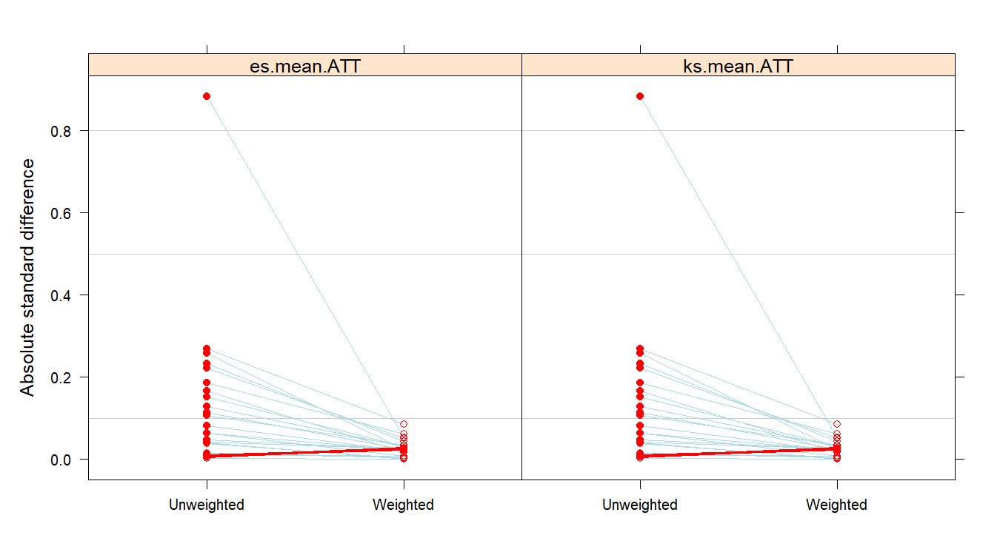
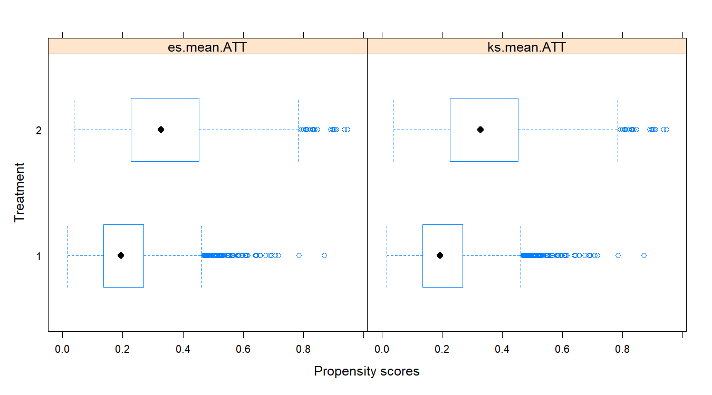
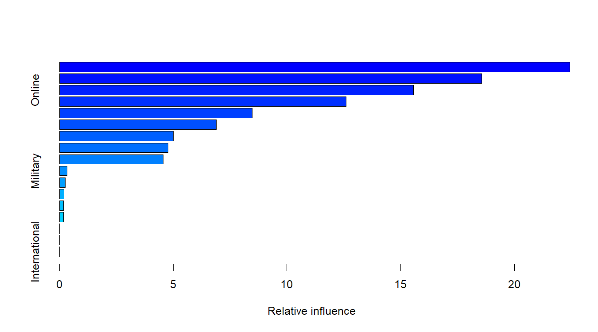
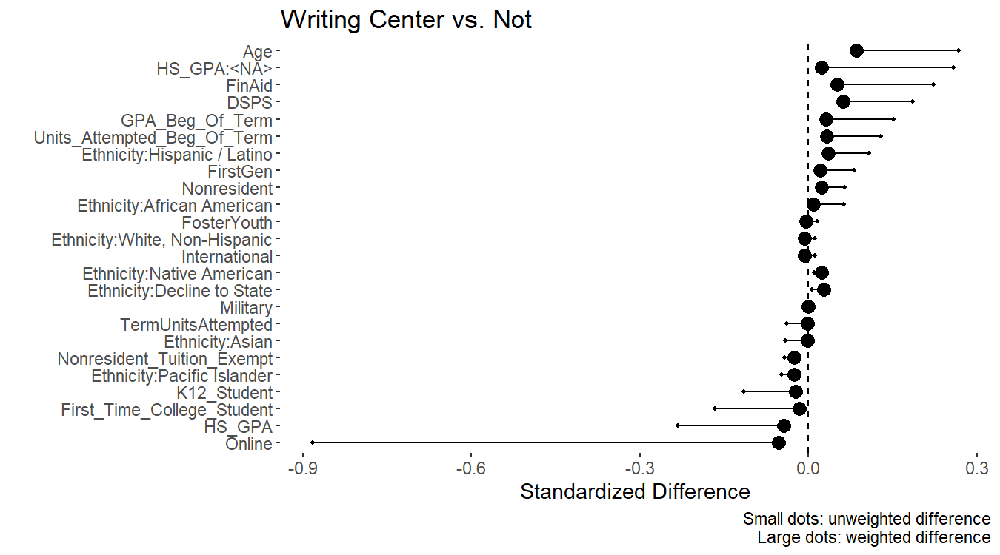

# Introduction: Program Evaluation in Education

In education, support programs are offered with a particular goal in mind, and in most cases, that goal is to increase the students' likelihood of success.  Whether that success is short-term (completion of a course) or long-term (achievement of a degree) depends on the intent of the program.  A support program can be broad and open to all students, or targeted and open to a subset of students.

From an accountability perspective, program evaluation is critical for institutions to understand if their programs are effective, and if so, by how much.  Quantifying participation, utilization, student perception, and outcomes of participants are important elements in understanding the value of the program.  However, these metrics cannot answer an important question of interest: **did the program truly increase student success?**  That is, in the absence of the program, would students fare in the same way (i.e., program had no effect) or would they have been worse off (i.e., program did have positive impact)?  Along the same vein, one might also ask **whether the measured impact would apply to all students if the program were expanded**.

These causal effect questions could be answered by a randomized-controlled experiment where the program administrator or investigator could randomly assign students to treatment (program) and control (no program) groups, and from there, assess the program's effectiveness by comparing the two groups.  However, in most institutional settings, conducting an experiment is infeasible and impractical as institutions would prefer to implement their programs sooner to support students, collecting evidence along the way to demonstrate accountability to stakeholders.  Moreover, withholding support programs from a control group may not be justifiable if students are eligible for the program, which makes it even more challenging to make the case for an experiment.  In an observational setting (non-experimental) as described, estimating the causal impact is much more difficult due to confounding induced by student self-selection into the program.  That is, students who choose to participate may be quite different than students that do not participate.  When this happens, it is unclear whether a perceived positive impact from program participation could be attributed to the program or to other factors that differ between the two groups (confounding).

A popular and fine method for accounting for potential confounders is to adjust for them in a regression model.  This allows one to interpret the contrast of interest (e.g., mean difference, odds ratio, relative rates, etc.) as conditional among populations that have equal measurements in the variables being adjusted for.

Another popular quasi-experimental approach relies on estimating the students' likelihood of participation in the program, the so-called *propensity score*.  Assuming one can estimate this well using the available data, the estimated propensity scores aid in an apples-to-apples comparison by one of two subsequent steps:

1. Match participants and non-participants based on the estimated propensity scores (similar values are matched), and from this matched sample where some observations are excluded, draw inference between the two groups.  If there are no unmeasured confounders (an untestable assumption), then conditioning on the propensity scores in this way allows one to estimate the causal effect of the program.
2. Use the estimated propensity scores to weight each observation in the participant group and non-participant group.  The weights could be derived to allow one to estimate the average treatment effect (ATE) on the entire population (i.e., the effect if the program were to generalize to the entire student population) or the average treatment effect on the treated (ATT; the effect if the program was specific to those that self-selected into the program).  The idea is that some demographic attributes are under/over-represented in each of the two groups, and re-weighting each student allows one to construct a sample that is representative of the target population.

This vignette illustrates the latter approach using the [twang](https://CRAN.R-project.org/package=twang) package in R.  The `twang` package allows one to estimate the propensity scores using gradient boosted trees, a data-driven, nonparametric tree-based method that estimates the propensity score by combining many decision trees built sequentially, each modeling the residuals from the previous tree.  Estimating the propensity scores this way allows one to rely on a robust algorithm for arriving at the estimated propensity scores rather than investing additional effort to manually model the propensity scores using a parametric model like logistic regression.  Once the propensity score weights are derived, one could leverage the [survey](https://CRAN.R-project.org/package=survey) package in R to incorporate the weights in drawing inference via functions like `svyglm` (Generalized Linear Models for complex survey samples).

Although this vignette leverages R, the folks at RAND have also released code and [tutorials](https://www.rand.org/statistics/twang/tutorials.html) for STATA, SAS, and other platforms.  The interested reader should go there for additional tutorials.

# Toy Data Set: Writing Center at a Community College

To assist with demonstrating how one might leverage propensity score weights in program evaluation, we employ the `writing_center` data set from the `IRexamples` package.  First, let's load the data.

```R
library(IRexamples) ## load package with data
data(writing_center) ## load data
## For a description of the data, type ?writing_center in the console
head(writing_center) ## print top few observations
```
```
##   Student_ID        Term Section_ID Instructor_ID Main_CourseID Gender Age
## 1          1 Year 1 Fall        112          9569         ENG 1   Male  21
## 2          2 Year 1 Fall         89          1515         ENG 1 Female  24
## 3          3 Year 1 Fall         99          2357         ENG 1 Female  24
## 4          9 Year 1 Fall        102          1672         ENG 1   Male  24
## 5         11 Year 1 Fall        102          1672         ENG 1   Male  26
## 6         14 Year 1 Fall        102          1672         ENG 1 Female  21
##             Ethnicity FirstGen Military FosterYouth DSPS FinAid
## 1     Mixed Ethnicity        0        0           0    0      1
## 2     Mixed Ethnicity        0        0           0    0      0
## 3   Hispanic / Latino        0        0           0    0      1
## 4 White, Non-Hispanic        1        0           0    0      0
## 5               Asian        1        0           0    0      0
## 6 White, Non-Hispanic        0        0           0    0      0
##   Units_Attempted_Beg_Of_Term GPA_Beg_Of_Term TermUnitsAttempted K12_Student
## 1                        42.0        2.761905                 10           0
## 2                        93.5        2.374332                 10           0
## 3                        42.0        3.309524                 10           0
## 4                        49.0        2.020408                 10           0
## 5                        25.0        1.780000                  7           0
## 6                        29.0        3.137931                 13           0
##   First_Time_College_Student Nonresident_Tuition_Exempt International
## 1                          0                          0             0
## 2                          0                          0             0
## 3                          0                          1             0
## 4                          0                          0             0
## 5                          0                          0             0
## 6                          0                          0             0
##   Nonresident WR_Center Main_Course_SuccessFlag Main_Course_GradePoints HS_GPA
## 1           0         0                       1                       2     NA
## 2           0         1                       0                       1     NA
## 3           0         0                       1                       4  2.113
## 4           0         0                       1                       3  2.249
## 5           0         0                       1                       2  3.100
## 6           0         0                       1                       4     NA
##   Online N_Center_Visits Center_Attendance_Hours N_Conf
## 1      1              NA                      NA     NA
## 2      0              17                18.35194      1
## 3      0              NA                      NA     NA
## 4      0              NA                      NA     NA
## 5      0              NA                      NA     NA
## 6      0              NA                      NA     NA
```

For a description of each variable in the data set, bring up the help file for the data set by typing `?writing_center` in the R console.

In a nutshell, the data set contains students' first enrollment/attempt in ENG 1, a first year college level writing course, over several years.  Students may choose to receive additional support outside of the classroom at the college's writing center by enrolling in a 0.5-unit writing center/conference support course.  Students may use the writing center as a study center where they have access to computers, dictionaries, thesauri, etc.  At the center, students may also schedule 1:1 conferences with the instructor on duty, to get assistance and/or feedback on their writing by bringing a writing prompt or draft of their paper.  Students registered for this support course are required to spend at least 12 hours in the center, and to have at least 2 formal conferences.

Before evaluating the impact of the writing center, let's first explore the `writing_center` data set.

```R
library(dplyr) ## Assist with data manipulations
nrow(writing_center) ## Number of rows
## [1] 4727
length(unique(writing_center$Student_ID)) ## Distinct students
## [1] 4727
unique(writing_center$Main_CourseID) ## primary courses
## [1] "ENG 1"
table(writing_center$Term) ## terms/semesters
## 
##   Year 1 Fall   Year 2 Fall Year 2 Spring Year 2 Summer Year 3 Spring 
##          1121          1266           878           218          1074 
## Year 3 Summer 
##           170

length(unique(writing_center$Section_ID)) ## Num sections
## [1] 224
length(unique(writing_center$Instructor_ID)) ## Num instructors
## [1] 52

## Overall success rates and grade points in the ENG 1 course.
writing_center %>%
  group_by(WR_Center) %>%
  summarize_at(.vars=c('Main_Course_SuccessFlag', 'Main_Course_GradePoints')
               , .funs=mean
               )
## # A tibble: 2 x 3
##   WR_Center Main_Course_SuccessFlag Main_Course_GradePoints
##       <dbl>                   <dbl>                   <dbl>
## 1         0                   0.767                    2.53
## 2         1                   0.782                    2.58

## Online modality and Age by writing center utilization
writing_center %>%
  group_by(WR_Center) %>%
  summarize_at(.vars=c('Online', 'Age')
               , .funs=mean
  )
## # A tibble: 2 x 3
##   WR_Center Online   Age
##       <dbl>  <dbl> <dbl>
## 1         0 0.132   19.8
## 2         1 0.0171  21.9
```

---
# Based on this exploration, students that enrolled in the writing center course have an overall ENG 1 course success rate of `R round(mean(writing_center$Main_Course_SuccessFlag[writing_center$WR_Center==1])*100, 1)`%, whereas those that did not enroll in the writing center have an overall ENG 1 course success rate of `R round(mean(writing_center$Main_Course_SuccessFlag[writing_center$WR_Center==0])*100, 1)`%.  On the surface, it appears the writing center is marginally effective at increasing course success.
---

Based on this exploration, students that enrolled in the writing center course have an overall ENG 1 course success rate of 78.2%, whereas those that did not enroll in the writing center have an overall ENG 1 course success rate of 76.7%.  On the surface, it appears the writing center is marginally effective at increasing course success.

# Estimating Propensity Score Weights Using the `twang` Package

In evaluating the writing center, let's assume that course success in ENG 1 is the outcome of interest (`Main_Course_SuccessFlag`).  This is a binary outcome.

Before evaluating the writing center, we need to identify variables that we would like to attempt to control for, i.e., variables for which we would like to achieve balance when comparing the two groups, writing center users and non-writing center users.  By balance, we mean that both groups have the same distribution of the covariate, approximating what we would expect under a randomized-controlled experiment.  Identifying adjustment variables is typically **the most difficult step in any analysis of observational data** as it requires careful consideration.  One strategy is to list out all factors that one believes causally impacts the outcome of interest.  From this list, identify the variables that may be correlated with program participation.  This latter list constitutes a list of potential confounders that could be included in the estimation of the propensity scores.  Anything on the list for which we do not have data or measurements on should be acknowledged and listed as a limitation of the analysis.

Suppose the adjustment variables have been identified.  Before proceeding with the analysis, let's convert any variables with a `character` data type to a `factor` data type.  That way, any function that uses these variables in modeling will know to treat it as a group variable (e.g., creating dummy or indicator variables on the fly).  From there, we could leverage the `ps` function from the `twang` package to return a list of gradient boosted tree models, modeling the likelihood that a student participates in the writing center.

```R
library(twang) ## package has ps function for modeling propensity scores
adj_vars <- c('Age', 'Ethnicity', 'FirstGen', 'Military', 'FosterYouth', 'DSPS', 'FinAid', 'Units_Attempted_Beg_Of_Term', 'GPA_Beg_Of_Term', 'TermUnitsAttempted', 'K12_Student', 'First_Time_College_Student', 'International', 'Nonresident_Tuition_Exempt', 'Nonresident', 'Online', 'HS_GPA') ## list of pre-specified adjustment variables

## Which variables are character?
names(writing_center)[sapply(writing_center, is.character)]
## [1] "Term"          "Main_CourseID" "Gender"        "Ethnicity"

## Convert data type: character to factor
for (i in seq_along(adj_vars)) {
  if (is.character(writing_center[[adj_vars[i]]])) {
    writing_center[[adj_vars[i]]] <- factor(writing_center[[adj_vars[i]]])
  }
}

## Set random seed
set.seed(123)

## Fit propensity score model
ps_fit_att <- ps(WR_Center ~ . # Use all variables
                 , data=writing_center %>% select(WR_Center, one_of(adj_vars)) ## include only "outcome" (writing center utilization) and explanatory variables
                 , estimand='ATT' # on the treated, can be ATE
                 , verbose=FALSE # don't print intermediate logs
                 )
## above step takes some time because it is fitting many trees iteratively to fit the unexplained residuals

length(ps_fit_att) ## number of objects returned
## [1] 18
names(ps_fit_att) ## names of objects
##  [1] "gbm.obj"    "treat"      "treat.var"  "desc"       "ps"        
##  [6] "w"          "sampw"      "estimand"   "version"    "datestamp" 
## [11] "parameters" "alerts"     "iters"      "balance.ks" "balance.es"
## [16] "balance"    "n.trees"    "data"
```

In the previous code, we returned the results of `ps` to an object named `ps_fit_att`.  When we called `ps`, we specified the estimand to be `estimand='ATT'`, which states that our goal is to draw inference on the average treatment effect among the treated.  Alternatively, one could have specified `estimand='ATE'` which would state that our goal is to draw inference on the average treatment effect for the population.  The choice of `estimand` should depend on the research question.  The following are a few guiding questions that might help the analyst decide which to use:

1.  Can the program be implemented for all students?  If this is not feasible, then the average treatment effect (ATE) for all students is a hypothethical estimand and may not make sense.  ATT should probably be used.
2.  Is the goal to gather evidence to expand the program to everyone?  If so, then the average treatment effect (ATE) for all students should probably be used.
3.  Is the goal to assess the impact of the program among those that participated?  If so, then ATT should be used.

From the previous code, the returned object `ps_fit_att` actually contains a lot of data objects and information for the user to select which gradient boosted tree model (which tree to stop at) the user wants to use to estimate the propensity scores.  A user would typically choose from one of two stopping points or trees:

1. The tree that minimizes the average difference in the standardized means of covariates between treatment vs. control (`es.mean.ATT`).
2. The tree that minimizes the average difference in the maximum difference in the distribution of each covariate between treatment vs. control, as measured by the Komolgorov-Smirnoff statistic (`ks.mean.ATT`).

For each covariate, balance could be measured by calculating the standardized mean for each group, then taking the difference in standardized means between treatment and control.  A covariate is balanced for the two groups, treatment and control, if this mean difference is small.  If one were to leverage a set of propensity score weights to weight each obversvation and calculate the mean differences, then the hope is that the difference would be small for each covariate, which would suggest that the two groups are similar on each covariate.  This could be visualized as below:

---
# ```{r, fig.width=7, fig.height=5}
# plot(ps_fit_att, plots='es') ## plots=3
# ```
---

```R
plot(ps_fit_att, plots='es') ## plots=3
#dev.copy(png, filename='ps_plot_es.png', width=9, height=5, units='in', res=150)
#dev.off()
```
<!-- {width=100%} -->
<!--{width=100%}-->
<!-- {width=100%} -->
{width=100%}

First, let's restrict our attention to the left pane, `es.mean.ATT`.  This pane shows us results of a tree that minimizes the average standardized difference for the ATT estimand.  Each point represents the mean difference between treatment and control for one covariate on the vertical axis.  On the horizontal axis, the mean difference is shown for the "Unweighted" (no adjustment) scenario and the "Weighted" (adjusted) scenario.  The visualization attempts to show the lack of balance across covariates before incorporating propensity score weights, and the (hopefully) balance in covariates after incorporating propensity score weights.  A standardized difference below 0.1 would indicate reasonable balance.

The second pane on the right shows the same results but for propensity scores estimated using a tree that minimizes the average maximum difference in the covariate distributions.  Typically, results for both trees are very similar, so the recommendation is to pick one tree, `es.mean.ATT` or `ks.mean.ATT`, and stick with that tree for the remainder of the analysis.  For this vignette, we pick `es.mean.ATT` to continue our illustration.

One could also review the distribution of the propensity score weights, as seen below.

---
# ```{r, fig.width=7, fig.height=5}
# plot(ps_fit_att, plots='boxplot') ## plots=2
# ## plot(ps_fit_att, plots=4) ## p-values of mean differences
# ## plot(ps_fit_att, plots=5) ## p-values of KS statistics
# ```
---

```R
plot(ps_fit_att, plots='boxplot') ## plots=2
#dev.copy(png, filename='ps_plot_boxplot.png', width=9, height=5, units='in', res=150)
#dev.off()
## plot(ps_fit_att, plots=4) ## p-values of mean differences
## plot(ps_fit_att, plots=5) ## p-values of KS statistics
```
<!-- {width=100%} -->
<!--{width=100%}-->
<!-- {width=100%} -->
{width=100%}

Focusing on the left pane of the previous visualization, we see that those in group 2 (treatment) generally have higher propensity to be in the treatment group compared to those in group 1 (control).  In general, although the distributions differ between the two groups, there is still overlap across the propensity score space (0-1).  If there is very little overlap (e.g., those in treatment are concentrated towards 1 and those in control are concentrated towards 0), then the use of propensity scores may not be as useful in drawing causal inference.

The following shows summaries for each variable using the `bal.table` function.  First, we look at the results for the unweighted case.  Then, we look at the results for the weighted case.  The columns `tx.mean`, `ct.mean`, and `std.eff.sz` show the mean of the covariate in the treatment group, mean of the covariate in the control group, and the standardized difference between the two groups.   The `std.eff.sz` is what is being visualized when `plot(ps_fit_att, plots='es')` was called previously.

```R
## Unweighted
bal.table(ps_fit_att)$unw
##                                tx.mn  tx.sd  ct.mn  ct.sd std.eff.sz    stat
## Age                           21.872  7.548 19.846  4.651      0.268   8.651
## Ethnicity:African American     0.027  0.163  0.017  0.130      0.063   3.305
## Ethnicity:Asian                0.291  0.454  0.310  0.462     -0.041      NA
## Ethnicity:Decline to State     0.022  0.148  0.021  0.145      0.006      NA
## Ethnicity:Hispanic / Latino    0.158  0.364  0.118  0.323      0.108      NA
## NA                                NA     NA     NA     NA         NA      NA
## Ethnicity:Native American      0.001  0.029  0.001  0.024      0.010      NA
## Ethnicity:Pacific Islander     0.001  0.029  0.002  0.047     -0.048      NA
## Ethnicity:White, Non-Hispanic  0.322  0.467  0.316  0.465      0.012      NA
## FirstGen                       0.381  0.486  0.341  0.474      0.082   2.432
## Military                       0.021  0.142  0.021  0.143     -0.002  -0.051
## FosterYouth                    0.007  0.083  0.006  0.075      0.015   0.452
## DSPS                           0.127  0.333  0.065  0.246      0.186   5.845
## FinAid                         0.591  0.492  0.481  0.500      0.223   6.590
## Units_Attempted_Beg_Of_Term   16.939 19.032 14.490 16.989      0.129   3.918
## GPA_Beg_Of_Term                2.155  1.536  1.923  1.560      0.151   4.466
## TermUnitsAttempted            10.827  4.384 10.997  4.495     -0.039  -1.139
## K12_Student                    0.009  0.097  0.021  0.142     -0.115  -3.004
## First_Time_College_Student     0.294  0.456  0.370  0.483     -0.167  -4.881
## International                  0.086  0.280  0.083  0.275      0.011   0.320
## Nonresident_Tuition_Exempt     0.029  0.168  0.036  0.187     -0.042  -1.224
## Nonresident                    0.035  0.184  0.023  0.151      0.064   1.980
## Online                         0.017  0.130  0.132  0.338     -0.883 -16.802
## HS_GPA                         2.977  0.588  3.113  0.492     -0.232  -6.276
## HS_GPA:<NA>                    0.251  0.434  0.139  0.346      0.258   8.013
##                                pval    ks ks.pval
## Age                           0.000 0.114   0.000
## Ethnicity:African American    0.002 0.010   0.002
## Ethnicity:Asian                  NA 0.019      NA
## Ethnicity:Decline to State       NA 0.001      NA
## Ethnicity:Hispanic / Latino      NA 0.039      NA
## NA                               NA    NA      NA
## Ethnicity:Native American        NA 0.000      NA
## Ethnicity:Pacific Islander       NA 0.001      NA
## Ethnicity:White, Non-Hispanic    NA 0.006      NA
## FirstGen                      0.015 0.040   0.127
## Military                      0.959 0.000   1.000
## FosterYouth                   0.651 0.001   1.000
## DSPS                          0.000 0.062   0.002
## FinAid                        0.000 0.110   0.000
## Units_Attempted_Beg_Of_Term   0.000 0.101   0.000
## GPA_Beg_Of_Term               0.000 0.072   0.000
## TermUnitsAttempted            0.255 0.036   0.206
## K12_Student                   0.003 0.011   1.000
## First_Time_College_Student    0.000 0.076   0.000
## International                 0.749 0.003   1.000
## Nonresident_Tuition_Exempt    0.221 0.007   1.000
## Nonresident                   0.048 0.012   1.000
## Online                        0.000 0.115   0.000
## HS_GPA                        0.000 0.128   0.000
## HS_GPA:<NA>                   0.000 0.112   0.000

## Weighted
bal.table(ps_fit_att)$es.mean.ATT
##                                tx.mn  tx.sd  ct.mn  ct.sd std.eff.sz   stat
## Age                           21.872  7.548 21.229  6.730      0.085  1.845
## Ethnicity:African American     0.027  0.163  0.026  0.159      0.009  0.522
## Ethnicity:Asian                0.291  0.454  0.292  0.454     -0.001     NA
## Ethnicity:Decline to State     0.022  0.148  0.018  0.134      0.027     NA
## Ethnicity:Hispanic / Latino    0.158  0.364  0.145  0.352      0.035     NA
## NA                                NA     NA     NA     NA         NA     NA
## Ethnicity:Native American      0.001  0.029  0.000  0.013      0.023     NA
## Ethnicity:Pacific Islander     0.001  0.029  0.002  0.040     -0.025     NA
## Ethnicity:White, Non-Hispanic  0.322  0.467  0.325  0.468     -0.007     NA
## FirstGen                       0.381  0.486  0.371  0.483      0.021  0.566
## Military                       0.021  0.142  0.021  0.142      0.000  0.001
## FosterYouth                    0.007  0.083  0.007  0.084     -0.004 -0.100
## DSPS                           0.127  0.333  0.106  0.308      0.062  1.653
## FinAid                         0.591  0.492  0.566  0.496      0.051  1.388
## Units_Attempted_Beg_Of_Term   16.939 19.032 16.332 18.657      0.032  0.670
## GPA_Beg_Of_Term                2.155  1.536  2.107  1.539      0.031  0.839
## TermUnitsAttempted            10.827  4.384 10.834  4.407     -0.002 -0.043
## K12_Student                    0.009  0.097  0.012  0.107     -0.023 -0.699
## First_Time_College_Student     0.294  0.456  0.301  0.459     -0.016 -0.452
## International                  0.086  0.280  0.088  0.283     -0.007 -0.189
## Nonresident_Tuition_Exempt     0.029  0.168  0.033  0.180     -0.026 -0.739
## Nonresident                    0.035  0.184  0.031  0.173      0.023  0.619
## Online                         0.017  0.130  0.024  0.153     -0.053 -1.692
## HS_GPA                         2.977  0.588  3.002  0.544     -0.044 -1.066
## HS_GPA:<NA>                    0.251  0.434  0.240  0.427      0.024  0.599
##                                pval    ks ks.pval
## Age                           0.065 0.039   0.203
## Ethnicity:African American    0.806 0.001   0.806
## Ethnicity:Asian                  NA 0.000      NA
## Ethnicity:Decline to State       NA 0.004      NA
## Ethnicity:Hispanic / Latino      NA 0.013      NA
## NA                               NA    NA      NA
## Ethnicity:Native American        NA 0.001      NA
## Ethnicity:Pacific Islander       NA 0.001      NA
## Ethnicity:White, Non-Hispanic    NA 0.003      NA
## FirstGen                      0.572 0.010   1.000
## Military                      0.999 0.000   1.000
## FosterYouth                   0.920 0.000   1.000
## DSPS                          0.098 0.021   0.916
## FinAid                        0.165 0.025   0.747
## Units_Attempted_Beg_Of_Term   0.503 0.028   0.630
## GPA_Beg_Of_Term               0.402 0.022   0.869
## TermUnitsAttempted            0.966 0.015   0.996
## K12_Student                   0.485 0.002   1.000
## First_Time_College_Student    0.651 0.007   1.000
## International                 0.850 0.002   1.000
## Nonresident_Tuition_Exempt    0.460 0.004   1.000
## Nonresident                   0.536 0.004   1.000
## Online                        0.091 0.007   1.000
## HS_GPA                        0.286 0.024   0.862
## HS_GPA:<NA>                   0.549 0.011   1.000
```

For the interested user, one could also view the important variables in the tree model.

---
# ```{r, fig.width=7, fig.height=5}
# summary(ps_fit_att$gbm.obj, n.trees=ps_fit_att$desc$es.mean.ATT$n.trees)
# ```
---

```R
summary(ps_fit_att$gbm.obj, n.trees=ps_fit_att$desc$es.mean.ATT$n.trees)
#dev.copy(png, filename='ps_plot_influence.png', width=9, height=5, units='in', res=150)
#dev.off()

##                                                     var    rel.inf
## HS_GPA                                           HS_GPA 22.4510331
## Age                                                 Age 18.5602099
## Online                                           Online 15.5637054
## TermUnitsAttempted                   TermUnitsAttempted 12.6056086
## Units_Attempted_Beg_Of_Term Units_Attempted_Beg_Of_Term  8.4724233
## GPA_Beg_Of_Term                         GPA_Beg_Of_Term  6.8915135
## Ethnicity                                     Ethnicity  5.0042068
## FinAid                                           FinAid  4.7646862
## DSPS                                               DSPS  4.5630620
## Military                                       Military  0.3394101
## First_Time_College_Student   First_Time_College_Student  0.2447535
## Nonresident                                 Nonresident  0.1859316
## Nonresident_Tuition_Exempt   Nonresident_Tuition_Exempt  0.1816653
## FirstGen                                       FirstGen  0.1717908
## FosterYouth                                 FosterYouth  0.0000000
## K12_Student                                 K12_Student  0.0000000
## International                             International  0.0000000
```
<!-- {width=100%} -->
<!--{width=100%}-->
<!-- {width=100%} -->
{width=100%}

The default visualizations provided in the `twang` package are very useful from an analyst's perspective.  However, one might want to do some tweaking to better present the impact of the propensity score weights on balance in the covariates to a wider audience.

```R
library(ggplot2) # Visualization package
library(ggthemes) # themes
library(forcats) # reorder categories

# Store balance table results for both unweight and weighted scenarios in a single data frame
d_demo_summ <- bind_rows(
  bal.table(ps_fit_att)$unw %>% 
    mutate(Comparison_Type='Unadj.', Variable=rownames(bal.table(ps_fit_att)$unw))
  , bal.table(ps_fit_att)$es.mean.ATT %>% 
    mutate(Comparison_Type='Adj.', Variable=rownames(bal.table(ps_fit_att)$es.mean.ATT))
  ) %>%
  # filter(!(Variable %in% c('NA'))) %>%
  filter(!is.na(std.eff.sz)) %>%
  select(Comparison_Type, Variable, std.eff.sz)
```

---
# ```{r, fig.width=7, fig.height=5}
# # Visualize
# d_demo_summ %>% 
#   arrange(desc(Comparison_Type), desc(std.eff.sz)) %>%
#   group_by(Variable) %>%
#   mutate(std.eff.sz0=std.eff.sz[Comparison_Type=='Unadj.']) %>%
#   ungroup %>% 
#   ggplot(data=., mapping=aes(x=fct_reorder(factor(Variable), std.eff.sz0), y=std.eff.sz, group=Variable)) +
#   geom_point(mapping=aes(size=ifelse(Comparison_Type=='Unadj.', 1, 2))) +
#   scale_size_continuous(range = c(1,4)) +
#   geom_line() +
#   geom_hline(yintercept=0, lty=2) +
#   coord_flip() +
#   ylab('Standardized Difference') +
#   xlab('') +
#   ggtitle('Writing Center vs. Not') +
#   theme_tufte(base_family='Arial Narrow') +
#   theme(text=element_text(size=14)) +
#   # theme_ipsum(grid=FALSE) +
#   # scale_color_manual(values=c('slategrey', 'darkblue'), guide=FALSE) +
#   theme(legend.position='none') +
#   labs(caption='Small dots: unweighted difference\nLarge dots: weighted difference')
# ```
---

```R
# Visualize
d_demo_summ %>% 
  arrange(desc(Comparison_Type), desc(std.eff.sz)) %>%
  group_by(Variable) %>%
  mutate(std.eff.sz0=std.eff.sz[Comparison_Type=='Unadj.']) %>%
  ungroup %>% 
  ggplot(data=., mapping=aes(x=fct_reorder(factor(Variable), std.eff.sz0), y=std.eff.sz, group=Variable)) +
  geom_point(mapping=aes(size=ifelse(Comparison_Type=='Unadj.', 1, 2))) +
  scale_size_continuous(range = c(1,4)) +
  geom_line() +
  geom_hline(yintercept=0, lty=2) +
  coord_flip() +
  ylab('Standardized Difference') +
  xlab('') +
  ggtitle('Writing Center vs. Not') +
  theme_tufte(base_family='Arial Narrow') +
  theme(text=element_text(size=14)) +
  # theme_ipsum(grid=FALSE) +
  # scale_color_manual(values=c('slategrey', 'darkblue'), guide=FALSE) +
  theme(legend.position='none') +
  labs(caption='Small dots: unweighted difference\nLarge dots: weighted difference')
#dev.copy(png, filename='ps_plot_balance.png', width=9, height=5, units='in', res=150)
#dev.off()
```
<!-- {width=100%} -->
<!--{width=100%}-->
<!-- {width=100%} -->
{width=100%}

From this visualization, we see that those that enrolled in the writing center tend to be older than those that did not enroll in the writing center (top row, small dot).  However, after incorporating the propensity score weights, the difference in age is much closer to zero (top row, large dot).  Similarly, for the last row, those not enrolled in the writing center have higher rates of online modality in the primary ENG 1 course compared to those enrolled in the writing center (bottom row, small dot).  However, after incorporating the propensity score weights, the difference in online modality is much closer to zero (bottow row, large dot).  This visualization shows that the propensity score weights are doing a reasonable job at attaining balance in the covariates (large dots close to 0).


# Statistical Inference Using Propensity Score Weights Using the `survey` Package

Before incorporating the propensity score weights, let's first illustrate how one might estimate the impact of the writing center on course success using logistic regression.

```R
fit_unw <- glm(Main_Course_SuccessFlag ~ WR_Center
             , data=writing_center
             , family=binomial(link='logit')
               )
summary(fit_unw)
## 
## Call:
## glm(formula = Main_Course_SuccessFlag ~ WR_Center, family = binomial(link = "logit"), 
##     data = writing_center)
## 
## Deviance Residuals: 
##     Min       1Q   Median       3Q      Max  
## -1.7446   0.7019   0.7288   0.7288   0.7288  
## 
## Coefficients:
##             Estimate Std. Error z value Pr(>|z|)    
## (Intercept)  1.19026    0.03964   30.03   <2e-16 ***
## WR_Center    0.08521    0.08117    1.05    0.294    
## ---
## Signif. codes:  0 '***' 0.001 '**' 0.01 '*' 0.05 '.' 0.1 ' ' 1
## 
## (Dispersion parameter for binomial family taken to be 1)
## 
##     Null deviance: 5093.0  on 4726  degrees of freedom
## Residual deviance: 5091.9  on 4725  degrees of freedom
## AIC: 5095.9
## 
## Number of Fisher Scoring iterations: 4

# Odds ratio
exp(fit_unw$coef)
## (Intercept)   WR_Center 
##    3.287952    1.088943
```

---
# Those that enrolled in the writing center are associated with a `R round(exp(fit_unw$coef)[2], 1)`-fold increase in the odds of course success.
---

Those that enrolled in the writing center are associated with a 1.09-fold increase in the odds of course success.

Now, to incorporate weights, we need to rely on the `survey` package in order to properly calculate standard errors in our inference.  Note that by default, the `survey` package uses robust standard errors, which is a very good default to guard against model mis-specification.

```R
library(survey) # Load package
# Extract weights
writing_center$w_ATT <- get.weights(ps_fit_att, stop.method='es.mean')
# Create a survey design package to be used as a data object subsequently
design_ps_att <- svydesign(ids= ~ 1, weights= ~ w_ATT, data=writing_center)
# Fit model
fit_att <- svyglm(Main_Course_SuccessFlag ~ WR_Center, design=design_ps_att, family=binomial(link='logit'))
summary(fit_att)
## 
## Call:
## svyglm(formula = Main_Course_SuccessFlag ~ WR_Center, design = design_ps_att, 
##     family = binomial(link = "logit"))
## 
## Survey design:
## svydesign(ids = ~1, weights = ~w_ATT, data = writing_center)
## 
## Coefficients:
##             Estimate Std. Error t value Pr(>|t|)    
## (Intercept)  1.09391    0.05080  21.534   <2e-16 ***
## WR_Center    0.18156    0.08717   2.083   0.0373 *  
## ---
## Signif. codes:  0 '***' 0.001 '**' 0.01 '*' 0.05 '.' 0.1 ' ' 1
## 
## (Dispersion parameter for binomial family taken to be 1.000212)
## 
## Number of Fisher Scoring iterations: 5

# Odds ratio
exp(fit_att$coef)
## (Intercept)   WR_Center 
##    2.985924    1.199090

# 95% confidence interval
exp(confint(fit_att))
##                2.5 %   97.5 %
## (Intercept) 2.702948 3.298526
## WR_Center   1.010771 1.422495
```

---
# After incorporating the propensity score weights, the writing center is associated with a `R round(exp(fit_att$coef[2]), 1)`-fold increase in the odds for course success (95% CI: `R round(exp(confint(fit_att))[2,1], 1)` -- `R round(exp(confint(fit_att))[2,2], 1)`).
---

After incorporating the propensity score weights, the writing center is associated with a 1.20-fold increase in the odds for course success (95% CI: 1.01 -- 1.42).

# Exercise: Doubly Robust Estimation

The so-called *doubly-robust estimator* can be estimated by incorporating adjustment variables into the weighted regression model in the previous section (adding adjustment variables to the right of `~` in the call to `svyglm`).  This estimator incorporates both propensity score weights and adjustment variables in the regression (*doubly*), and is robust in the sense that only one of the following is required to be true to consistently estimate that causal effect of the writing center:

1.  the regression model is correctly-specified and represents the causal mechanism of course success, or
2.  the propensity score model is correctly-specified and represents the treatment-selection mechanism.

Both are unknown to the user.

As an exercise, the reader is encouraged to try this on their own by adapting the code from the previous section.

# Other Considerations In Evaluation

The previous analysis shows a small effect on course success from the writing center.  As described in the data description, students enrolled in the writing center section (what is represented by the `WR_Center` flag) are required to visit the writing center and have conferences with the instructor on duty.  There are other things one might consider for comparison in evaluating the writing center that may be insightful for the program administrator:

1. those that actually visited the center vs. those that did not visit and those not enrolled in the writing center (`N_Center_Visits`);
2. those that actually had writing conferences vs. not (`N_Conf`);
3. those that had at least X number of writing conferences vs. not (`N_Conf`); and
3. those that spend at least X amount of time in the center vs. not (`Center_Attendance_Hours`).

Finally, one should also assess the assumptions that underly their analysis.  In this vignette, we leveraged propensity scores and weighted logistic regression.  Are there other potential confounders that we left out in the analysis?  What else could explain the effect that we are observing?  Regression assumes the observations are independent.  Is this truly the case?  Groups of students enroll in a section.  Each section is taught by an instructor.  Given how students are naturally clustered in a section, they do not seem independent of one another (think of instructors that have high course success rates or low success rates: knowing whether or not a student was successful in the course reveals information about whether or classmate was successful in the course).  One might want to account for this clustering or instructor-level effect.  Not addressing for the non-independent observations yields invalid inference from both an estimation and a quantifaction of uncertainty (standard error) perspectives.  Accounting for instructor-level effects is illustrated in another [vignette](Ex-03-Instructor-Level-Effects-With-Bayesian-Multilevel-Models.html).

# Appendix: R and R Package Versions

This vignette was generated using an R session with the following packages.  There may be some discrepancies when the reader replicates the code caused by version mismatch.

```R
sessionInfo()
## R version 4.0.2 (2020-06-22)
## Platform: x86_64-w64-mingw32/x64 (64-bit)
## Running under: Windows 10 x64 (build 17763)
## 
## Matrix products: default
## 
## locale:
## [1] LC_COLLATE=English_United States.1252 
## [2] LC_CTYPE=English_United States.1252   
## [3] LC_MONETARY=English_United States.1252
## [4] LC_NUMERIC=C                          
## [5] LC_TIME=English_United States.1252    
## 
## attached base packages:
## [1] grid      stats     graphics  grDevices utils     datasets  methods  
## [8] base     
## 
## other attached packages:
##  [1] survey_4.0           survival_3.2-11      Matrix_1.3-4        
##  [4] forcats_0.5.1        ggthemes_4.2.4       ggplot2_3.3.3       
##  [7] twang_2.3            dplyr_1.0.6          IRexamples_0.0.1    
## [10] RevoUtils_11.0.2     RevoUtilsMath_11.0.0
## 
## loaded via a namespace (and not attached):
##  [1] prettydoc_0.4.1     gbm_2.1.8           tidyselect_1.1.1   
##  [4] xfun_0.23           bslib_0.2.5.1       purrr_0.3.4        
##  [7] mitools_2.4         splines_4.0.2       lattice_0.20-44    
## [10] colorspace_2.0-1    vctrs_0.3.8         generics_0.1.0     
## [13] htmltools_0.5.1.1   yaml_2.2.1          utf8_1.2.1         
## [16] rlang_0.4.11        jquerylib_0.1.4     pillar_1.6.1       
## [19] glue_1.4.2          withr_2.4.2         DBI_1.1.1          
## [22] xgboost_1.4.1.1     RColorBrewer_1.1-2  jpeg_0.1-8.1       
## [25] lifecycle_1.0.0     stringr_1.4.0       MatrixModels_0.5-0 
## [28] munsell_0.5.0       gtable_0.3.0        evaluate_0.14      
## [31] labeling_0.4.2      latticeExtra_0.6-29 knitr_1.33         
## [34] fansi_0.5.0         highr_0.9           xtable_1.8-4       
## [37] scales_1.1.1        jsonlite_1.7.2      farver_2.1.0       
## [40] png_0.1-7           digest_0.6.27       stringi_1.4.6      
## [43] cli_2.5.0           tools_4.0.2         magrittr_2.0.1     
## [46] sass_0.4.0          tibble_3.1.2        crayon_1.4.1       
## [49] pkgconfig_2.0.3     ellipsis_0.3.2      data.table_1.14.0  
## [52] rmarkdown_2.9       rstudioapi_0.13     R6_2.5.0           
## [55] compiler_4.0.2
```
