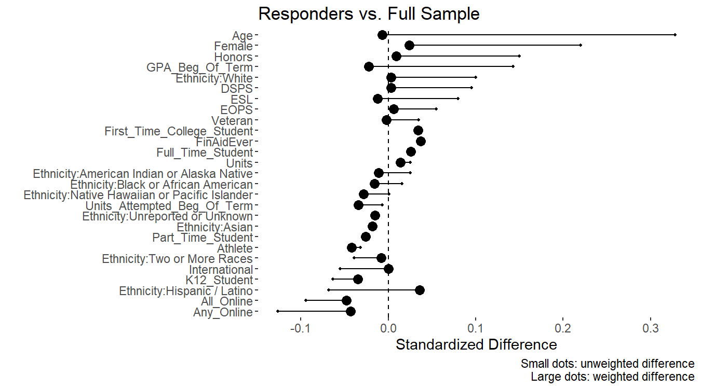

```{r, include=FALSE}
knitr::opts_chunk$set(error=TRUE) # in case CRAN vignette build does not have internet, fail gracefully
```
# Introduction: Survey Non-response Bias

Surveys allow institutional researchers to collect and measure valuable information from students/constituents for assessment (eg, satisfaction and perception).  They are especially useful when all individuals invited to participate actually respond.  However, in reality, the response rate is typically very low, especially when the survey is administered by email.

When only a subset of individuals respond, surveys can suffer from **non-response bias**, meaning results can be skewed since responders may be very different than non-responders.  For example, when conducting a survey by email at a community college, responders may tend to be younger students (eg, those more tech savvy), where older students from the community may be less likely to respond since they don't check their email as often.

When reporting survey results, it is customary to quantify the survey response rate to communicate the possibility of non-response bias.  A careful analyst could caution of this potential non-response bias and suggest that the results hold for the responders, and may or may not hold for the larger target population of interest.  For surveys where the stakes are higher, the analyst could compare the demographics of the responders to non-responders or to the entire target population to understand which groups are under- or over-represented.

One way to address non-response bias is to increase the response rate, either by incentivizing the response with a prize or administering the survey in a way that ensures a response (eg, using the survey to take attendance for a required workshop).  A data-driven alternative is to build a model for survey response (yes or no), produce survey weights based on this model, and re-weight observations when analyzing the results (eg, cases with lower likelihood of response would be weighted higher).  This approach addresses non-response bias only if the non-response is independent of the outcome (responses to questions in the survey).  If whether or not an individual responds to the survey depends on how they would respond to the survey questions, then a weighted analysis will not fix this bias (there is no way to correct for the bias as the actual responses are unknown by definition of non-response, making it impossible to correctly model response).  Also, a weighted analysis is useful only if the analyst has access to variables that relate to decisions around participation.  That is, demographic information alone may not be enough if the decision to participate is more intricate.

In this vignette, we illustrate how one might leverage the [twang](https://cran.r-project.org/package=twang) package in R to model survey response using gradient boosted trees and derive survey weights.  The `twang` package was designed to estimate propensity scores using gradient boosted trees, but can be re-purposed for survey non-response as described in the "Non-response weights" section in the `twang` [vignette](https://cran.r-project.org/package=twang/vignettes/twang.pdf).

Modeling survey response using gradient boosted trees from `twang` allows one to predict survey response without investing a lot of time and effort to arrive at a reasonable model.  For those not familiar, gradient boosted trees is a popular and well-established machine learning algorithm that arrives at good predictions without too much manual tweaking from the analyst's perspective.  The trade-off compared to a semi-parametric regression model is that the underlying structure and relationships between the covariates and outcome are not transparent, which is acceptable in this application since the goal is to arrive at non-response weights to reduce non-respose bias, not to draw inference on survey response.  The structure of the survey response model is not of primary interest.

Note that this vignette does not suggest adjusting for survey non-response using weights in all surveys.  The purpose of the vignette is to illustrate how one might accomplish this task in R.  In practicality, the author usually reports survey results as is, with the understanding that the results hold for the responders, and employ survey weights in very rare, high stakes surveys.

# Toy Data Set: Student Satisfaction at a Community College

To assist with demonstrating the estimation of non-response weights, we employ the `survey_response` and `survey_results` data sets from the `IRexamples` package.  First, let's load the data sets.

```R
library(IRexamples) # package with data
# Load data from package
data(survey_response)
data(survey_results)
# ?survey_response or ?survey_results for description
```

For a description of these two data sets, type `?survey_response` and `?survey_results` in the R console.

Briefly, a student satisfaction survey was administered in a particular year at community college.  The `survey_response` data set contains a list of responders and non-responders.  It also contains demographic information of all students that were invited to participate in the survey.  Actual survey results for the responders are stored in the `survey_results` data set.

Let's briefly explore the two data sets.
```R
nrow(survey_response)
## [1] 12379

nrow(survey_results)
## [1] 1423

head(survey_response)
##              Email_Masked Responded Age Female         Ethnicity K12_Student
## 1 email_00001@college.edu         0  21      0             White           0
## 2 email_00002@college.edu         0  41      1             Asian           0
## 3 email_00003@college.edu         0  18      1             White           0
## 4 email_00004@college.edu         0  18      1             Asian           0
## 5 email_00005@college.edu         0  26      0 Hispanic / Latino           0
## 6 email_00006@college.edu         0  18      0 Two or More Races           0
##   First_Time_College_Student Veteran DSPS EOPS FinAidEver Honors International
## 1                          0       0    0    0          1      0             0
## 2                          0       0    0    0          0      0             0
## 3                          1       0    0    0          0      0             0
## 4                          1       0    0    0          1      0             0
## 5                          0       0    0    0          1      0             0
## 6                          1       0    0    0          1      0             0
##   ESL Athlete GPA_Beg_Of_Term Units_Attempted_Beg_Of_Term Units
## 1   0       0        2.791667                          48     9
## 2   1       0        0.000000                           0     8
## 3   0       0        0.000000                           0     9
## 4   0       0        0.000000                           0    10
## 5   0       0        0.000000                          14     4
## 6   0       0        0.000000                           0    14
##   Noncredit_Student Part_Time_Student Full_Time_Student Any_Online All_Online
## 1                 0                 1                 0          0          0
## 2                 0                 1                 0          0          0
## 3                 0                 1                 0          0          0
## 4                 0                 1                 0          0          0
## 5                 0                 1                 0          1          1
## 6                 0                 0                 1          0          0

length(unique(survey_response$Email_Masked))
## [1] 12379

head(survey_results)
##              Email_Masked Overall Satisfaction Classroom learning experience
## 1 email_06316@college.edu   Somewhat Satisfied                Very Satisfied
## 2 email_05103@college.edu    Very Dissatisfied         Somewhat Dissatisfied
## 3 email_09762@college.edu       Very Satisfied            Somewhat Satisfied
## 4 email_00473@college.edu       Very Satisfied                Very Satisfied
## 5 email_03027@college.edu   Somewhat Satisfied                Very Satisfied
## 6 email_06955@college.edu   Somewhat Satisfied            Somewhat Satisfied
##   Your ability to register for classes you want/need Variety of courses offered
## 1                              Somewhat Dissatisfied         Somewhat Satisfied
## 2                                 Somewhat Satisfied         Somewhat Satisfied
## 3                                 Somewhat Satisfied             Very Satisfied
## 4                                 Somewhat Satisfied         Somewhat Satisfied
## 5                              Somewhat Dissatisfied         Somewhat Satisfied
## 6                                     Very Satisfied             Very Satisfied
##   Class size (number of students in a class) Campus safety/security
## 1                         Somewhat Satisfied     Somewhat Satisfied
## 2                         Somewhat Satisfied         Very Satisfied
## 3                             Very Satisfied         Very Satisfied
## 4                             Very Satisfied     Somewhat Satisfied
## 5                             Very Satisfied         Very Satisfied
## 6                             Very Satisfied         Very Satisfied
##   Financial Aid Office Tutoring Services Selecting a major            Canvas
## 1                 <NA>              <NA>              <NA>    Very Satisfied
## 2                 <NA> Very Dissatisfied     Somewhat Easy Very Dissatisfied
## 3                 <NA>              <NA>              <NA>    Very Satisfied
## 4       Very Satisfied              <NA>              <NA>    Very Satisfied
## 5                 <NA>    Very Satisfied     Somewhat Easy    Very Satisfied
## 6                 <NA>              <NA>         Very Easy              <NA>
##   Have you heard about the new California Initiative called Guided Pathways?
## 1                                                                         No
## 2                                                                         No
## 3                                                                         No
## 4                                                                         No
## 5                                                                         No
## 6                                                                         No

length(unique(survey_results$Email_Masked))
## [1] 1423

## Response rate
mean(survey_response$Responded)
## [1] 0.1149527
```

---
# Based on this exploration, `Email_Masked` is the common key that could be used to join the two data sets.  The response rate for the survey is `R round(mean(survey_response$Responded)*100, 0)`%.
---
Based on this exploration, `Email_Masked` is the common key that could be used to join the two data sets.  The response rate for the survey is 11%.

# Modeling Survey Response with `twang`

To model survey response, we leverage the `ps` function from `twang` to build a gradient boosted tree model on `Responded` as an outcome from the `survey_response` data.  The `survey_response` data set also contains demographic and background information on students that could be used to model survey response.

```R
# Load packages
library(twang) # ps function
library(dplyr) # data manipulation
library(forcats) # maniuplate cateogorical/factor variables
library(ggplot2) # plotting
library(ggthemes) # themes

# Potential predictors: use all variables that are included
pred_vars <- names(survey_response)[3:ncol(survey_response)]
pred_vars
##  [1] "Age"                         "Female"                     
##  [3] "Ethnicity"                   "K12_Student"                
##  [5] "First_Time_College_Student"  "Veteran"                    
##  [7] "DSPS"                        "EOPS"                       
##  [9] "FinAidEver"                  "Honors"                     
## [11] "International"               "ESL"                        
## [13] "Athlete"                     "GPA_Beg_Of_Term"            
## [15] "Units_Attempted_Beg_Of_Term" "Units"                      
## [17] "Noncredit_Student"           "Part_Time_Student"          
## [19] "Full_Time_Student"           "Any_Online"                 
## [21] "All_Online"

# Summary
summary(survey_response %>% select(Responded, one_of(pred_vars)))
##    Responded          Age            Female        Ethnicity        
##  Min.   :0.000   Min.   :10.00   Min.   :0.0000   Length:12379      
##  1st Qu.:0.000   1st Qu.:19.00   1st Qu.:0.0000   Class :character  
##  Median :0.000   Median :21.00   Median :0.0000   Mode  :character  
##  Mean   :0.115   Mean   :24.58   Mean   :0.4957                     
##  3rd Qu.:0.000   3rd Qu.:26.00   3rd Qu.:1.0000                     
##  Max.   :1.000   Max.   :81.00   Max.   :1.0000                     
##   K12_Student     First_Time_College_Student    Veteran       
##  Min.   :0.0000   Min.   :0.0000             Min.   :0.00000  
##  1st Qu.:0.0000   1st Qu.:0.0000             1st Qu.:0.00000  
##  Median :0.0000   Median :0.0000             Median :0.00000  
##  Mean   :0.0429   Mean   :0.1761             Mean   :0.01656  
##  3rd Qu.:0.0000   3rd Qu.:0.0000             3rd Qu.:0.00000  
##  Max.   :1.0000   Max.   :1.0000             Max.   :1.00000  
##       DSPS              EOPS           FinAidEver         Honors       
##  Min.   :0.00000   Min.   :0.00000   Min.   :0.0000   Min.   :0.00000  
##  1st Qu.:0.00000   1st Qu.:0.00000   1st Qu.:0.0000   1st Qu.:0.00000  
##  Median :0.00000   Median :0.00000   Median :0.0000   Median :0.00000  
##  Mean   :0.07658   Mean   :0.07795   Mean   :0.4771   Mean   :0.04702  
##  3rd Qu.:0.00000   3rd Qu.:0.00000   3rd Qu.:1.0000   3rd Qu.:0.00000  
##  Max.   :1.00000   Max.   :1.00000   Max.   :1.0000   Max.   :1.00000  
##  International         ESL            Athlete        GPA_Beg_Of_Term
##  Min.   :0.0000   Min.   :0.0000   Min.   :0.00000   Min.   :0.000  
##  1st Qu.:0.0000   1st Qu.:0.0000   1st Qu.:0.00000   1st Qu.:0.000  
##  Median :0.0000   Median :0.0000   Median :0.00000   Median :2.526  
##  Mean   :0.0618   Mean   :0.1494   Mean   :0.02779   Mean   :2.083  
##  3rd Qu.:0.0000   3rd Qu.:0.0000   3rd Qu.:0.00000   3rd Qu.:3.389  
##  Max.   :1.0000   Max.   :1.0000   Max.   :1.00000   Max.   :4.000  
##  Units_Attempted_Beg_Of_Term     Units        Noncredit_Student
##  Min.   :  0.00              Min.   : 0.500   Min.   :0        
##  1st Qu.:  0.00              1st Qu.: 5.000   1st Qu.:0        
##  Median : 18.00              Median :10.000   Median :0        
##  Mean   : 26.19              Mean   : 9.763   Mean   :0        
##  3rd Qu.: 42.00              3rd Qu.:14.000   3rd Qu.:0        
##  Max.   :256.00              Max.   :28.000   Max.   :0        
##  Part_Time_Student Full_Time_Student   Any_Online       All_Online     
##  Min.   :0.0000    Min.   :0.0000    Min.   :0.0000   Min.   :0.00000  
##  1st Qu.:0.0000    1st Qu.:0.0000    1st Qu.:0.0000   1st Qu.:0.00000  
##  Median :1.0000    Median :0.0000    Median :0.0000   Median :0.00000  
##  Mean   :0.5626    Mean   :0.4374    Mean   :0.3343   Mean   :0.07957  
##  3rd Qu.:1.0000    3rd Qu.:1.0000    3rd Qu.:1.0000   3rd Qu.:0.00000  
##  Max.   :1.0000    Max.   :1.0000    Max.   :1.0000   Max.   :1.00000
```

Before we start modeling `Responded`, we first convert variables with a `character` data type to a `factor` data type in R.  That way, modeling functions (eg, `ps`) will know to treat it as a group variable.

```R
# Convert character variables to factor
char_vars <- lapply(survey_response, class) == 'character'
survey_response[, char_vars] <- lapply(survey_response[, char_vars], as.factor)
```

Next, we model survey response using `ps` from `twang`.
```R
# Propensity Score on Responded variable
ps_fit <- ps(Responded ~ . ## Use all variables
           , data=survey_response %>% select(Responded, one_of(pred_vars)) ## Select just the response and specified predictors
           , estimand='ATE' ## ATE: Generalize to all those invited for the survey, not just responders
           , verbose=FALSE
             )
## Warning in gbm.fit(x = x, y = y, offset = offset, distribution = distribution, :
## variable 17: Noncredit_Student has no variation.

length(ps_fit)
## [1] 18

names(ps_fit)
##  [1] "gbm.obj"    "treat"      "treat.var"  "desc"       "ps"        
##  [6] "w"          "sampw"      "estimand"   "version"    "datestamp" 
## [11] "parameters" "alerts"     "iters"      "balance.ks" "balance.es"
## [16] "balance"    "n.trees"    "data"
```

We specify the estimand to be `'ATE'` as we want weights that generalize to all students invited to participate in the survey, not just those that responded.  We return the results of `ps` to `ps_fit`.  The object `ps_fit` contains many data elements and objects that helps the user select the gradient tree model that could be used to derive survey weights.  In general, there are two tree models worth considering, one labeled `es.mean.ATE` and one labeled `ks.mean.ATE`.  In the vast majority of cases, the two are quite similar.  For simplicity, choose one of the two and stick with it in any analysis.  For this vignette, we choose the `es.mean.ATE` model.  For a brief description on these two models, see the [vignette](./Ex-01-Propensity-Score-Weights-Using-GBM.html) on propensity score weights.

In this next set of code, we extract the weights from the `es.mean.ATE` model.

```R
# summary(ps_fit$gbm.obj, n.trees=ps_fit$desc$es.mean.ATE$n.trees)
# plot(ps_fit, plots=3)
# bal.table(ps_fit)$es.mean.ATE


# Get weights
survey_response$weight <- get.weights(ps_fit, stop.method="es.mean")
summary(survey_response$weight)
##    Min. 1st Qu.  Median    Mean 3rd Qu.    Max. 
##   1.012   1.073   1.109   1.880   1.193  45.005
```

Recall that in a propensity score analysis, the hope is that the distribution of the covariates are balanced between the two comparison groups, treatment and control, when the observations are weighted.  For survey non-response, the hope is that the weighted observations from the **responders** are similar to that of the **full sample** that includes both responders and non-responders.  To do this assessment, we construct a synthetic data set with synthetic treatment and weight variables to "trick" the functions from `twang` to compare the full sample (first group) to that of the responders (second group).  More precisely, we take the following steps:

1. Create a new data set that combines (stacks) two data sets:
   a. The full data set that includes responders and non-responders.
   b. The responders data set.
2. Create a synthetic treatment variable `trt_trick`, where the observations in the first data set have value `trt_trick=1` and the observations in the second data set have value `trt_trick=0`.  Similarly, create a synthetic weight variable `weight_trick`, where the observations in the first data set have value `weight_trick=1` and the observations in the second data set have value `weight_trick=weight`, where `weight` contains weights from the survey response model (derived from `ps`).
3. With this new data set and with the synthetic `trt_trick` and `weight_trick` variables, we could re-purpose the `dx.wts` function from `twang` to compare the covariates between two groups, the unweighted full sample vs. the weighted responders.  For this to work, we have to set `estimand='ATT'` when calling `dx.wts` (generalizing to those with `trt_trick=1`, which corresponds to the full sample).

```R
survey_trick <- rbind(
  data.frame(survey_response, trt_trick=1, weight_trick=1) # full sample
  , data.frame(survey_response, trt_trick=0, weight_trick=survey_response$weight) %>%
    filter(Responded==1) # Responders, weighted
) # Trick dx.wts function to summarize this data set to compare if weighted responders are similar to the full sample (ATT since full sample has trt_trick=1 as trick treatment)

# Summary object
survey_trick_summ <- dx.wts(x=survey_trick$weight_trick
                   , data=survey_trick
                   , estimand='ATT' ## Need this to compare unweighted full sample and the weighted responders
                   , vars=pred_vars
                   , treat.var='trt_trick'
                   )

# unweighted full sample
bal.table(survey_trick_summ)[[1]][, c('tx.mn', 'ct.mn', 'std.eff.sz', 'ks')]
##                                                tx.mn  ct.mn std.eff.sz    ks
## Age                                           24.579 27.836     -0.328 0.127
## Female                                         0.496  0.606     -0.220 0.110
## Ethnicity:American Indian or Alaska Native     0.001  0.001     -0.025 0.001
## Ethnicity:Asian                                0.332  0.323      0.021 0.010
## Ethnicity:Black or African American            0.021  0.023     -0.016 0.002
## Ethnicity:Hispanic / Latino                    0.247  0.218      0.068 0.029
## Ethnicity:Native Hawaiian or Pacific Islander  0.003  0.003     -0.001 0.000
## Ethnicity:Two or More Races                    0.053  0.044      0.039 0.009
## Ethnicity:Unreported or Unknown                0.020  0.018      0.015 0.002
## Ethnicity:White                                0.323  0.370     -0.100 0.047
## K12_Student                                    0.043  0.030      0.063 0.013
## First_Time_College_Student                     0.176  0.189     -0.034 0.013
## Veteran                                        0.017  0.021     -0.035 0.005
## DSPS                                           0.077  0.102     -0.095 0.025
## EOPS                                           0.078  0.093     -0.055 0.015
## FinAidEver                                     0.477  0.494     -0.034 0.017
## Honors                                         0.047  0.079     -0.150 0.032
## International                                  0.062  0.048      0.055 0.013
## ESL                                            0.149  0.178     -0.080 0.028
## Athlete                                        0.028  0.022      0.032 0.005
## GPA_Beg_Of_Term                                2.083  2.299     -0.143 0.107
## Units_Attempted_Beg_Of_Term                   26.190 26.001      0.007 0.022
## Units                                          9.763  9.887     -0.025 0.023
## Noncredit_Student                              0.000  0.000         NA 0.000
## Part_Time_Student                              0.563  0.548      0.029 0.015
## Full_Time_Student                              0.437  0.452     -0.029 0.015
## Any_Online                                     0.334  0.275      0.126 0.060
## All_Online                                     0.080  0.054      0.094 0.025

# weighted responders
bal.table(survey_trick_summ)[[2]][, c('tx.mn', 'ct.mn', 'std.eff.sz', 'ks')]
##                                                tx.mn  ct.mn std.eff.sz    ks
## Age                                           24.579 24.511      0.007 0.008
## Female                                         0.496  0.507     -0.024 0.012
## Ethnicity:American Indian or Alaska Native     0.001  0.000      0.011 0.000
## Ethnicity:Asian                                0.332  0.324      0.018 0.009
## Ethnicity:Black or African American            0.021  0.019      0.016 0.002
## Ethnicity:Hispanic / Latino                    0.247  0.262     -0.036 0.015
## Ethnicity:Native Hawaiian or Pacific Islander  0.003  0.001      0.028 0.001
## Ethnicity:Two or More Races                    0.053  0.051      0.008 0.002
## Ethnicity:Unreported or Unknown                0.020  0.018      0.015 0.002
## Ethnicity:White                                0.323  0.324     -0.003 0.001
## K12_Student                                    0.043  0.036      0.035 0.007
## First_Time_College_Student                     0.176  0.189     -0.034 0.013
## Veteran                                        0.017  0.016      0.002 0.000
## DSPS                                           0.077  0.077     -0.003 0.001
## EOPS                                           0.078  0.080     -0.006 0.002
## FinAidEver                                     0.477  0.495     -0.037 0.018
## Honors                                         0.047  0.049     -0.009 0.002
## International                                  0.062  0.062      0.000 0.000
## ESL                                            0.149  0.145      0.012 0.004
## Athlete                                        0.028  0.021      0.042 0.007
## GPA_Beg_Of_Term                                2.083  2.050      0.022 0.016
## Units_Attempted_Beg_Of_Term                   26.190 25.214      0.034 0.021
## Units                                          9.763  9.831     -0.014 0.015
## Noncredit_Student                              0.000  0.000         NA 0.000
## Part_Time_Student                              0.563  0.550      0.026 0.013
## Full_Time_Student                              0.437  0.450     -0.026 0.013
## Any_Online                                     0.334  0.314      0.043 0.020
## All_Online                                     0.080  0.067      0.048 0.013

d_demo_summ_trick <- bind_rows(
  bal.table(survey_trick_summ)[[1]] %>% 
    mutate(Comparison_Type='Unadj.', Variable=rownames(bal.table(ps_fit)$unw))
  , bal.table(survey_trick_summ)[[2]] %>% 
    mutate(Comparison_Type='Adj.', Variable=rownames(bal.table(ps_fit)$es.mean.ATE))
  ) %>%
  # filter(!(Variable %in% c('NA'))) %>%
  filter(!is.na(std.eff.sz)) %>%
  select(Comparison_Type, Variable, std.eff.sz)
```

---
# ```{r, fig.width=7, fig.height=5}
# # Visualize
# d_demo_summ_trick %>% 
#   arrange(desc(Comparison_Type), desc(std.eff.sz)) %>%
#   group_by(Variable) %>%
#   mutate(std.eff.sz0=std.eff.sz[Comparison_Type=='Unadj.']) %>%
#   ungroup %>%
#   # Originally full sample vs. responders, let's reverse it.
#   mutate(std.eff.sz0=-1 * std.eff.sz0
#        , std.eff.sz=-1 * std.eff.sz
#          ) %>% 
#   ggplot(data=., mapping=aes(x=fct_reorder(factor(Variable), std.eff.sz0), y=std.eff.sz, group=Variable)) +
#   geom_point(mapping=aes(size=ifelse(Comparison_Type=='Unadj.', 1, 2))) +
#   scale_size_continuous(range = c(1,4)) +
#   geom_line() +
#   geom_hline(yintercept=0, lty=2) +
#   coord_flip() +
#   ylab('Standardized Difference') +
#   xlab('') +
#   # ggtitle('Responded to Survey vs. Not') +
#   ggtitle('Responders vs. Full Sample') +
#   theme_tufte(base_family='Arial Narrow') +
#   theme(text=element_text(size=14)) +
#   # theme_ipsum(grid=FALSE) +
#   # scale_color_manual(values=c('slategrey', ivc_color), guide=FALSE) +
#   theme(legend.position="none") +
#   labs(caption='Small dots: unweighted difference\nLarge dots: weighted difference')
# ```
---

```R
# Visualize
d_demo_summ_trick %>% 
  arrange(desc(Comparison_Type), desc(std.eff.sz)) %>%
  group_by(Variable) %>%
  mutate(std.eff.sz0=std.eff.sz[Comparison_Type=='Unadj.']) %>%
  ungroup %>%
  # Originally full sample vs. responders, let's reverse it.
  mutate(std.eff.sz0=-1 * std.eff.sz0
       , std.eff.sz=-1 * std.eff.sz
         ) %>% 
  ggplot(data=., mapping=aes(x=fct_reorder(factor(Variable), std.eff.sz0), y=std.eff.sz, group=Variable)) +
  geom_point(mapping=aes(size=ifelse(Comparison_Type=='Unadj.', 1, 2))) +
  scale_size_continuous(range = c(1,4)) +
  geom_line() +
  geom_hline(yintercept=0, lty=2) +
  coord_flip() +
  ylab('Standardized Difference') +
  xlab('') +
  # ggtitle('Responded to Survey vs. Not') +
  ggtitle('Responders vs. Full Sample') +
  theme_tufte(base_family='Arial Narrow') +
  theme(text=element_text(size=14)) +
  # theme_ipsum(grid=FALSE) +
  # scale_color_manual(values=c('slategrey', ivc_color), guide=FALSE) +
  theme(legend.position="none") +
  labs(caption='Small dots: unweighted difference\nLarge dots: weighted difference')
#dev.copy(png, filename='survey_plot_balance.png', width=9, height=5, units='in', res=150)
#dev.off()
```
<!--  -->
<!-- {width=100%} -->
<!-- {width=100%} -->
{width=100%}

Let's interpret the previous visualization.  Prior to applying the survey weights, responders tend to be older compared to the full sample (top row, small dot).  After incoporating survey weights, the responders have a similar age distribution compared to the full sample as expressed by the mean (top row, large dot).  Similarly, prior to applying the survey weights, responders have a lower rate of students taking any online course compared to the full sample that has a higher online course rate (last row, small dot).  After incorporating the survey weights, the difference in online course rate is closer to 0.  Overall, there was imbalance on a few variables (`Age`, `Female`, `GPA`, and `Ethnicity:White`) prior to the use of survey weights.  The use of survey weights reduced the imbalance across all variables (absolute standardized difference less than 0.1).

# Statistical Inference with Survey Weights

With the survey weights (`survey_response$weight`), one could now summarize the responses accounting for survey non-response.  First, let's combine the survey weights with the survey results.

```R
# Append weight to results data
survey_results_w <- survey_results %>%
  left_join(survey_response %>%
            select(Email_Masked, weight)
            )
sum(survey_results_w$weight)
## [1] 10957.57
```

Next, let's explore some results.

```R
table(survey_results_w$`Overall Satisfaction`)
## 
## Somewhat Dissatisfied    Somewhat Satisfied     Very Dissatisfied 
##                   103                   554                    80 
##        Very Satisfied 
##                   671

survey_results_w %>%
  ## filter(!is.na(`Overall Satisfaction`)) %>% 
  group_by(`Overall Satisfaction`) %>% 
  summarize(N_Raw=n()
            , N_Wt=sum(weight)
            ) %>%
  ungroup %>%
  mutate(Pct_Raw=N_Raw/sum(N_Raw)
         , Pct_Wt=N_Wt/sum(N_Wt)
         )
## # A tibble: 5 x 5
##   `Overall Satisfaction` N_Raw  N_Wt Pct_Raw Pct_Wt
##   <chr>                  <int> <dbl>   <dbl>  <dbl>
## 1 Somewhat Dissatisfied    103  848.  0.0724 0.0774
## 2 Somewhat Satisfied       554 4486.  0.389  0.409 
## 3 Very Dissatisfied         80  628.  0.0562 0.0573
## 4 Very Satisfied           671 4865.  0.472  0.444 
## 5 <NA>                      15  131.  0.0105 0.0119
```

In the previous results, the `Raw` suffix refers to unweighted results and the `Wt` suffix refers to weighted results.  The weighted results and unweighted results (the columns with `Pct` prefix) aren't too different for `Overall Satisfaction`.  This isn't too surprising since there wasn't a lot of imbalance between survey responders and the full sample to begin with.  In surveys where responders are highly not representative of the full sample, the weighted results may have a more substantial difference.

# Recap

As mentioned at the beginning of this vignette, there are a few options when it comes to reporting survey results when a good portion of the invitees do not respond:

1. Report the raw survey results for the responders, and acknowledge that the results hold for just the responders.  It may or may not hold for the target population.
2. Examine and compare the demographics of the responders to non-responders.  If the demographics are similar, then report the raw survey results and mention that responders look to be similar to non-responders, so one could make an assumption that the results based on the responders hold true for the target population.  The responders may differ than non-responders in other ways that are not measurable, and hence, cannot be tested.
3. Construct a survey response model as illustrated in this vignettte, and report the weighted results.  Assuming the survey response model reasonably captures participants' decision to respond or not, the results could be generalized for the target population.

# Appendix: R and R Package Versions

This vignette was generated using an R session with the following packages.  There may be some discrepancies when the reader replicates the code caused by version mismatch.

```R
sessionInfo()
## R version 4.0.2 (2020-06-22)
## Platform: x86_64-w64-mingw32/x64 (64-bit)
## Running under: Windows 10 x64 (build 17763)
## 
## Matrix products: default
## 
## locale:
## [1] LC_COLLATE=English_United States.1252 
## [2] LC_CTYPE=English_United States.1252   
## [3] LC_MONETARY=English_United States.1252
## [4] LC_NUMERIC=C                          
## [5] LC_TIME=English_United States.1252    
## 
## attached base packages:
## [1] stats     graphics  grDevices utils     datasets  methods   base     
## 
## other attached packages:
## [1] ggthemes_4.2.4       ggplot2_3.3.3        forcats_0.5.1       
## [4] dplyr_1.0.6          twang_2.3            IRexamples_0.0.1    
## [7] RevoUtils_11.0.2     RevoUtilsMath_11.0.0
## 
## loaded via a namespace (and not attached):
##  [1] gbm_2.1.8           tidyselect_1.1.1    xfun_0.23          
##  [4] bslib_0.2.5.1       purrr_0.3.4         mitools_2.4        
##  [7] splines_4.0.2       lattice_0.20-44     colorspace_2.0-1   
## [10] vctrs_0.3.8         generics_0.1.0      htmltools_0.5.1.1  
## [13] yaml_2.2.1          utf8_1.2.1          survival_3.2-11    
## [16] rlang_0.4.11        jquerylib_0.1.4     pillar_1.6.1       
## [19] withr_2.4.2         glue_1.4.2          DBI_1.1.1          
## [22] xgboost_1.4.1.1     RColorBrewer_1.1-2  jpeg_0.1-8.1       
## [25] lifecycle_1.0.0     stringr_1.4.0       MatrixModels_0.5-0 
## [28] munsell_0.5.0       gtable_0.3.0        evaluate_0.14      
## [31] labeling_0.4.2      latticeExtra_0.6-29 knitr_1.33         
## [34] fansi_0.5.0         highr_0.9           xtable_1.8-4       
## [37] scales_1.1.1        jsonlite_1.7.2      farver_2.1.0       
## [40] png_0.1-7           digest_0.6.27       stringi_1.4.6      
## [43] survey_4.0          grid_4.0.2          cli_2.5.0          
## [46] tools_4.0.2         magrittr_2.0.1      sass_0.4.0         
## [49] tibble_3.1.2        crayon_1.4.1        pkgconfig_2.0.3    
## [52] ellipsis_0.3.2      Matrix_1.3-4        data.table_1.14.0  
## [55] rstudioapi_0.13     rmarkdown_2.9       R6_2.5.0           
## [58] compiler_4.0.2
```
