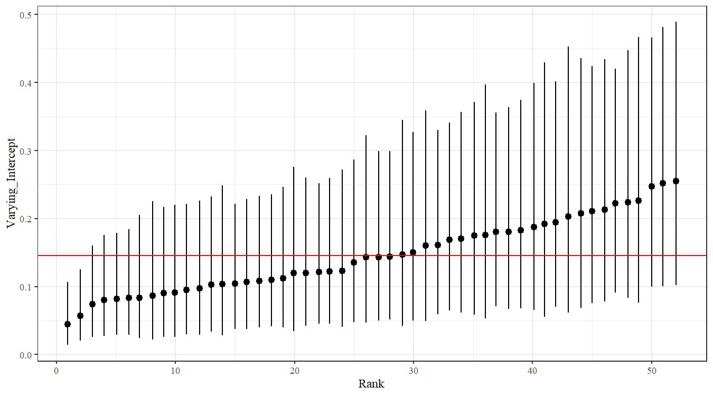

# Introduction: Instructor- or Section-level Effects in Program Evaluation

In the propensity score weight [vignette](./Ex-01-Propensity-Score-Weights-Using-GBM.html), we saw how one might evaluate a student support program using propensity scores to estimate the causal effects of the program.  The example used for illustration involves the `writing_center` data from the `IRexamples` package.  Briefly, the data set contains students' first enrollment/attempt in ENG 1, a first year college level writing course, over several years.  Students may choose to receive additional support outside of the classroom at the college's writing center by enrolling in a 0.5-unit writing center/conference support course.  Students may use the writing center as a study center where they have access to computers, dictionaries, thesauri, etc.  At the center, students may also schedule 1:1 conferences with the instructor on duty, to get assistance and/or feedback on their writing by bringing a writing prompt or draft of their paper.  Students registered for this support course are required to spend at least 12 hours in the center, and to have at least 2 formal conferences.

Suppose course success in ENG 1 is the outcome of interest.  As described in the previous vignette, a regression model comparing writing center enrollment to non-enrollment with adjustment variables or group comparisons weighted by propensity score weights are common approaches for evaluating the impact of the writing center on course success.  However, if we were to carefully consider the data sample and structure, we would recognize the natural clustering of students in sections taught by the same instructor.  This clustering may give rise to correlated data within a section or among students taught by the same instructor (i.e., non-independent observations).  Inferences obtained by the two aforementioned approaches may be flawed in that estimates for both the writing center impact and the associated standard errors may be inaccurate due to a violation of the independence assumption.

A natural first step that one might consider to account for clustering is to fit a Generalized Linear Model (GLM) with fixed effects for each section or each instructor (i.e., using section and/or instructor flags as adjustment variables).  Although intuitive and straightforward, this approach is usually not recommended in practice when the number of clusters are large and the number of observations in each cluster are small because there is insufficient data (small sample size) to estimate the large number of parameters (number of fixed effects plus other adjustment variables).  Those trained in econometrics may point to [de-meaning](https://www.econometrics-with-r.org/10-3-fixed-effects-regression.html) the outcome variable and adjustment variables in linear regression / ordinary least squares to avoid estimation of the fixed effects, but the mathematics do not work out as nicely in non-linear models such as GLM's with non-linear link functions.  In the writing center example, we have many sections, but most sections have less than 25 students, as seen below.

```R
library(IRexamples) # contains writing_center data
library(dplyr) # ease with data manipulations

# Load data
data(writing_center)

# Class size frequency
writing_center %>%
  group_by(Term, Section_ID) %>%
  tally %>%
  ungroup %>%
  rename(Class_Size=n) %>% 
  group_by(Class_Size) %>%
  tally %>%
  ungroup %>%
  rename(Num_Sections=n)
## # A tibble: 20 x 2
##    Class_Size Num_Sections
##         <int>        <int>
##  1         10            1
##  2         11            2
##  3         12            2
##  4         13            4
##  5         14            2
##  6         15            8
##  7         16            6
##  8         17           11
##  9         18           20
## 10         19           15
## 11         20           18
## 12         21           27
## 13         22           27
## 14         23           20
## 15         24           25
## 16         25           20
## 17         26            9
## 18         27            5
## 19         30            2
## 20         33            1
```

Popular methods that account for the classroom clustering or instructor-level effects include Generalized Linear Mixed Models (GLMM) and Generalized Estimating Equations (GEE; also refered to as *population-averaged* or *marginal mean* models).  Both are extensions of GLM, where the former incorporates random effects or latent variables to capture the effect of the clusters, and the latter assumes a correlation structure for students within a section or for students taught by the same instructor and allows for misspecification of the correlation structure since inference is based on robust standard errors.  In this vignette, we illustrate the use of Bayesian Multilevel Models (or Bayesian Hierarchical Models), which in essence will be a GLMM under a Bayesian framework.  We opt for this approach because estimation and inference under a Bayesian framework for GLMM is more numerically stable compared to a likelihood-based frequentist framework.  Moreover, the [rstanarm](https://CRAN.R-project.org/package=rstanarm) package in R allows for a convenient interface for complex models estimated using [Stan](https://mc-stan.org/), a robust statistical computing platform specializing in Hamiltonian Monte Carlo.  Additional details on how to use `rstanarm` for a Multilevel Model could be found in [this](https://mc-stan.org/users/documentation/case-studies/tutorial_rstanarm.html) tutorial.

# Example: GLM Not Accounting for Instructor-level Effects

Before we illustrate the use of Bayesian Multilevel Models, let's first illustrate how one would fit a GLM on course success using the writing center flag and some adjustment variables.  In particular, we will fit a logistic regression model (binary outcome with logit link function).  For those not familiar with the `writing_center` data, type `?writing_center` in the R console after loading the `IRexamples` package.

```R
fit_glm <- glm(Main_Course_SuccessFlag ~ 1 + Gender + Ethnicity + FirstGen + Military + FosterYouth + DSPS + FinAid + Units_Attempted_Beg_Of_Term + GPA_Beg_Of_Term + TermUnitsAttempted + K12_Student + First_Time_College_Student + Nonresident_Tuition_Exempt + International + Nonresident + Online + WR_Center
                             , data=writing_center
                             , family=binomial(link='logit')
              )
```

In the previous code, we call the `glm` function to model `Main_Course_SuccessFlag` as the outcome.  On the right hand side of `~` in the formula specification, `1` represents the intercept, and the remaining terms are predictors in our model.  The `WR_Center` variable is a flag indicating enrollment in the writing center, and the other predictors are adjustment variables in the model.  The `family=binomial(link='logit')` argument specifies a logistic regression model.  The results are stored in `fit_glm`, as seen below.

```R
# Model summary
summary(fit_glm)
## 
## Call:
## glm(formula = Main_Course_SuccessFlag ~ 1 + Gender + Ethnicity + 
##     FirstGen + Military + FosterYouth + DSPS + FinAid + Units_Attempted_Beg_Of_Term + 
##     GPA_Beg_Of_Term + TermUnitsAttempted + K12_Student + First_Time_College_Student + 
##     Nonresident_Tuition_Exempt + International + Nonresident + 
##     Online + WR_Center, family = binomial(link = "logit"), data = writing_center)
## 
## Deviance Residuals: 
##     Min       1Q   Median       3Q      Max  
## -3.2440   0.1614   0.4299   0.6654   2.3091  
## 
## Coefficients:
##                               Estimate Std. Error z value Pr(>|z|)    
## (Intercept)                  -2.067410   0.448125  -4.613 3.96e-06 ***
## GenderFemale                  0.144271   0.339512   0.425 0.670883    
## GenderMale                   -0.160479   0.338189  -0.475 0.635126    
## EthnicityAsian                0.524207   0.277177   1.891 0.058593 .  
## EthnicityDecline to State    -0.054581   0.364994  -0.150 0.881128    
## EthnicityHispanic / Latino   -0.286383   0.279436  -1.025 0.305428    
## EthnicityMixed Ethnicity      0.096240   0.275141   0.350 0.726502    
## EthnicityNative American     -0.557699   1.589359  -0.351 0.725667    
## EthnicityPacific Islander     0.352540   0.999109   0.353 0.724197    
## EthnicityWhite, Non-Hispanic  0.237113   0.272097   0.871 0.383521    
## FirstGen                     -0.089381   0.084427  -1.059 0.289745    
## Military                     -0.218572   0.259138  -0.843 0.398971    
## FosterYouth                   0.160135   0.525722   0.305 0.760671    
## DSPS                         -0.257622   0.136136  -1.892 0.058439 .  
## FinAid                       -0.037308   0.087455  -0.427 0.669671    
## Units_Attempted_Beg_Of_Term   0.004585   0.002835   1.617 0.105865    
## GPA_Beg_Of_Term               0.328934   0.035889   9.165  < 2e-16 ***
## TermUnitsAttempted            0.230946   0.009936  23.243  < 2e-16 ***
## K12_Student                   3.381302   1.014323   3.334 0.000857 ***
## First_Time_College_Student    0.574293   0.115087   4.990 6.04e-07 ***
## Nonresident_Tuition_Exempt    0.002794   0.206427   0.014 0.989200    
## International                -0.304306   0.176058  -1.728 0.083908 .  
## Nonresident                   0.609108   0.313673   1.942 0.052155 .  
## Online                       -0.106318   0.131146  -0.811 0.417550    
## WR_Center                     0.146165   0.095495   1.531 0.125869    
## ---
## Signif. codes:  0 '***' 0.001 '**' 0.01 '*' 0.05 '.' 0.1 ' ' 1
## 
## (Dispersion parameter for binomial family taken to be 1)
## 
##     Null deviance: 5093.0  on 4726  degrees of freedom
## Residual deviance: 4038.5  on 4702  degrees of freedom
## AIC: 4088.5
## 
## Number of Fisher Scoring iterations: 6

# Odds ratio
exp(coef(fit_glm))
##                  (Intercept)                 GenderFemale 
##                    0.1265130                    1.1551972 
##                   GenderMale               EthnicityAsian 
##                    0.8517358                    1.6891196 
##    EthnicityDecline to State   EthnicityHispanic / Latino 
##                    0.9468820                    0.7509747 
##     EthnicityMixed Ethnicity     EthnicityNative American 
##                    1.1010228                    0.5725249 
##    EthnicityPacific Islander EthnicityWhite, Non-Hispanic 
##                    1.4226770                    1.2675845 
##                     FirstGen                     Military 
##                    0.9144973                    0.8036652 
##                  FosterYouth                         DSPS 
##                    1.1736688                    0.7728871 
##                       FinAid  Units_Attempted_Beg_Of_Term 
##                    0.9633791                    1.0045957 
##              GPA_Beg_Of_Term           TermUnitsAttempted 
##                    1.3894856                    1.2597906 
##                  K12_Student   First_Time_College_Student 
##                   29.4090327                    1.7758748 
##   Nonresident_Tuition_Exempt                International 
##                    1.0027982                    0.7376349 
##                  Nonresident                       Online 
##                    1.8387905                    0.8991390 
##                    WR_Center 
##                    1.1573868

# Confidence intervals
exp(confint(fit_glm))
##                                   2.5 %      97.5 %
## (Intercept)                  0.05344506   0.3109644
## GenderFemale                 0.57568249   2.1945993
## GenderMale                   0.42544121   1.6134593
## EthnicityAsian               0.96774097   2.8768103
## EthnicityDecline to State    0.46106194   1.9333211
## EthnicityHispanic / Latino   0.42848656   1.2850283
## EthnicityMixed Ethnicity     0.63320071   1.8674079
## EthnicityNative American     0.02623404  18.5547001
## EthnicityPacific Islander    0.22844502  12.9140864
## EthnicityWhite, Non-Hispanic 0.73307162   2.1363931
## FirstGen                     0.77530262   1.0795289
## Military                     0.48965995   1.3565830
## FosterYouth                  0.44268324   3.5375731
## DSPS                         0.59319758   1.0118437
## FinAid                       0.81142847   1.1433340
## Units_Attempted_Beg_Of_Term  0.99907283   1.0102473
## GPA_Beg_Of_Term              1.29595582   1.4917834
## TermUnitsAttempted           1.23573581   1.2848293
## K12_Student                  6.33632156 523.9105661
## First_Time_College_Student   1.41833362   2.2271716
## Nonresident_Tuition_Exempt   0.67405801   1.5161891
## International                0.52422783   1.0460131
## Nonresident                  1.02646424   3.5383057
## Online                       0.69681674   1.1654993
## WR_Center                    0.96084736   1.3972699
```

---
# After adjusting for student demographic and background information, the odds ratio comparing those enrolled in the writing center to those not in the writing center is estimated to be `R round(exp(coef(fit_glm))['WR_Center'], 2)` (95% CI: `R round(exp(confint(fit_glm, 'WR_Center'))[1], 2)` -- `R round(exp(confint(fit_glm, 'WR_Center'))[2], 2)`).
---

After adjusting for student demographic and background information, the odds ratio comparing those enrolled in the writing center to those not in the writing center is estimated to be 1.16 (95% CI: 0.96 -- 1.40).

# Example: Bayesian Multilevel Model Accounting for Instructor-level Effects

In Bayesian inference, besides specifying a statistical model to represent and help answer a question of interest (e.g., logistic regression model), one also specifies a prior distribution for each model parameter (e.g., the regression coefficients, the outcome variance parameter, etc.).  A posterior distribution resulting from the likelihood of the statistical model and the prior distribution is used to draw statistical inference.  In nearly all non-trivial scenarios, inference is done by obtaining a random sample of the model parameters using the posterior distribution.  From this monte carlo sample, one could calculate the posterior mean, median, and quantiles for each parameter.  The posterior mean or median could be used as an estimate of each parameter, and the 2.5% and 97.5% quantiles could be used to construct 95% credible intervals for each parameter.

The `rstanarm` package allows users to fit a Bayesian GLMM or Bayesian Multilevel Model using the `stan_glmer` function, as illustrated below.  Due to the computational complexity of sampling from the posterior distribution, it is not unusual for the computer to run for 10 minutes before results are returned.

```R
library(rstanarm) # Load package for multilevel models

# Convert to factor instead of numeric
writing_center$Instructor_ID <- factor(writing_center$Instructor_ID)
writing_center$Section_ID <- factor(writing_center$Section_ID)

# Fit
fit_bhm <- stan_glmer(Main_Course_SuccessFlag ~ 1 + Gender + Ethnicity + FirstGen + Military + FosterYouth + DSPS + FinAid + Units_Attempted_Beg_Of_Term + GPA_Beg_Of_Term + TermUnitsAttempted + K12_Student + First_Time_College_Student + Nonresident_Tuition_Exempt + International + Nonresident + Online + WR_Center + (1 | Instructor_ID)
                  # + (1 | Section_ID) # If we wanted to include section mixed effects
                  , data=writing_center
                  , family=binomial(link='logit')
                  , seed=1000
                  # , prior=normal(0, 10, autoscale=FALSE)
                  , init_r=0.1
                  )
## 
## SAMPLING FOR MODEL 'bernoulli' NOW (CHAIN 1).
## Chain 1: 
## Chain 1: Gradient evaluation took 0.004 seconds
## Chain 1: 1000 transitions using 10 leapfrog steps per transition would take 40 seconds.
## Chain 1: Adjust your expectations accordingly!
## Chain 1: 
## Chain 1: 
## Chain 1: Iteration:    1 / 2000 [  0%]  (Warmup)
## Chain 1: Iteration:  200 / 2000 [ 10%]  (Warmup)
## Chain 1: Iteration:  400 / 2000 [ 20%]  (Warmup)
## Chain 1: Iteration:  600 / 2000 [ 30%]  (Warmup)
## Chain 1: Iteration:  800 / 2000 [ 40%]  (Warmup)
## Chain 1: Iteration: 1000 / 2000 [ 50%]  (Warmup)
## Chain 1: Iteration: 1001 / 2000 [ 50%]  (Sampling)
## Chain 1: Iteration: 1200 / 2000 [ 60%]  (Sampling)
## Chain 1: Iteration: 1400 / 2000 [ 70%]  (Sampling)
## Chain 1: Iteration: 1600 / 2000 [ 80%]  (Sampling)
## Chain 1: Iteration: 1800 / 2000 [ 90%]  (Sampling)
## Chain 1: Iteration: 2000 / 2000 [100%]  (Sampling)
## Chain 1: 
## Chain 1:  Elapsed Time: 156.267 seconds (Warm-up)
## Chain 1:                70.044 seconds (Sampling)
## Chain 1:                226.311 seconds (Total)
## Chain 1: 
## 
## SAMPLING FOR MODEL 'bernoulli' NOW (CHAIN 2).
## Chain 2: 
## Chain 2: Gradient evaluation took 0.002 seconds
## Chain 2: 1000 transitions using 10 leapfrog steps per transition would take 20 seconds.
## Chain 2: Adjust your expectations accordingly!
## Chain 2: 
## Chain 2: 
## Chain 2: Iteration:    1 / 2000 [  0%]  (Warmup)
## Chain 2: Iteration:  200 / 2000 [ 10%]  (Warmup)
## Chain 2: Iteration:  400 / 2000 [ 20%]  (Warmup)
## Chain 2: Iteration:  600 / 2000 [ 30%]  (Warmup)
## Chain 2: Iteration:  800 / 2000 [ 40%]  (Warmup)
## Chain 2: Iteration: 1000 / 2000 [ 50%]  (Warmup)
## Chain 2: Iteration: 1001 / 2000 [ 50%]  (Sampling)
## Chain 2: Iteration: 1200 / 2000 [ 60%]  (Sampling)
## Chain 2: Iteration: 1400 / 2000 [ 70%]  (Sampling)
## Chain 2: Iteration: 1600 / 2000 [ 80%]  (Sampling)
## Chain 2: Iteration: 1800 / 2000 [ 90%]  (Sampling)
## Chain 2: Iteration: 2000 / 2000 [100%]  (Sampling)
## Chain 2: 
## Chain 2:  Elapsed Time: 142.509 seconds (Warm-up)
## Chain 2:                73.586 seconds (Sampling)
## Chain 2:                216.095 seconds (Total)
## Chain 2: 
## 
## SAMPLING FOR MODEL 'bernoulli' NOW (CHAIN 3).
## Chain 3: 
## Chain 3: Gradient evaluation took 0.002 seconds
## Chain 3: 1000 transitions using 10 leapfrog steps per transition would take 20 seconds.
## Chain 3: Adjust your expectations accordingly!
## Chain 3: 
## Chain 3: 
## Chain 3: Iteration:    1 / 2000 [  0%]  (Warmup)
## Chain 3: Iteration:  200 / 2000 [ 10%]  (Warmup)
## Chain 3: Iteration:  400 / 2000 [ 20%]  (Warmup)
## Chain 3: Iteration:  600 / 2000 [ 30%]  (Warmup)
## Chain 3: Iteration:  800 / 2000 [ 40%]  (Warmup)
## Chain 3: Iteration: 1000 / 2000 [ 50%]  (Warmup)
## Chain 3: Iteration: 1001 / 2000 [ 50%]  (Sampling)
## Chain 3: Iteration: 1200 / 2000 [ 60%]  (Sampling)
## Chain 3: Iteration: 1400 / 2000 [ 70%]  (Sampling)
## Chain 3: Iteration: 1600 / 2000 [ 80%]  (Sampling)
## Chain 3: Iteration: 1800 / 2000 [ 90%]  (Sampling)
## Chain 3: Iteration: 2000 / 2000 [100%]  (Sampling)
## Chain 3: 
## Chain 3:  Elapsed Time: 238.512 seconds (Warm-up)
## Chain 3:                71.84 seconds (Sampling)
## Chain 3:                310.352 seconds (Total)
## Chain 3: 
## 
## SAMPLING FOR MODEL 'bernoulli' NOW (CHAIN 4).
## Chain 4: 
## Chain 4: Gradient evaluation took 0.002 seconds
## Chain 4: 1000 transitions using 10 leapfrog steps per transition would take 20 seconds.
## Chain 4: Adjust your expectations accordingly!
## Chain 4: 
## Chain 4: 
## Chain 4: Iteration:    1 / 2000 [  0%]  (Warmup)
## Chain 4: Iteration:  200 / 2000 [ 10%]  (Warmup)
## Chain 4: Iteration:  400 / 2000 [ 20%]  (Warmup)
## Chain 4: Iteration:  600 / 2000 [ 30%]  (Warmup)
## Chain 4: Iteration:  800 / 2000 [ 40%]  (Warmup)
## Chain 4: Iteration: 1000 / 2000 [ 50%]  (Warmup)
## Chain 4: Iteration: 1001 / 2000 [ 50%]  (Sampling)
## Chain 4: Iteration: 1200 / 2000 [ 60%]  (Sampling)
## Chain 4: Iteration: 1400 / 2000 [ 70%]  (Sampling)
## Chain 4: Iteration: 1600 / 2000 [ 80%]  (Sampling)
## Chain 4: Iteration: 1800 / 2000 [ 90%]  (Sampling)
## Chain 4: Iteration: 2000 / 2000 [100%]  (Sampling)
## Chain 4: 
## Chain 4:  Elapsed Time: 243.786 seconds (Warm-up)
## Chain 4:                92.942 seconds (Sampling)
## Chain 4:                336.728 seconds (Total)
## Chain 4:
```

The interface to `stan_glmer` is quite similar to that of `glm`.  In the formula argument, we use the exact same specification as before, but add `(1 | Instructor_ID)` on the right hand side of the of `~`.  This specifies a random intercept on `Instructor_ID`, which is a random effect at the instructor level and accounts for correlation among students taught by the same instructor.  The user could also specify a random effect on the section instead of the instructor by adding `(1 | Section_ID)`, or specify random effects for both instructors and sections with `(1 | Instructor_ID) + (1 | Section_ID)`.  For the purpose of this vignette and the writing center example, we focus on instructor-level effects, as specified by `(1 | Instructor_ID)`.

The `seed` argument ensures reproducibility of the results as inference is based on monte carlo samples (data sampled from the posterior distribution of the model).  The default `prior` argument is used, but could be modified if the user wishes to impose an informative prior on the parameters in the model.  The `init_r` argument helps to start sampling from the posterior distribution (without specifying this, errrors may arise).

Once a monte carlo sample is obtained from `stan_glmer`, we could obtain a summary of the results with the following:

```R
# Summary of all parameters
summary(fit_bhm)
## 
## Model Info:
##  function:     stan_glmer
##  family:       binomial [logit]
##  formula:      Main_Course_SuccessFlag ~ 1 + Gender + Ethnicity + FirstGen + 
##     Military + FosterYouth + DSPS + FinAid + Units_Attempted_Beg_Of_Term + 
##     GPA_Beg_Of_Term + TermUnitsAttempted + K12_Student + First_Time_College_Student + 
##     Nonresident_Tuition_Exempt + International + Nonresident + 
##     Online + WR_Center + (1 | Instructor_ID)
##  algorithm:    sampling
##  sample:       4000 (posterior sample size)
##  priors:       see help('prior_summary')
##  observations: 4727
##  groups:       Instructor_ID (52)
## 
## Estimates:
##                                                mean   sd   10%   50%   90%
## (Intercept)                                  -1.9    0.5 -2.6  -2.0  -1.3 
## GenderFemale                                  0.0    0.3 -0.4   0.0   0.5 
## GenderMale                                   -0.3    0.3 -0.7  -0.3   0.2 
## EthnicityAsian                                0.4    0.3  0.1   0.4   0.8 
## EthnicityDecline to State                    -0.1    0.4 -0.6  -0.1   0.4 
## EthnicityHispanic / Latino                   -0.3    0.3 -0.7  -0.3   0.1 
## EthnicityMixed Ethnicity                      0.1    0.3 -0.3   0.1   0.4 
## EthnicityNative American                     -0.5    1.8 -2.6  -0.6   1.7 
## EthnicityPacific Islander                     0.4    1.1 -0.9   0.4   1.8 
## EthnicityWhite, Non-Hispanic                  0.2    0.3 -0.2   0.2   0.6 
## FirstGen                                     -0.1    0.1 -0.2  -0.1   0.0 
## Military                                     -0.2    0.3 -0.6  -0.2   0.1 
## FosterYouth                                   0.2    0.6 -0.6   0.1   0.9 
## DSPS                                         -0.3    0.1 -0.5  -0.3  -0.1 
## FinAid                                       -0.1    0.1 -0.2  -0.1   0.1 
## Units_Attempted_Beg_Of_Term                   0.0    0.0  0.0   0.0   0.0 
## GPA_Beg_Of_Term                               0.3    0.0  0.3   0.3   0.4 
## TermUnitsAttempted                            0.2    0.0  0.2   0.2   0.3 
## K12_Student                                   4.0    1.3  2.6   3.8   5.6 
## First_Time_College_Student                    0.6    0.1  0.5   0.6   0.8 
## Nonresident_Tuition_Exempt                    0.0    0.2 -0.3   0.0   0.2 
## International                                -0.3    0.2 -0.6  -0.3  -0.1 
## Nonresident                                   0.7    0.3  0.3   0.7   1.1 
## Online                                       -0.3    0.2 -0.5  -0.3   0.0 
## WR_Center                                     0.3    0.1  0.2   0.3   0.4 
## b[(Intercept) Instructor_ID:910]             -0.2    0.3 -0.6  -0.2   0.1 
## b[(Intercept) Instructor_ID:1210]             0.3    0.3 -0.1   0.3   0.7 
## b[(Intercept) Instructor_ID:1515]            -1.0    0.2 -1.2  -1.0  -0.7 
## b[(Intercept) Instructor_ID:1597]             0.5    0.4  0.0   0.5   1.0 
## b[(Intercept) Instructor_ID:1612]            -0.2    0.2 -0.5  -0.2   0.0 
## b[(Intercept) Instructor_ID:1649]             0.0    0.3 -0.3   0.0   0.3 
## b[(Intercept) Instructor_ID:1658]            -0.6    0.2 -0.9  -0.6  -0.3 
## b[(Intercept) Instructor_ID:1660]            -0.3    0.3 -0.8  -0.3   0.1 
## b[(Intercept) Instructor_ID:1672]             0.1    0.3 -0.3   0.1   0.5 
## b[(Intercept) Instructor_ID:1833]            -0.3    0.2 -0.6  -0.3   0.0 
## b[(Intercept) Instructor_ID:1900]             0.8    0.3  0.4   0.8   1.2 
## b[(Intercept) Instructor_ID:1938]             0.4    0.3  0.0   0.4   0.7 
## b[(Intercept) Instructor_ID:1953]             0.6    0.3  0.3   0.6   1.0 
## b[(Intercept) Instructor_ID:1980]             0.0    0.4 -0.4   0.0   0.5 
## b[(Intercept) Instructor_ID:2001]            -0.6    0.2 -0.8  -0.6  -0.3 
## b[(Intercept) Instructor_ID:2017]             0.6    0.2  0.3   0.6   0.9 
## b[(Intercept) Instructor_ID:2019]             0.6    0.3  0.1   0.5   1.0 
## b[(Intercept) Instructor_ID:2029]             0.5    0.3  0.1   0.5   1.0 
## b[(Intercept) Instructor_ID:2034]            -0.2    0.4 -0.7  -0.2   0.3 
## b[(Intercept) Instructor_ID:2038]             0.3    0.3 -0.1   0.3   0.6 
## b[(Intercept) Instructor_ID:2156]             0.2    0.4 -0.3   0.2   0.7 
## b[(Intercept) Instructor_ID:2292]             0.1    0.4 -0.5   0.1   0.6 
## b[(Intercept) Instructor_ID:2293]            -0.5    0.4 -1.0  -0.5   0.0 
## b[(Intercept) Instructor_ID:2321]            -0.1    0.2 -0.4  -0.1   0.1 
## b[(Intercept) Instructor_ID:2350]            -0.6    0.4 -1.1  -0.6  -0.1 
## b[(Intercept) Instructor_ID:2351]             0.2    0.3 -0.1   0.2   0.5 
## b[(Intercept) Instructor_ID:2357]             0.1    0.3 -0.3   0.1   0.4 
## b[(Intercept) Instructor_ID:2358]            -0.5    0.4 -1.0  -0.5   0.0 
## b[(Intercept) Instructor_ID:3272]             0.8    0.3  0.4   0.8   1.1 
## b[(Intercept) Instructor_ID:3316]            -0.4    0.3 -0.9  -0.4   0.0 
## b[(Intercept) Instructor_ID:3380]             0.3    0.4 -0.3   0.3   0.8 
## b[(Intercept) Instructor_ID:3598]             0.6    0.4  0.1   0.6   1.1 
## b[(Intercept) Instructor_ID:3984]             0.1    0.3 -0.3   0.1   0.4 
## b[(Intercept) Instructor_ID:4550]            -0.3    0.3 -0.6  -0.3   0.1 
## b[(Intercept) Instructor_ID:4776]            -0.1    0.3 -0.5  -0.1   0.3 
## b[(Intercept) Instructor_ID:5224]            -0.7    0.2 -1.0  -0.7  -0.4 
## b[(Intercept) Instructor_ID:6216]            -0.6    0.5 -1.2  -0.6   0.0 
## b[(Intercept) Instructor_ID:7882]             0.4    0.3  0.0   0.4   0.8 
## b[(Intercept) Instructor_ID:8450]             0.4    0.5 -0.2   0.4   1.0 
## b[(Intercept) Instructor_ID:8483]            -0.1    0.2 -0.4  -0.1   0.1 
## b[(Intercept) Instructor_ID:8605]            -0.3    0.2 -0.6  -0.3   0.0 
## b[(Intercept) Instructor_ID:8722]            -0.4    0.4 -0.9  -0.4   0.1 
## b[(Intercept) Instructor_ID:8735]            -0.1    0.3 -0.5  -0.1   0.2 
## b[(Intercept) Instructor_ID:8816]            -1.3    0.3 -1.6  -1.2  -0.9 
## b[(Intercept) Instructor_ID:8975]            -0.6    0.2 -0.8  -0.6  -0.3 
## b[(Intercept) Instructor_ID:9014]             0.4    0.3  0.0   0.4   0.8 
## b[(Intercept) Instructor_ID:9102]            -0.4    0.3 -0.8  -0.4   0.0 
## b[(Intercept) Instructor_ID:9412]             0.3    0.2  0.0   0.3   0.6 
## b[(Intercept) Instructor_ID:9569]             0.8    0.3  0.4   0.8   1.2 
## b[(Intercept) Instructor_ID:9589]             0.4    0.3  0.0   0.3   0.7 
## b[(Intercept) Instructor_ID:9927]             0.5    0.4 -0.1   0.5   1.0 
## b[(Intercept) Instructor_ID:9935]             0.4    0.2  0.1   0.4   0.7 
## Sigma[Instructor_ID:(Intercept),(Intercept)]  0.3    0.1  0.2   0.3   0.5 
## 
## Fit Diagnostics:
##            mean   sd   10%   50%   90%
## mean_PPD 0.8    0.0  0.8   0.8   0.8  
## 
## The mean_ppd is the sample average posterior predictive distribution of the outcome variable (for details see help('summary.stanreg')).
## 
## MCMC diagnostics
##                                              mcse Rhat n_eff
## (Intercept)                                  0.0  1.0  1740 
## GenderFemale                                 0.0  1.0  2937 
## GenderMale                                   0.0  1.0  2954 
## EthnicityAsian                               0.0  1.0  1188 
## EthnicityDecline to State                    0.0  1.0  1639 
## EthnicityHispanic / Latino                   0.0  1.0  1222 
## EthnicityMixed Ethnicity                     0.0  1.0  1170 
## EthnicityNative American                     0.0  1.0  5255 
## EthnicityPacific Islander                    0.0  1.0  4188 
## EthnicityWhite, Non-Hispanic                 0.0  1.0  1149 
## FirstGen                                     0.0  1.0  6328 
## Military                                     0.0  1.0  6401 
## FosterYouth                                  0.0  1.0  6846 
## DSPS                                         0.0  1.0  5501 
## FinAid                                       0.0  1.0  5786 
## Units_Attempted_Beg_Of_Term                  0.0  1.0  4688 
## GPA_Beg_Of_Term                              0.0  1.0  3500 
## TermUnitsAttempted                           0.0  1.0  6135 
## K12_Student                                  0.0  1.0  3266 
## First_Time_College_Student                   0.0  1.0  3393 
## Nonresident_Tuition_Exempt                   0.0  1.0  7035 
## International                                0.0  1.0  6159 
## Nonresident                                  0.0  1.0  6218 
## Online                                       0.0  1.0  3504 
## WR_Center                                    0.0  1.0  4820 
## b[(Intercept) Instructor_ID:910]             0.0  1.0  4503 
## b[(Intercept) Instructor_ID:1210]            0.0  1.0  4997 
## b[(Intercept) Instructor_ID:1515]            0.0  1.0  2714 
## b[(Intercept) Instructor_ID:1597]            0.0  1.0  5064 
## b[(Intercept) Instructor_ID:1612]            0.0  1.0  2940 
## b[(Intercept) Instructor_ID:1649]            0.0  1.0  4047 
## b[(Intercept) Instructor_ID:1658]            0.0  1.0  3558 
## b[(Intercept) Instructor_ID:1660]            0.0  1.0  5576 
## b[(Intercept) Instructor_ID:1672]            0.0  1.0  5086 
## b[(Intercept) Instructor_ID:1833]            0.0  1.0  3120 
## b[(Intercept) Instructor_ID:1900]            0.0  1.0  4697 
## b[(Intercept) Instructor_ID:1938]            0.0  1.0  3602 
## b[(Intercept) Instructor_ID:1953]            0.0  1.0  4839 
## b[(Intercept) Instructor_ID:1980]            0.0  1.0  5923 
## b[(Intercept) Instructor_ID:2001]            0.0  1.0  3518 
## b[(Intercept) Instructor_ID:2017]            0.0  1.0  4116 
## b[(Intercept) Instructor_ID:2019]            0.0  1.0  5321 
## b[(Intercept) Instructor_ID:2029]            0.0  1.0  4585 
## b[(Intercept) Instructor_ID:2034]            0.0  1.0  6708 
## b[(Intercept) Instructor_ID:2038]            0.0  1.0  4102 
## b[(Intercept) Instructor_ID:2156]            0.0  1.0  4735 
## b[(Intercept) Instructor_ID:2292]            0.0  1.0  6324 
## b[(Intercept) Instructor_ID:2293]            0.0  1.0  5567 
## b[(Intercept) Instructor_ID:2321]            0.0  1.0  3456 
## b[(Intercept) Instructor_ID:2350]            0.0  1.0  3600 
## b[(Intercept) Instructor_ID:2351]            0.0  1.0  3842 
## b[(Intercept) Instructor_ID:2357]            0.0  1.0  4300 
## b[(Intercept) Instructor_ID:2358]            0.0  1.0  4845 
## b[(Intercept) Instructor_ID:3272]            0.0  1.0  4234 
## b[(Intercept) Instructor_ID:3316]            0.0  1.0  5221 
## b[(Intercept) Instructor_ID:3380]            0.0  1.0  7226 
## b[(Intercept) Instructor_ID:3598]            0.0  1.0  5157 
## b[(Intercept) Instructor_ID:3984]            0.0  1.0  4942 
## b[(Intercept) Instructor_ID:4550]            0.0  1.0  4254 
## b[(Intercept) Instructor_ID:4776]            0.0  1.0  4796 
## b[(Intercept) Instructor_ID:5224]            0.0  1.0  3771 
## b[(Intercept) Instructor_ID:6216]            0.0  1.0  5737 
## b[(Intercept) Instructor_ID:7882]            0.0  1.0  4378 
## b[(Intercept) Instructor_ID:8450]            0.0  1.0  5625 
## b[(Intercept) Instructor_ID:8483]            0.0  1.0  2983 
## b[(Intercept) Instructor_ID:8605]            0.0  1.0  3646 
## b[(Intercept) Instructor_ID:8722]            0.0  1.0  5696 
## b[(Intercept) Instructor_ID:8735]            0.0  1.0  4644 
## b[(Intercept) Instructor_ID:8816]            0.0  1.0  3706 
## b[(Intercept) Instructor_ID:8975]            0.0  1.0  3220 
## b[(Intercept) Instructor_ID:9014]            0.0  1.0  5408 
## b[(Intercept) Instructor_ID:9102]            0.0  1.0  5009 
## b[(Intercept) Instructor_ID:9412]            0.0  1.0  3965 
## b[(Intercept) Instructor_ID:9569]            0.0  1.0  4778 
## b[(Intercept) Instructor_ID:9589]            0.0  1.0  4091 
## b[(Intercept) Instructor_ID:9927]            0.0  1.0  5488 
## b[(Intercept) Instructor_ID:9935]            0.0  1.0  3706 
## Sigma[Instructor_ID:(Intercept),(Intercept)] 0.0  1.0  1230 
## mean_PPD                                     0.0  1.0  3934 
## log-posterior                                0.3  1.0   932 
## 
## For each parameter, mcse is Monte Carlo standard error, n_eff is a crude measure of effective sample size, and Rhat is the potential scale reduction factor on split chains (at convergence Rhat=1).

# Focus on WR_Center coefficient
summary(fit_bhm
        , pars = c('WR_Center')
        , probs = c(0.025, 0.5, 0.975)
        , digits = 2
        )
## 
## Model Info:
##  function:     stan_glmer
##  family:       binomial [logit]
##  formula:      Main_Course_SuccessFlag ~ 1 + Gender + Ethnicity + FirstGen + 
##     Military + FosterYouth + DSPS + FinAid + Units_Attempted_Beg_Of_Term + 
##     GPA_Beg_Of_Term + TermUnitsAttempted + K12_Student + First_Time_College_Student + 
##     Nonresident_Tuition_Exempt + International + Nonresident + 
##     Online + WR_Center + (1 | Instructor_ID)
##  algorithm:    sampling
##  sample:       4000 (posterior sample size)
##  priors:       see help('prior_summary')
##  observations: 4727
##  groups:       Instructor_ID (52)
## 
## Estimates:
##             mean   sd   2.5%   50%   97.5%
## WR_Center 0.30   0.11 0.09   0.30  0.51   
## 
## MCMC diagnostics
##           mcse Rhat n_eff
## WR_Center 0.00 1.00 4820 
## 
## For each parameter, mcse is Monte Carlo standard error, n_eff is a crude measure of effective sample size, and Rhat is the potential scale reduction factor on split chains (at convergence Rhat=1).
```

In the next set of code, we extract the simulated draws and summarize them for our own needs (e.g., inference on the odds ratio comparing writing center to no writing center).

```R
sims <- as.matrix(fit_bhm) # Extract random draws
dim(sims) # Columns are parameters, rows are observations from MCMC
## [1] 4000   78

colnames(sims) # Each column contains draws for a model parameter
##  [1] "(Intercept)"                                 
##  [2] "GenderFemale"                                
##  [3] "GenderMale"                                  
##  [4] "EthnicityAsian"                              
##  [5] "EthnicityDecline to State"                   
##  [6] "EthnicityHispanic / Latino"                  
##  [7] "EthnicityMixed Ethnicity"                    
##  [8] "EthnicityNative American"                    
##  [9] "EthnicityPacific Islander"                   
## [10] "EthnicityWhite, Non-Hispanic"                
## [11] "FirstGen"                                    
## [12] "Military"                                    
## [13] "FosterYouth"                                 
## [14] "DSPS"                                        
## [15] "FinAid"                                      
## [16] "Units_Attempted_Beg_Of_Term"                 
## [17] "GPA_Beg_Of_Term"                             
## [18] "TermUnitsAttempted"                          
## [19] "K12_Student"                                 
## [20] "First_Time_College_Student"                  
## [21] "Nonresident_Tuition_Exempt"                  
## [22] "International"                               
## [23] "Nonresident"                                 
## [24] "Online"                                      
## [25] "WR_Center"                                   
## [26] "b[(Intercept) Instructor_ID:910]"            
## [27] "b[(Intercept) Instructor_ID:1210]"           
## [28] "b[(Intercept) Instructor_ID:1515]"           
## [29] "b[(Intercept) Instructor_ID:1597]"           
## [30] "b[(Intercept) Instructor_ID:1612]"           
## [31] "b[(Intercept) Instructor_ID:1649]"           
## [32] "b[(Intercept) Instructor_ID:1658]"           
## [33] "b[(Intercept) Instructor_ID:1660]"           
## [34] "b[(Intercept) Instructor_ID:1672]"           
## [35] "b[(Intercept) Instructor_ID:1833]"           
## [36] "b[(Intercept) Instructor_ID:1900]"           
## [37] "b[(Intercept) Instructor_ID:1938]"           
## [38] "b[(Intercept) Instructor_ID:1953]"           
## [39] "b[(Intercept) Instructor_ID:1980]"           
## [40] "b[(Intercept) Instructor_ID:2001]"           
## [41] "b[(Intercept) Instructor_ID:2017]"           
## [42] "b[(Intercept) Instructor_ID:2019]"           
## [43] "b[(Intercept) Instructor_ID:2029]"           
## [44] "b[(Intercept) Instructor_ID:2034]"           
## [45] "b[(Intercept) Instructor_ID:2038]"           
## [46] "b[(Intercept) Instructor_ID:2156]"           
## [47] "b[(Intercept) Instructor_ID:2292]"           
## [48] "b[(Intercept) Instructor_ID:2293]"           
## [49] "b[(Intercept) Instructor_ID:2321]"           
## [50] "b[(Intercept) Instructor_ID:2350]"           
## [51] "b[(Intercept) Instructor_ID:2351]"           
## [52] "b[(Intercept) Instructor_ID:2357]"           
## [53] "b[(Intercept) Instructor_ID:2358]"           
## [54] "b[(Intercept) Instructor_ID:3272]"           
## [55] "b[(Intercept) Instructor_ID:3316]"           
## [56] "b[(Intercept) Instructor_ID:3380]"           
## [57] "b[(Intercept) Instructor_ID:3598]"           
## [58] "b[(Intercept) Instructor_ID:3984]"           
## [59] "b[(Intercept) Instructor_ID:4550]"           
## [60] "b[(Intercept) Instructor_ID:4776]"           
## [61] "b[(Intercept) Instructor_ID:5224]"           
## [62] "b[(Intercept) Instructor_ID:6216]"           
## [63] "b[(Intercept) Instructor_ID:7882]"           
## [64] "b[(Intercept) Instructor_ID:8450]"           
## [65] "b[(Intercept) Instructor_ID:8483]"           
## [66] "b[(Intercept) Instructor_ID:8605]"           
## [67] "b[(Intercept) Instructor_ID:8722]"           
## [68] "b[(Intercept) Instructor_ID:8735]"           
## [69] "b[(Intercept) Instructor_ID:8816]"           
## [70] "b[(Intercept) Instructor_ID:8975]"           
## [71] "b[(Intercept) Instructor_ID:9014]"           
## [72] "b[(Intercept) Instructor_ID:9102]"           
## [73] "b[(Intercept) Instructor_ID:9412]"           
## [74] "b[(Intercept) Instructor_ID:9569]"           
## [75] "b[(Intercept) Instructor_ID:9589]"           
## [76] "b[(Intercept) Instructor_ID:9927]"           
## [77] "b[(Intercept) Instructor_ID:9935]"           
## [78] "Sigma[Instructor_ID:(Intercept),(Intercept)]"

# Odds ratio of WR_Center
OR_WR_Center <- exp(sims[, 'WR_Center'])

mean(OR_WR_Center) ## Mean of OR_WR_Center
## [1] 1.35359

median(OR_WR_Center) ## Median of OR_WR_Center
## [1] 1.347018

quantile(OR_WR_Center, c(0.025, 0.975)) ## 95% credible interval
##     2.5%    97.5% 
## 1.099113 1.657074
```

---
# The above results show the odds ratio estimate and credible intervals for the impact of the writing center accounting for both the adjustment variables and the instructor-level effects.  That is, after adjusting for the student background characteristics (those listed in the model) and instructor-level effects, **those that enrolled in the writing center are associated with a `R round(mean(OR_WR_Center), 2)`-fold increase in the odds for course success in ENG 1 compared to those not enrolled in the writing center (95% credible interval: `R round(quantile(OR_WR_Center, 0.025), 2)` -- `R round(quantile(OR_WR_Center, 0.975), 2)`)**.
---

The above results show the odds ratio estimate and credible intervals for the impact of the writing center accounting for both the adjustment variables and the instructor-level effects.  That is, after adjusting for the student background characteristics (those listed in the model) and instructor-level effects, **those that enrolled in the writing center are associated with a 1.35-fold increase in the odds for course success in ENG 1 compared to those not enrolled in the writing center (95% credible interval: 1.10 -- 1.66**.

The following table compares the estimated odds ratios from GLM and Bayesian Multi-level Model:

---
# ```{r echo=FALSE, results='asis'}
# library(knitr)
# d_results <- tibble(Model=c('GLM', 'Bayesian Multi-level Model')
#                   , `Odds Ratio: WR Center vs. Not`=c(exp(coef(fit_glm))['WR_Center'], mean(OR_WR_Center))
#                     , `Lower Limit`=c(exp(confint(fit_glm, 'WR_Center'))[1], quantile(OR_WR_Center, 0.025))
#                     , `Upper Limit`=c(exp(confint(fit_glm, 'WR_Center'))[2], quantile(OR_WR_Center, 0.975))
#                     )
# kable(d_results)
# ```
---

|Model|Odds Ratio: WR Center vs. Not|Lower Limit|Upper Limit|
| --- | --- | --- | --- |
| GLM | 1.16 | 0.96 | 1.40 |
| Bayesian Multi-level Model | 1.35 | 1.10 | 1.66 |

## Illustration: Range in Instructor Effects Based on Model

The following shows the different instructor-level intercepts based on the fitted Bayesian GLMM, which further supports the case for accounting for instructor-level effects when evaluating the writing center program.

```R
library(ggplot2)
library(ggthemes)

# Extract simulations for intercept
mu_a_sims <- as.matrix(fit_bhm, pars='(Intercept)')

# Extract simulations for instructor-level intercepts
u_sims <- as.matrix(fit_bhm, regex_pars='\\(Intercept\\) Instructor_ID')

# Combine intercepts
a_sims <- as.numeric(mu_a_sims) + u_sims

# Store mean and quantiles as data frame
a_df <- data.frame(Varying_Intercept=apply(binomial(link='logit')$linkinv(a_sims), 2, mean)
                   , Q2.5=apply(binomial(link='logit')$linkinv(a_sims), 2, quantile, 0.025)
                   , Q97.5=apply(binomial(link='logit')$linkinv(a_sims), 2, quantile, 0.975)
           ) %>%
  mutate(Rank=rank(Varying_Intercept))
```

---
# ```{r, fig.width=7, fig.height=5}
# # Plot instructor-level alphas's posterior mean and 95% credible interval
# ggplot(data = a_df, aes(x = Rank, y = Varying_Intercept)) +
#   geom_pointrange(aes(ymin = Q2.5, ymax = Q97.5), position = position_jitter(width = 0.1, height = 0)) + 
#   geom_hline(yintercept = mean(a_df$Varying_Intercept), size = 0.5, col = "red") + 
#   # scale_x_continuous("Rank", breaks = seq(from = 0, to = 80, by = 5)) + 
#   # scale_y_continuous(expression(paste("varying intercept, ", alpha[j]))) + 
#   theme_bw( base_family = "serif")
# ```
---

```R
# Plot instructor-level alphas's posterior mean and 95% credible interval
ggplot(data = a_df, aes(x = Rank, y = Varying_Intercept)) +
  geom_pointrange(aes(ymin = Q2.5, ymax = Q97.5), position = position_jitter(width = 0.1, height = 0)) + 
  geom_hline(yintercept = mean(a_df$Varying_Intercept), size = 0.5, col = "red") + 
  # scale_x_continuous("Rank", breaks = seq(from = 0, to = 80, by = 5)) + 
  # scale_y_continuous(expression(paste("varying intercept, ", alpha[j]))) + 
  theme_bw( base_family = "serif")
#dev.copy(png, filename='instructor_plot.png', width=9, height=5, units='in', res=150)
#dev.off()
```
<!--  -->
<!-- {width=100%} -->
<!-- {width=100%} -->
{width=100%}

# References and Further Reading

- [*Mixed-effects modeling with R*](https://lme4.r-forge.r-project.org/book/) by Douglas Bates
- [*Data Analysis Using Regression and Multilevel/Hierarchical Models*](http://www.stat.columbia.edu/~gelman/arm/) by Andrew Gelman and Jennifer Hill

# Appendix: R and R Package Versions

This vignette was generated using an R session with the following packages.  There may be some discrepancies when the reader replicates the code caused by version mismatch.

```R
sessionInfo()
## R version 4.0.2 (2020-06-22)
## Platform: x86_64-w64-mingw32/x64 (64-bit)
## Running under: Windows 10 x64 (build 17763)
## 
## Matrix products: default
## 
## locale:
## [1] LC_COLLATE=English_United States.1252 
## [2] LC_CTYPE=English_United States.1252   
## [3] LC_MONETARY=English_United States.1252
## [4] LC_NUMERIC=C                          
## [5] LC_TIME=English_United States.1252    
## 
## attached base packages:
## [1] stats     graphics  grDevices utils     datasets  methods   base     
## 
## other attached packages:
## [1] ggthemes_4.2.4       ggplot2_3.3.3        knitr_1.33          
## [4] rstanarm_2.21.1      Rcpp_1.0.6           dplyr_1.0.6         
## [7] IRexamples_0.0.1     RevoUtils_11.0.2     RevoUtilsMath_11.0.0
## 
## loaded via a namespace (and not attached):
##  [1] nlme_3.1-152         matrixStats_0.59.0   xts_0.12.1          
##  [4] threejs_0.3.3        rstan_2.21.2         tools_4.0.2         
##  [7] bslib_0.2.5.1        utf8_1.2.1           R6_2.5.0            
## [10] DT_0.18              colorspace_2.0-1     withr_2.4.2         
## [13] tidyselect_1.1.1     gridExtra_2.3        prettyunits_1.1.1   
## [16] processx_3.5.2       curl_4.3.1           compiler_4.0.2      
## [19] cli_2.5.0            shinyjs_2.0.0        labeling_0.4.2      
## [22] colourpicker_1.1.0   sass_0.4.0           scales_1.1.1        
## [25] dygraphs_1.1.1.6     ggridges_0.5.3       callr_3.7.0         
## [28] stringr_1.4.0        digest_0.6.27        StanHeaders_2.21.0-7
## [31] minqa_1.2.4          rmarkdown_2.9        base64enc_0.1-3     
## [34] pkgconfig_2.0.3      htmltools_0.5.1.1    lme4_1.1-27         
## [37] highr_0.9            fastmap_1.1.0        htmlwidgets_1.5.3   
## [40] rlang_0.4.11         rstudioapi_0.13      shiny_1.6.0         
## [43] farver_2.1.0         jquerylib_0.1.4      generics_0.1.0      
## [46] zoo_1.8-9            jsonlite_1.7.2       crosstalk_1.1.1     
## [49] gtools_3.9.2         inline_0.3.19        magrittr_2.0.1      
## [52] loo_2.4.1            bayesplot_1.8.1      Matrix_1.3-4        
## [55] munsell_0.5.0        fansi_0.5.0          lifecycle_1.0.0     
## [58] stringi_1.4.6        yaml_2.2.1           MASS_7.3-54         
## [61] pkgbuild_1.2.0       plyr_1.8.6           grid_4.0.2          
## [64] parallel_4.0.2       promises_1.2.0.1     crayon_1.4.1        
## [67] miniUI_0.1.1.1       lattice_0.20-44      splines_4.0.2       
## [70] ps_1.6.0             pillar_1.6.1         igraph_1.2.6        
## [73] boot_1.3-28          markdown_1.1         shinystan_2.5.0     
## [76] reshape2_1.4.4       codetools_0.2-18     stats4_4.0.2        
## [79] rstantools_2.1.1     glue_1.4.2           evaluate_0.14       
## [82] V8_3.4.2             RcppParallel_5.1.4   nloptr_1.2.2.2      
## [85] vctrs_0.3.8          httpuv_1.6.1         gtable_0.3.0        
## [88] purrr_0.3.4          xfun_0.23            mime_0.10           
## [91] xtable_1.8-4         later_1.2.0          survival_3.2-11     
## [94] rsconnect_0.8.18     tibble_3.1.2         shinythemes_1.2.0   
## [97] ellipsis_0.3.2
```
