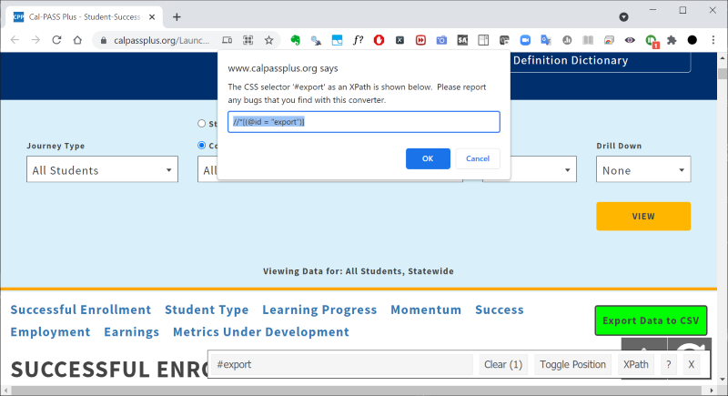

# Introduction: Webscraping

Institutional research (IR) professionals often times rely on external sources of data in addition to internal data.  For example, IR professionals in the California Community College (CCC) system may be interested in data provided by the state's Chancellor's Office (CO) such as those on the [Student Success Metrics](https://www.calpassplus.org/LaunchBoard/Student-Success-Metrics.aspx) (SSM), [Data Mart](https://datamart.cccco.edu/Default.aspx), [Scorecard](https://scorecard.cccco.edu/scorecard.aspx), or [Launchboard](https://www.calpassplus.org/LaunchBoard/Home.aspx).  In addition, they may be interested in data provided by the California State University (CSU; e.g., the CSU [admissions dashboard](https://www2.calstate.edu/data-center/institutional-research-analyses/Pages/applications-and-admissions.aspx)) or the University of California (UC; e.g., the UC [admissions dashboard](https://www.universityofcalifornia.edu/about-us/information-center/admissions-source-school)).

These external data sources provide rich and useful information via their online interfaces, but sometimes there may be a need to download the raw data files for the information to be presented in a different manner, combined with other sources, or analyzed further.  For example, achievement data could be downloaded for all colleges in order for an institution to benchmark itself against other institutions as this view is not offered online.

In this vignette, we illustrate how to leverage R to webscrape (automatically download) online data files.  Think of webscraping as launching a web browser that one could navigate and command using a set of instructions (code) instead of manually moving the mouse/trackpad and clicking on links/buttons.  Although initially effortful, scripting the download process allows one to re-run the download process at future dates with minimal effort.  The payoff is especially worthwhile if the download process involves a lot of files at each run (e.g., 116 files, one for each CCC, or lots of iterations based on various dropdown menus) or if the process is recurring (e.g., weekly).

In R, the easiest way to webscrape data is via the [rvest](https://CRAN.R-project.org/package=rvest) package, which allows one to webscrape html pages.  However, this vignette focuses on the more complicated [RSelenium](https://CRAN.R-project.org/package=RSelenium) package because it supports pages that utilize javascript (`rvest` does not support this), which is quite common on many websites.  Learning how to webscrape using `RSelenium` allows one to download data from nearly all sites.

# Installation and Setup

## Virtualization (VT-x) in System BIOS

Before we start to webscrape in R using the [RSelenium](https://CRAN.R-project.org/package=RSelenium) package, we have to enable and install a few hardware and software dependencies.

First, the user must enable virtualization on their computer by turning on VT-x in their BIOS.  For those not familiar with how to do this, do a web search for "Computer Make/Model VT-x".  This usually requires rebooting the computer, entering the BIOS by hitting one of the function (F#) keys, and navigating to a page that allows the user to enable VT-x.

What this option does is it allows Windows to run a virtual server on the system, which is needed for us to launch a virtual server with a web browser (web driver) that R could control using code.

## Docker and Selenium Server

Download and install [Docker Desktop for Windows](https://docs.docker.com/get-docker/), which requires admin rights.  For those not familiar, Docker allows users to install different applications as containers in a virtual environment.  For our use case, this application will be the Selenium Web Driver in a container, giving us a web browser that we could control.  The installation process should ask the user to restart their computer to finish the installation process.

On Windows 10, click the start menu and type *"Edit local users and groups"*.  Go to the *"Groups"* folder, and navigate to *"docker-users"*.  Right-click this icon and click *"Add to group..."*.  Then add your username to this group.  This step also requires admin rights.

On Windows 10, launch *"Windows Powershell"* from the Start Menu.  Type the following in the terminal to install Firefox in a Selenium server container inside Docker.

```sh
docker pull selenium/standalone-firefox:2.53.0
```

<!-- {width=100%} -->
<!-- {width=100%} -->
<!-- {width=100%} -->
{width=100%} 

The previous command downloads the specified container image.  In this vignette, we pick Firefox over Chrome as it allows for more control in the browser (navigating and clicking).  We stick to a single version, Firefox 2.53.0, in order to ensure consistency (codes and commands may be different depending on the version of the browser).

## SelectorGadget Extension for Chrome

In order to identify different elements on a webpage for clicking or selecting dropdown menus, install the [SelectorGadget](https://chrome.google.com/webstore/detail/selectorgadget/mhjhnkcfbdhnjickkkdbjoemdmbfginb) extension in Chrome (the browser on your computer that you use regularly, not the one used for webscraping).


## RSelenium in R

In R, download and install R with the following command:

```R
install.packages('RSelenium', repos='https://cran.r-project.org')
```

## Rtools to access the `zip` command in Windows

We will be making use of the `makeFirefoxProfile` function from `RSelenium`, which will require the `zip` command to package the results.  Most Windows systems do not come with this command.  The easiest way to get access to this is to install [Rtools](https://cran.r-project.org/bin/windows/Rtools/) on the Windows system.  For Rtools 4.0 or earlier, remember to [add](https://cran.r-project.org/bin/windows/Rtools/rtools40.html) the the make utilities into the `PATH` environment variable.

# Summary of Webscraping Workflow

The workflow for scraping data are as follows:

1. Launch the Selenium server in Docker via *Windows Powershell*.
2. Start R and load the `RSelenium` package.
3. In R, connect to the Selenium server.
4. In R, visit the site of interest, navigate the page, and download the necessary files.
5. Exit R.
6. Stop Selenium server in Docker via *Windows Powershell*.

This workflow will be leveraged in a few examples in this vignette.

# Example: Webscrape Scorecard Data for All Colleges

## Exploration and Strategy

In this example, we illustrate how to download each college's data file on the CCC [Scorecard](https://scorecard.cccco.edu/scorecard.aspx).  That is, the goal is to download the data provided for each college present in the college dropdown, as shown here:

<!-- {width=100%} -->
<!-- {width=100%} -->
<!-- {width=100%} -->
{width=100%} 

Before going into technical details, let's first explore the site and formulate a strategy.  On the [Scorecard](https://scorecard.cccco.edu/scorecard.aspx) site, select one college.  We'll select *Irvine Valley College* for illustration.  The browser should take the visitor to the following page:

<!-- {width=100%} -->
<!-- {width=100%} -->
<!-- {width=100%} -->
{width=100%} 

There are two things worth noting:

1. The URL listed in the browser is now `https://scorecard.cccco.edu/scorecardrates.aspx?CollegeID=892`.  Irvine Valley College (IVC) has  `CollegeID=892` in this URL.  For those not familiar, this is the district/college code assigned to IVC by the state, as used in all MIS data submissions.  A list of the district/college codes can be found [here](https://webdata.cccco.edu/ded/DistrictCollegeCodes.pdf).
2. To download the data file, scroll to the bottom, and notice the *Five Year* download button, as seen below.  The button has the URL `https://scorecard.cccco.edu/fiveyear.aspx?CollegeID=892`, and clicking it downloads a file named `892_FiveYear.xlsx`.

<!-- {width=100%} -->
<!-- {width=100%} -->
<!-- {width=100%} -->
{width=100%} 

Now, recall the goal is to download the aforementioned excel file for all colleges.  Based on the previous exploration, one could download the files by repeatedly visiting the URL `https://scorecard.cccco.edu/fiveyear.aspx?CollegeID=YYY`, where we change `YYY` to be various college codes.  A general webscraping strategy is as follows:

1. Obtain the list of college ID's from [here](https://webdata.cccco.edu/ded/DistrictCollegeCodes.pdf), and make it accessible in R.
2. In R, construct the various URL's of interest based on the previous list.
3. Visit the URL's generated in the previous step to download the many excel files.

In the next section, we'll put this strategy into action with R and `RSelenium`.

## Execution

Launch *Windows Powershell* from the Start Menu.  Then run the following command in the terminal.

```sh
docker run -d -v ~/Downloads/Selenium-Downloads/://home/seluser/Downloads -p 4445:4444 -p 5901:5900 selenium/standalone-firefox:2.53.0
```

The previous command has a few parameters worth noting:

- `docker run` is the command to run an application.
- `selenium/standalone-firefox:2.53.0` is the application to run.
- Forward port 4444 and 5900 on the virtual server to ports 4445 and 5901, respectively, on the host computer (the user's computer).  In R, we will connect to `localhost` (host computer) on port 4445, which will connect to the virtual server on port 4444.
- Map the virtual server's download folder, `/home/seluser/Downloads`, to the host computer's download folder, `~/Downloads/Selenium-Downloads`, where `~` refers to `C:/Users/USERNAME` and `USERNAME` is the username of the current user on the Windows system.  This mapping allows files to be downloaded to Selenium's default folder, `/home/seluser/Downloads`, which will be accessible for the user at `C:/Users/USERNAME/Downloads/Selenium-Downloads`.

The *Windows Powershell* terminal should look similar to the following after running the command:

<!-- {width=100%} -->
<!-- {width=100%} -->
<!-- {width=100%} -->
{width=100%} 

Next, let's launch R.  In R, we create a Firefox profile, and connect to the Selenium Web Driver / Server using the following code:

```R
library(RSelenium)

# Firefox profile
fprof <- makeFirefoxProfile(list(browser.download.dir='/home/seluser/Downloads'
                                 , browser.download.folderList=2L
                                 , browser.download.manager.showWhenStarting=FALSE
                                 , browser.helperApps.neverAsk.saveToDisk='text/csv;application/vnd.ms-excel;application/zip' # This says if a CSV/XLS/XLSX/ZIP is encountered, then download file automatically into default download folder
                                 # See MIME Types here: https://developer.mozilla.org/en-US/docs/Web/HTTP/Basics_of_HTTP/MIME_types/Common_types
                                 ))

# Remote driver
remDr <- remoteDriver(browserName='firefox'
                    , port=4445L
                    , extraCapabilities=fprof
                    , remoteServerAddr='localhost'
                      )

## ## If the user wants to use chrome, they will also need to download the Chrome version of Selenium
## remDr <- remoteDriver(browserName='chrome'
##                       , port=4445L
##                       , remoteServerAddr='localhost'
##                       , extraCapabilities=list(chromeOptions=list(prefs=list('profile.default_content_settings.popups'=0L, 'download.prompt_for_download'=FALSE, 'download.default_directory'='/home/seluser/Downloads'))) # https://stackoverflow.com/questions/35504731/specify-download-folder-in-rselenium
##                         )

# Connect to selenium server
remDr$open()
## [1] "Connecting to remote server"
## $applicationCacheEnabled
## [1] TRUE
## 
## $rotatable
## [1] FALSE
## 
## $handlesAlerts
## [1] TRUE
## 
## $databaseEnabled
## [1] TRUE
## 
## $version
## [1] "45.0.2"
## 
## $platform
## [1] "LINUX"
## 
## $nativeEvents
## [1] FALSE
## 
## $acceptSslCerts
## [1] TRUE
## 
## $webdriver.remote.sessionid
## [1] "6a53fec1-485f-4834-98b1-b5e1ac651615"
## 
## $webStorageEnabled
## [1] TRUE
## 
## $locationContextEnabled
## [1] TRUE
## 
## $browserName
## [1] "firefox"
## 
## $takesScreenshot
## [1] TRUE
## 
## $javascriptEnabled
## [1] TRUE
## 
## $cssSelectorsEnabled
## [1] TRUE
## 
## $id
## [1] "6a53fec1-485f-4834-98b1-b5e1ac651615"
```

Before constructing the URL's of the excel files and visiting those links, let's first explore some basics of `RSelenium`.  

```R
# URL
scorecard_url <- 'https://scorecard.cccco.edu/scorecard.aspx'

# Visit URL
remDr$navigate(scorecard_url)

# Get title of page
remDr$getTitle()
## [[1]]
## [1] "2019 Student Success Scorecard"
```

```R
# Get a screenshot of the current page, to confirm we are on the right page
# remDr$screenshot(display=TRUE) # Running this should open up an image of the page in a browser
remDr$screenshot(file='RSelenium_Screenshot_Scorecard.png')
```

Running the `remDr$screenshot(display=TRUE)` line should open up the following in an image viewer:

<!-- {width=100%} -->
<!-- {width=100%} -->
<!-- {width=100%} -->
{width=100%} 

The screenshot function is especially useful during the development phase of the script as it allows one to debug the process by viewing what the browser looks like.  Whenever code errors out or when things don't go as planned, debug the problematic steps with the screenshot function.

Next, let's construct the URL's of the excel files and visit those URL's.  First, to obtain the list of college ID's, download [this](https://webdata.cccco.edu/ded/DistrictCollegeCodes.pdf) file, and open the PDF file in MS Word.  After the conversion in MS Word, the user should have a table that could be highlighted, copied, and pasted into MS Excel.  After doing so, the college codes are extracted and specified in R as follows:

```R
college_codes <- c('611', '621', '911', '111', '411', '811', '482', '481', '921', '821', '831', '832', '833', '711', '311', '312', '313', '971', '931', '721', '121', '421', '422', '441', '731', '021', '022', '451', '031', '521', '522', '523', '221', '131', '841', '748', '741', '742', '743', '744', '745', '746', '747', '749', '231', '232', '234', '233', '334', '335', '141', '531', '051', '461', '851', '941', '241', '861', '862', '863', '431', '951', '061', '771', '341', '345', '343', '344', '872', '871', '873', '161', '881', '962', '963', '961', '981', '982', '076', '071', '078', '072', '073', '361', '363', '551', '471', '472', '641', '371', '372', '373', '651', '652', '661', '781', '561', '171', '271', '181', '281', '261', '892', '891', '091', '571', '572', '576', '681', '682', '683', '991', '581', '582', '691', '492', '493', '591', '592', '292', '291')
```

```R
scorecard_download_base_url <- 'https://scorecard.cccco.edu/fiveyear.aspx?CollegeID='

for (i in seq_along(college_codes)) {
# for (i in 1:2) { ## Use this to test first two colleges
  current_url <- paste0(scorecard_download_base_url, college_codes[i]) # Create URL
  cat(current_url, '\n') # Print URL
  remDr$navigate(current_url) # Navigate to URL
  Sys.sleep(5) # Pause for 5 seconds before continuing
}
## https://scorecard.cccco.edu/fiveyear.aspx?CollegeID=611 
## https://scorecard.cccco.edu/fiveyear.aspx?CollegeID=621 
## https://scorecard.cccco.edu/fiveyear.aspx?CollegeID=911 
## https://scorecard.cccco.edu/fiveyear.aspx?CollegeID=111 
## https://scorecard.cccco.edu/fiveyear.aspx?CollegeID=411 
## https://scorecard.cccco.edu/fiveyear.aspx?CollegeID=811 
## https://scorecard.cccco.edu/fiveyear.aspx?CollegeID=482 
## https://scorecard.cccco.edu/fiveyear.aspx?CollegeID=481 
## https://scorecard.cccco.edu/fiveyear.aspx?CollegeID=921 
## https://scorecard.cccco.edu/fiveyear.aspx?CollegeID=821 
## https://scorecard.cccco.edu/fiveyear.aspx?CollegeID=831 
## https://scorecard.cccco.edu/fiveyear.aspx?CollegeID=832 
## https://scorecard.cccco.edu/fiveyear.aspx?CollegeID=833 
## https://scorecard.cccco.edu/fiveyear.aspx?CollegeID=711 
## https://scorecard.cccco.edu/fiveyear.aspx?CollegeID=311 
## https://scorecard.cccco.edu/fiveyear.aspx?CollegeID=312 
## https://scorecard.cccco.edu/fiveyear.aspx?CollegeID=313 
## https://scorecard.cccco.edu/fiveyear.aspx?CollegeID=971 
## https://scorecard.cccco.edu/fiveyear.aspx?CollegeID=931 
## https://scorecard.cccco.edu/fiveyear.aspx?CollegeID=721 
## https://scorecard.cccco.edu/fiveyear.aspx?CollegeID=121 
## https://scorecard.cccco.edu/fiveyear.aspx?CollegeID=421 
## https://scorecard.cccco.edu/fiveyear.aspx?CollegeID=422 
## https://scorecard.cccco.edu/fiveyear.aspx?CollegeID=441 
## https://scorecard.cccco.edu/fiveyear.aspx?CollegeID=731 
## https://scorecard.cccco.edu/fiveyear.aspx?CollegeID=021 
## https://scorecard.cccco.edu/fiveyear.aspx?CollegeID=022 
## https://scorecard.cccco.edu/fiveyear.aspx?CollegeID=451 
## https://scorecard.cccco.edu/fiveyear.aspx?CollegeID=031 
## https://scorecard.cccco.edu/fiveyear.aspx?CollegeID=521 
## https://scorecard.cccco.edu/fiveyear.aspx?CollegeID=522 
## https://scorecard.cccco.edu/fiveyear.aspx?CollegeID=523 
## https://scorecard.cccco.edu/fiveyear.aspx?CollegeID=221 
## https://scorecard.cccco.edu/fiveyear.aspx?CollegeID=131 
## https://scorecard.cccco.edu/fiveyear.aspx?CollegeID=841 
## https://scorecard.cccco.edu/fiveyear.aspx?CollegeID=748 
## https://scorecard.cccco.edu/fiveyear.aspx?CollegeID=741 
## https://scorecard.cccco.edu/fiveyear.aspx?CollegeID=742 
## https://scorecard.cccco.edu/fiveyear.aspx?CollegeID=743 
## https://scorecard.cccco.edu/fiveyear.aspx?CollegeID=744 
## https://scorecard.cccco.edu/fiveyear.aspx?CollegeID=745 
## https://scorecard.cccco.edu/fiveyear.aspx?CollegeID=746 
## https://scorecard.cccco.edu/fiveyear.aspx?CollegeID=747 
## https://scorecard.cccco.edu/fiveyear.aspx?CollegeID=749 
## https://scorecard.cccco.edu/fiveyear.aspx?CollegeID=231 
## https://scorecard.cccco.edu/fiveyear.aspx?CollegeID=232 
## https://scorecard.cccco.edu/fiveyear.aspx?CollegeID=234 
## https://scorecard.cccco.edu/fiveyear.aspx?CollegeID=233 
## https://scorecard.cccco.edu/fiveyear.aspx?CollegeID=334 
## https://scorecard.cccco.edu/fiveyear.aspx?CollegeID=335 
## https://scorecard.cccco.edu/fiveyear.aspx?CollegeID=141 
## https://scorecard.cccco.edu/fiveyear.aspx?CollegeID=531 
## https://scorecard.cccco.edu/fiveyear.aspx?CollegeID=051 
## https://scorecard.cccco.edu/fiveyear.aspx?CollegeID=461 
## https://scorecard.cccco.edu/fiveyear.aspx?CollegeID=851 
## https://scorecard.cccco.edu/fiveyear.aspx?CollegeID=941 
## https://scorecard.cccco.edu/fiveyear.aspx?CollegeID=241 
## https://scorecard.cccco.edu/fiveyear.aspx?CollegeID=861 
## https://scorecard.cccco.edu/fiveyear.aspx?CollegeID=862 
## https://scorecard.cccco.edu/fiveyear.aspx?CollegeID=863 
## https://scorecard.cccco.edu/fiveyear.aspx?CollegeID=431 
## https://scorecard.cccco.edu/fiveyear.aspx?CollegeID=951 
## https://scorecard.cccco.edu/fiveyear.aspx?CollegeID=061 
## https://scorecard.cccco.edu/fiveyear.aspx?CollegeID=771 
## https://scorecard.cccco.edu/fiveyear.aspx?CollegeID=341 
## https://scorecard.cccco.edu/fiveyear.aspx?CollegeID=345 
## https://scorecard.cccco.edu/fiveyear.aspx?CollegeID=343 
## https://scorecard.cccco.edu/fiveyear.aspx?CollegeID=344 
## https://scorecard.cccco.edu/fiveyear.aspx?CollegeID=872 
## https://scorecard.cccco.edu/fiveyear.aspx?CollegeID=871 
## https://scorecard.cccco.edu/fiveyear.aspx?CollegeID=873 
## https://scorecard.cccco.edu/fiveyear.aspx?CollegeID=161 
## https://scorecard.cccco.edu/fiveyear.aspx?CollegeID=881 
## https://scorecard.cccco.edu/fiveyear.aspx?CollegeID=962 
## https://scorecard.cccco.edu/fiveyear.aspx?CollegeID=963 
## https://scorecard.cccco.edu/fiveyear.aspx?CollegeID=961 
## https://scorecard.cccco.edu/fiveyear.aspx?CollegeID=981 
## https://scorecard.cccco.edu/fiveyear.aspx?CollegeID=982 
## https://scorecard.cccco.edu/fiveyear.aspx?CollegeID=076 
## https://scorecard.cccco.edu/fiveyear.aspx?CollegeID=071 
## https://scorecard.cccco.edu/fiveyear.aspx?CollegeID=078 
## https://scorecard.cccco.edu/fiveyear.aspx?CollegeID=072 
## https://scorecard.cccco.edu/fiveyear.aspx?CollegeID=073 
## https://scorecard.cccco.edu/fiveyear.aspx?CollegeID=361 
## https://scorecard.cccco.edu/fiveyear.aspx?CollegeID=363 
## https://scorecard.cccco.edu/fiveyear.aspx?CollegeID=551 
## https://scorecard.cccco.edu/fiveyear.aspx?CollegeID=471 
## https://scorecard.cccco.edu/fiveyear.aspx?CollegeID=472 
## https://scorecard.cccco.edu/fiveyear.aspx?CollegeID=641 
## https://scorecard.cccco.edu/fiveyear.aspx?CollegeID=371 
## https://scorecard.cccco.edu/fiveyear.aspx?CollegeID=372 
## https://scorecard.cccco.edu/fiveyear.aspx?CollegeID=373 
## https://scorecard.cccco.edu/fiveyear.aspx?CollegeID=651 
## https://scorecard.cccco.edu/fiveyear.aspx?CollegeID=652 
## https://scorecard.cccco.edu/fiveyear.aspx?CollegeID=661 
## https://scorecard.cccco.edu/fiveyear.aspx?CollegeID=781 
## https://scorecard.cccco.edu/fiveyear.aspx?CollegeID=561 
## https://scorecard.cccco.edu/fiveyear.aspx?CollegeID=171 
## https://scorecard.cccco.edu/fiveyear.aspx?CollegeID=271 
## https://scorecard.cccco.edu/fiveyear.aspx?CollegeID=181 
## https://scorecard.cccco.edu/fiveyear.aspx?CollegeID=281 
## https://scorecard.cccco.edu/fiveyear.aspx?CollegeID=261 
## https://scorecard.cccco.edu/fiveyear.aspx?CollegeID=892 
## https://scorecard.cccco.edu/fiveyear.aspx?CollegeID=891 
## https://scorecard.cccco.edu/fiveyear.aspx?CollegeID=091 
## https://scorecard.cccco.edu/fiveyear.aspx?CollegeID=571 
## https://scorecard.cccco.edu/fiveyear.aspx?CollegeID=572 
## https://scorecard.cccco.edu/fiveyear.aspx?CollegeID=576 
## https://scorecard.cccco.edu/fiveyear.aspx?CollegeID=681 
## https://scorecard.cccco.edu/fiveyear.aspx?CollegeID=682 
## https://scorecard.cccco.edu/fiveyear.aspx?CollegeID=683 
## https://scorecard.cccco.edu/fiveyear.aspx?CollegeID=991 
## https://scorecard.cccco.edu/fiveyear.aspx?CollegeID=581 
## https://scorecard.cccco.edu/fiveyear.aspx?CollegeID=582 
## https://scorecard.cccco.edu/fiveyear.aspx?CollegeID=691 
## https://scorecard.cccco.edu/fiveyear.aspx?CollegeID=492 
## https://scorecard.cccco.edu/fiveyear.aspx?CollegeID=493 
## https://scorecard.cccco.edu/fiveyear.aspx?CollegeID=591 
## https://scorecard.cccco.edu/fiveyear.aspx?CollegeID=592 
## https://scorecard.cccco.edu/fiveyear.aspx?CollegeID=292 
## https://scorecard.cccco.edu/fiveyear.aspx?CollegeID=291 
```

After the above code completes, the user should see the downloaded files at `C:\Users\USERNAME\Downloads\Selenium-Downloads` on the host computer, as seen below:

<!-- {width=100%} -->
<!-- {width=100%} -->
<!-- {width=100%} -->
{width=100%} 

The user could now close R, then run the following command in *Windows Powershell* terminal to stop Selenium Server in Docker:

```sh
docker stop $(docker ps -q) # to stop when done
```

The terminal should look similar to the following:

<!-- {width=100%} -->
<!-- {width=100%} -->
<!-- {width=100%} -->
{width=100%} 

This completes the first example.

# Example: Webscrape Student Success Metrics Data for All Colleges

## Exploration and Strategy

In this next example, we seek to download all data files from the [Student Success Metrics](https://www.calpassplus.org/LaunchBoard/Student-Success-Metrics.aspx).  The page should look like the following:

<!-- {width=100%} -->
<!-- {width=100%} -->
<!-- {width=100%} -->
{width=100%} 

If one were to click the *All Students* journey, then the *College* radio button, then *Irvine Valley College* from the dropdown menu, then the *View* button, the page would look as follows:

<!-- {width=100%} -->
<!-- {width=100%} -->
<!-- {width=100%} -->
{width=100%} 

Notice the *Export Data to CSV* button.  If one were to click on that button, the browser would attempt to save the file `StudentSuccessMetrics_AllStudents_IrvineValleyCollege.csv`.  At the time this vignette was written, there was a spinning wheel shown on the page for about 10 seconds before the download prompt appeared.  This suggests that the download does not occur immediately, and that it would be a good idea to incorporate a pause of at least 10 seconds after this button is pressed to ensure a file is downloaded.

Let's inspect the downloaded file.  Notice the name of the CSV file that was generated.  Both the journey type and the name of the college are specified in the file name.  If one were to open this file, it becomes apparent that this file contains data for the specified journey type and institution for all years, disaggregation, and metrics.  Thus, to download all files, one just needs to focus on the *Journey Type* and the *College* dropdown menus.

Next, let's change the *Journey Type* dropdown to "Degree/Transfer Students", then click the *View* button.  It took about 3 seconds for the page to refresh.  Thus, whenever one changes the dropdown menu and click the *View* button, it might be a good idea to pause for at least 5 seconds to ensure the page refreshes.

One thing to note so far is that the URL in the address has not changed and remained the same through all the clicking: `https://www.calpassplus.org/LaunchBoard/Student-Success-Metrics`.  This is quite different from the previous example.  For the technically-inclined, the page is executing javascript code through all the navigation.  This is the reason why the `RSelenium` package is needed because the Selenium Web Driver is able to evaluate and execute javascript code.

Based on what we learned so far, the following strategy will allow us to download all CSV files for different college and journey type combinations:

1. Visit the Student Success Metrics page: `https://www.calpassplus.org/LaunchBoard/Student-Success-Metrics`.
2. Wait for 2 seconds so the page could load.
3. Click the *All Students* journey type.
4. Wait for 5 seconds so the page could load.
5. Click the *College* radio button.  "Allan Hancock College" is populated in the dropdown by default.
6. Determine the number of items in the *College* dropdown menu.
7. Determine the number of items in the *Journey Type* dropdown menu.
8. Create a *for* loop that cycles through the number of items in the *College* dropdown menu.
9. Create a *for* loop that cycles through the number of items in the *Journey Type* dropdown menu.
10. Select the appropriate *College* and *Journey Type*.
11. Click the *View* button.
12. Wait for 6 seconds.
13. Click the *Export Data to CSV* button.
14. Wait for 10 seconds so the CSV file downloads.
15. Repeat steps 10-14 for the remaining items in the *College* and *Journey Type* dropdown menus.

## Identifying the `XPath` of Web Elements for Clicking via SelectorGadget

The strategy outlined previously requires the user to specify the clicking of various links or buttons on the page.  The way that users could identify different locations on a page is via [XPath](https://en.wikipedia.org/wiki/XPath).  In a nutshell, one could use the *SelectorGadget* extension in Chrome to highlight a location of interest, and the extension would then provide the `XPath` of that location.  Think of `XPath` as an address or unique identifier to the element of interest on the page.  This `XPath` location could then be passed to `RSelenium` for Selenium to identify the location or web element of interest, and the user could then interact with this element (e.g., clicking the element, pressing the down keyboard button to scroll through a dropdown menu, etc.).

To illustrate, let's revisit the main SSM [page](https://www.calpassplus.org/LaunchBoard/Student-Success-Metrics).  Scroll to the location of interest, which in our case, would be the *All Students* link.  Click the *SelectorGadget* extension in Chrome (icon at the top in the extensions section), then move the mouse over the *All Students* link (the picture box).  Click the link.  At the bottom where the extension is shown, click the `XPath` button, and the `XPath` should display.  These two steps should look like the following:

<!-- {width=100%} -->
<!-- {width=100%} -->
<!-- {width=100%} -->
{width=100%} 

<!-- {width=100%} -->
<!-- {width=100%} -->
<!-- {width=100%} -->
{width=100%} 

The extension should then show the `XPath` to be:
```
//*[contains(concat( " ", @class, " " ), concat( " ", "grey", " " ))]
```

Turn off the *SelectorGadget* extension by clicking on its icon at the top.  Let's click the *All Students* link.  After the page loads, let's identify the `XPath` of the *College* radio button at the top:

<!-- {width=100%} -->
<!-- {width=100%} -->
<!-- {width=100%} -->
{width=100%} 

Turn off the *SelectorGadget* extension by clicking on its icon at the top, then click the *College* radio button.  Let's identify the `XPath` of the *View* button at the top:

<!-- {width=100%} -->
<!-- {width=100%} -->
<!-- {width=100%} -->
{width=100%} 

Click *Clear* in the *SelectorGadget* extension at the bottom.  Let's identify the `XPath` of the *Export Data to CSV* button at the top:

<!-- {width=100%} -->
<!-- {width=100%} -->
<!-- {width=100%} -->
{width=100%} 

Click *Clear* in the *SelectorGadget* extension at the bottom.  Let's identify the `XPath` of the *Journey Type* and *College* dropdown menus at the top:

<!-- {width=100%} -->
<!-- {width=100%} -->
<!-- {width=100%} -->
{width=100%} 

<!-- {width=100%} -->
<!-- {width=100%} -->
<!-- {width=100%} -->
{width=100%} 

We now have all the `XPath` locations of the links we need to execute the plan illustrated in the previous section:

```
## All Students link
//*[contains(concat( " ", @class, " " ), concat( " ", "grey", " " ))]

## College Radio Button
//*[(@id = "collegeFilterBtn")]

## View Button
//*[(@id = "view")]

## Export Button
//*[(@id = "export")]

## Journey Type Dropdown
//*[(@id = "select2-pgmDD-container")]

## College Dropdown
//*[(@id = "select2-schoolDD-container")]
```

## Identifying Web Elements Manually in Chrome (To Fix Some `XPath`'s)

If one were to try to click on the *All Students* link from the previous section in Selenium, the one with the following `XPath`,

```
## All Students link
//*[contains(concat( " ", @class, " " ), concat( " ", "grey", " " ))]
```

then the following error would be returned from Selenium:

```
Selenium message:Element is not currently visible and so may not be interacted with
Build info: version: '2.53.1', revision: 'a36b8b1', time: '2016-06-30 17:37:03'
System info: host: '9c06e0e28e14', ip: '172.17.0.2', os.name: 'Linux', os.arch: 'amd64', os.version: '4.9.184-linuxkit', java.version: '1.8.0_91'
Driver info: driver.version: unknown

Error: 	 Summary: ElementNotVisible
 	 Detail: An element command could not be completed because the element is not visible on the page.
 	 class: org.openqa.selenium.ElementNotVisibleException
	 Further Details: run errorDetails method
```

The reason for this is because the `XPath` provided by SelectorGadget is actually incorrect or not unique to that *All Students* link (NOTE: this rarely happens, and this is the author's first time encountering an incorrect `XPath` from SelectorGadget; this is due to some recent updates to the SSM page).  To get the correct link, one could do a manual inspection in the Chrome browser to identify the correct ID.

First, while on the SSM [page](https://www.calpassplus.org/LaunchBoard/Student-Success-Metrics), press *Ctrl + Shift + J* on the keyboard to bring up *Developer Tools*, as seen here:

<!-- {width=100%} -->
<!-- {width=100%} -->
<!-- {width=100%} -->
{width=100%} 

Then select the *Select an Element* icon in the top left (assisted by a box in red), or press *Ctrl + Shift + C*, to be able to select an element on the page and see results:

<!-- {width=100%} -->
<!-- {width=100%} -->
<!-- {width=100%} -->
{width=100%} 

Move the mouse cursor over the *All Students* link and click it for the console to show a description of it, as seen here:

<!-- {width=100%} -->
<!-- {width=100%} -->
<!-- {width=100%} -->
{width=100%} 

Notice that the link has an ID of `journeyBox5`.  Similar to the College radio button, View button, and Export button before, the `Xpath` for the *All Students* could be specified with the following:

```
## All Students Link
//*[(@id = "journeyBox5")]
```

This `XPath` should be used to refer to the *All Students* link.

## Execution

Let's now execute the plan formulated previously, incorporating the `XPath`'s found in the previous sections.

First, we start Selenium Server in Docker via *Windows Powershell*.

```sh
docker run -d -v ~/Downloads/Selenium-Downloads/://home/seluser/Downloads -p 4445:4444 -p 5901:5900 selenium/standalone-firefox:2.53.0
```

Then, we launch R, and set things up with the following code:

```R
library(RSelenium)

# Firefox profile
fprof <- makeFirefoxProfile(list(browser.download.dir='/home/seluser/Downloads'
                                 , browser.download.folderList=2L
                                 , browser.download.manager.showWhenStarting=FALSE
                                 , browser.helperApps.neverAsk.saveToDisk='text/csv;application/vnd.ms-excel;application/zip' # This says if a CSV/XLS/XLSX/ZIP is encountered, then download file automatically into default download folder
                                 # See MIME Types here: https://developer.mozilla.org/en-US/docs/Web/HTTP/Basics_of_HTTP/MIME_types/Common_types
                                 ))

# Remote driver
remDr <- remoteDriver(browserName='firefox'
                    , port=4445L
                    , extraCapabilities=fprof
                    , remoteServerAddr='localhost'
                      )

## ## If the user wants to use chrome, they will also need to download the Chrome version of Selenium
## remDr <- remoteDriver(browserName='chrome'
##                       , port=4445L
##                       , remoteServerAddr='localhost'
##                       , extraCapabilities=list(chromeOptions=list(prefs=list('profile.default_content_settings.popups'=0L, 'download.prompt_for_download'=FALSE, 'download.default_directory'='/home/seluser/Downloads'))) # https://stackoverflow.com/questions/35504731/specify-download-folder-in-rselenium
##                         )

# Connect to selenium server
remDr$open()
## [1] "Connecting to remote server"
## $applicationCacheEnabled
## [1] TRUE
## 
## $rotatable
## [1] FALSE
## 
## $handlesAlerts
## [1] TRUE
## 
## $databaseEnabled
## [1] TRUE
## 
## $version
## [1] "45.0.2"
## 
## $platform
## [1] "LINUX"
## 
## $nativeEvents
## [1] FALSE
## 
## $acceptSslCerts
## [1] TRUE
## 
## $webdriver.remote.sessionid
## [1] "01849a37-6c21-47c7-af04-9d8b4a2cab31"
## 
## $webStorageEnabled
## [1] TRUE
## 
## $locationContextEnabled
## [1] TRUE
## 
## $browserName
## [1] "firefox"
## 
## $takesScreenshot
## [1] TRUE
## 
## $javascriptEnabled
## [1] TRUE
## 
## $cssSelectorsEnabled
## [1] TRUE
## 
## $id
## [1] "01849a37-6c21-47c7-af04-9d8b4a2cab31"
```

Next, we implement the plan previously outlined.

```R
# URL
ssm_url <- 'https://www.calpassplus.org/LaunchBoard/Student-Success-Metrics.aspx'

# Visit URL
remDr$navigate(ssm_url)

# Get title of page
remDr$getTitle()
## [[1]]
## [1] "Cal-PASS Plus - Student-Success-Metrics"

# Get a screenshot of the current page, to confirm we are on the right page
## remDr$screenshot(display=TRUE) # Running this should open up an image of the page in a browser

# Locate and click the "All Students" journey button
all_students_button_elem <- remDr$findElement(using='xpath', '//*[(@id = "journeyBox5")]')
all_students_button_elem$clickElement()

# Pause
Sys.sleep(5)

# Locate college radio button and click
college_button_elem <- remDr$findElement(using='xpath', '//*[(@id = "collegeFilterBtn")]')
college_button_elem$clickElement()

# Select View to refresh: defaults to All Students, Allan Hancock
view_button_elem <- remDr$findElement(using='xpath', '//*[(@id = "view")]')
view_button_elem$clickElement()

# Pause
Sys.sleep(5)

# Inspect
# remDr$screenshot(display=TRUE) # Running this should open up an image of the page in a browser
```

At this step, running the screenshot function should show the following:

<!-- {width=100%} -->
<!-- {width=100%} -->
<!-- {width=100%} -->
{width=100%} 

Next, we identify the remaining buttons and determine the values in the dropdown menus of interest.

```R
# Identify Export button
export_button_elem <- remDr$findElement(using='xpath', '//*[(@id = "export")]')
# export_button_elem$clickElement()

# Identify Journey Type
journey_dropdown_elem <- remDr$findElement(using='xpath', '//*[(@id = "select2-pgmDD-container")]')
# journey_dropdown_elem$clickElement()

# Identify College Dropdown
college_dropdown_elem <- remDr$findElement(using='xpath', '//*[(@id = "select2-schoolDD-container")]')
# college_dropdown_elem$clickElement()

# Obtain values in dropdown menus
# Grab ID's from previous: pgmDD and schoolDD
journey_select_elem <- remDr$findElement(using='xpath', '//select[@id="pgmDD"]')
college_select_elem <- remDr$findElement(using='xpath', '//select[@id="schoolDD"]')

opts_journey <- journey_select_elem$selectTag()
opts_college <- college_select_elem$selectTag()

opts_journey$text
## [1] "All Students"                                          "Adult Education/English as a Second Language Students"
## [3] "Short-Term Career Students"                            "Degree/Transfer Students"                             
## [5] "Undecided Students"                                   

opts_journey$value
## [1] "1" "2" "3" "4" "5"

opts_college$text
##   [1] "Allan Hancock College"             "American River College"            "Antelope Valley College"          
##   [4] "Bakersfield College"               "Barstow College"                   "Berkeley City College"            
##   [7] "Butte College"                     "Cabrillo College"                  "Cañada College"                   
##  [10] "Cerritos College"                  "Cerro Coso Community College"      "Chabot College"                   
##  [13] "Chaffey College"                   "Citrus College"                    "City College of San Francisco"    
##  [16] "Clovis Community College"          "Coastline Community College"       "College of Alameda"               
##  [19] "College of Marin"                  "College of San Mateo"              "College of the Canyons"           
##  [22] "College of the Desert"             "College of the Redwoods"           "College of the Sequoias"          
##  [25] "College of the Siskiyous"          "Columbia College"                  "Compton College"                  
##  [28] "Contra Costa College"              "Copper Mountain Community College" "Cosumnes River College"           
##  [31] "Crafton Hills College"             "Cuesta College"                    "Cuyamaca College"                 
##  [34] "Cypress College"                   "De Anza College"                   "Diablo Valley College"            
##  [37] "East Los Angeles College"          "El Camino College"                 "Evergreen Valley College"         
##  [40] "Feather River College"             "Folsom Lake College"               "Foothill College"                 
##  [43] "Fresno City College"               "Fullerton College"                 "Gavilan College"                  
##  [46] "Glendale Community College"        "Golden West College"               "Grossmont College"                
##  [49] "Hartnell College"                  "Imperial Valley College"           "Irvine Valley College"            
##  [52] "Lake Tahoe Community College"      "Laney College"                     "Las Positas College"              
##  [55] "Lassen College"                    "Long Beach City College"           "Los Angeles City College"         
##  [58] "Los Angeles Harbor College"        "Los Angeles ITV"                   "Los Angeles Mission College"      
##  [61] "Los Angeles Pierce College"        "Los Angeles Southwest College"     "Los Angeles Trade-Tech College"   
##  [64] "Los Angeles Valley College"        "Los Medanos College"               "Marin Continuing"                 
##  [67] "Mendocino College"                 "Merced College"                    "Merritt College"                  
##  [70] "MiraCosta College"                 "Mission College"                   "Modesto Junior College"           
##  [73] "Monterey Peninsula College"        "Moorpark College"                  "Moreno Valley College"            
##  [76] "Mt. San Antonio College"           "Mt. San Jacinto College"           "Napa Valley College"              
##  [79] "Norco College"                     "North Orange Adult"                "Ohlone College"                   
##  [82] "Orange Coast College"              "Oxnard College"                    "Palo Verde College"               
##  [85] "Palomar College"                   "Pasadena City College"             "Porterville College"              
##  [88] "Rancho Santiago CED"               "Reedley College"                   "Rio Hondo College"                
##  [91] "Riverside City College"            "Sacramento City College"           "Saddleback College"               
##  [94] "San Bernardino Valley College"     "San Diego Adult"                   "San Diego City College"           
##  [97] "San Diego Mesa College"            "San Diego Miramar College"         "San Francisco Centers"            
## [100] "San Joaquin Delta College"         "San Jose City College"             "Santa Ana College"                
## [103] "Santa Barbara City College"        "Santa Barbara Continuing"          "Santa Monica College"             
## [106] "Santa Rosa Junior College"         "Santiago Canyon College"           "Shasta College"                   
## [109] "Sierra College"                    "Skyline College"                   "Solano Community College"         
## [112] "Southwestern College"              "Taft College"                      "Ventura College"                  
## [115] "Victor Valley College"             "West Hills College Coalinga"       "West Hills College Lemoore"       
## [118] "West Los Angeles College"          "West Valley College"               "Woodland Community College"       
## [121] "Yuba College"                     

opts_college$value
##   [1] "96"  "97"  "98"  "99"  "100" "101" "102" "103" "104" "105" "106" "107" "108" "109" "110" "111" "112" "113" "114"
##  [20] "115" "116" "117" "118" "119" "120" "121" "122" "123" "124" "125" "126" "127" "128" "129" "130" "131" "132" "133"
##  [39] "134" "135" "136" "137" "138" "139" "140" "141" "142" "143" "144" "145" "146" "147" "148" "149" "150" "151" "152"
##  [58] "153" "154" "155" "156" "157" "158" "159" "160" "161" "162" "163" "164" "165" "166" "167" "168" "169" "170" "171"
##  [77] "172" "173" "174" "175" "176" "177" "178" "179" "180" "181" "182" "183" "184" "185" "186" "187" "188" "189" "190"
##  [96] "191" "192" "193" "194" "195" "196" "197" "198" "199" "200" "201" "202" "203" "204" "205" "206" "207" "208" "209"
## [115] "210" "211" "212" "213" "214" "215" "216"
```

Based on the previous results, there are `121` colleges and `5` journeys to cycle through.  Let's now proceed with two *for* loops to iterate through each combination and download export the files:

```R
for (i in seq_along(opts_college$text)) { ## use this for full run
# for (i in 1:2) { ## use this to test first two colleges
# for (i in 21:121) { ## if process breaks in the middle, start with remDr$open() above, and re-run; in this line, start with the college number that errored out to continue download
  cat('i: ', i, ', College: ', opts_college$text[i], '\n')
  # Select college
  opts_college$elements[[i]]$clickElement()
  Sys.sleep(1)
  for (j in seq_along(opts_journey$text)) {
    cat('j: ', j, ', Journey: ', opts_journey$text[j], '\n')
    # Select journey
    opts_journey$elements[[j]]$clickElement()
    Sys.sleep(1)

    # Click View button
    view_button_elem$clickElement()
    Sys.sleep(6)

    # Click Export button
    export_button_elem$clickElement()
    Sys.sleep(10)
  }
}

# Other approaches: pressing down and enter on keyboard to cycle through dropdown menus.
##   college_dropdown_elem$clickElement()
##   college_dropdown_elem$sendKeysToActiveElement(list(key='down_arrow'))
##   college_dropdown_elem$sendKeysToActiveElement(list(key='enter'))

## i:  1 , College:  Allan Hancock College 
## j:  1 , Journey:  All Students 
## j:  2 , Journey:  Adult Education/English as a Second Language Students 
## j:  3 , Journey:  Short-Term Career Students 
## j:  4 , Journey:  Degree/Transfer Students 
## j:  5 , Journey:  Undecided Students 
## i:  2 , College:  American River College 
## j:  1 , Journey:  All Students 
## j:  2 , Journey:  Adult Education/English as a Second Language Students 
## j:  3 , Journey:  Short-Term Career Students 
## j:  4 , Journey:  Degree/Transfer Students 
## j:  5 , Journey:  Undecided Students 
## i:  3 , College:  Antelope Valley College 
## j:  1 , Journey:  All Students 
## j:  2 , Journey:  Adult Education/English as a Second Language Students 
## j:  3 , Journey:  Short-Term Career Students 
## j:  4 , Journey:  Degree/Transfer Students 
## j:  5 , Journey:  Undecided Students 
## i:  4 , College:  Bakersfield College 
## j:  1 , Journey:  All Students 
## j:  2 , Journey:  Adult Education/English as a Second Language Students 
## j:  3 , Journey:  Short-Term Career Students 
## j:  4 , Journey:  Degree/Transfer Students 
## j:  5 , Journey:  Undecided Students 
## i:  5 , College:  Barstow College 
## j:  1 , Journey:  All Students 
## j:  2 , Journey:  Adult Education/English as a Second Language Students 
## j:  3 , Journey:  Short-Term Career Students 
## j:  4 , Journey:  Degree/Transfer Students 
## j:  5 , Journey:  Undecided Students 
## i:  6 , College:  Berkeley City College 
## j:  1 , Journey:  All Students 
## j:  2 , Journey:  Adult Education/English as a Second Language Students 
## j:  3 , Journey:  Short-Term Career Students 
## j:  4 , Journey:  Degree/Transfer Students 
## j:  5 , Journey:  Undecided Students 
## i:  7 , College:  Butte College 
## j:  1 , Journey:  All Students 
## j:  2 , Journey:  Adult Education/English as a Second Language Students 
## j:  3 , Journey:  Short-Term Career Students 
## j:  4 , Journey:  Degree/Transfer Students 
## j:  5 , Journey:  Undecided Students 
## i:  8 , College:  Cabrillo College 
## j:  1 , Journey:  All Students 
## j:  2 , Journey:  Adult Education/English as a Second Language Students 
## j:  3 , Journey:  Short-Term Career Students 
## j:  4 , Journey:  Degree/Transfer Students 
## j:  5 , Journey:  Undecided Students 
## i:  9 , College:  Cañada College 
## j:  1 , Journey:  All Students 
## j:  2 , Journey:  Adult Education/English as a Second Language Students 
## j:  3 , Journey:  Short-Term Career Students 
## j:  4 , Journey:  Degree/Transfer Students 
## j:  5 , Journey:  Undecided Students 
## i:  10 , College:  Cerritos College 
## j:  1 , Journey:  All Students 
## j:  2 , Journey:  Adult Education/English as a Second Language Students 
## j:  3 , Journey:  Short-Term Career Students 
## j:  4 , Journey:  Degree/Transfer Students 
## j:  5 , Journey:  Undecided Students 
## i:  11 , College:  Cerro Coso Community College 
## j:  1 , Journey:  All Students 
## j:  2 , Journey:  Adult Education/English as a Second Language Students 
## j:  3 , Journey:  Short-Term Career Students 
## j:  4 , Journey:  Degree/Transfer Students 
## j:  5 , Journey:  Undecided Students 
## i:  12 , College:  Chabot College 
## j:  1 , Journey:  All Students 
## j:  2 , Journey:  Adult Education/English as a Second Language Students 
## j:  3 , Journey:  Short-Term Career Students 
## j:  4 , Journey:  Degree/Transfer Students 
## j:  5 , Journey:  Undecided Students 
## i:  13 , College:  Chaffey College 
## j:  1 , Journey:  All Students 
## j:  2 , Journey:  Adult Education/English as a Second Language Students 
## j:  3 , Journey:  Short-Term Career Students 
## j:  4 , Journey:  Degree/Transfer Students 
## j:  5 , Journey:  Undecided Students 
## i:  14 , College:  Citrus College 
## j:  1 , Journey:  All Students 
## j:  2 , Journey:  Adult Education/English as a Second Language Students 
## j:  3 , Journey:  Short-Term Career Students 
## j:  4 , Journey:  Degree/Transfer Students 
## j:  5 , Journey:  Undecided Students 
## i:  15 , College:  City College of San Francisco 
## j:  1 , Journey:  All Students 
## j:  2 , Journey:  Adult Education/English as a Second Language Students 
## j:  3 , Journey:  Short-Term Career Students 
## j:  4 , Journey:  Degree/Transfer Students 
## j:  5 , Journey:  Undecided Students 
## i:  16 , College:  Clovis Community College 
## j:  1 , Journey:  All Students 
## j:  2 , Journey:  Adult Education/English as a Second Language Students 
## j:  3 , Journey:  Short-Term Career Students 
## j:  4 , Journey:  Degree/Transfer Students 
## j:  5 , Journey:  Undecided Students 
## i:  17 , College:  Coastline Community College 
## j:  1 , Journey:  All Students 
## j:  2 , Journey:  Adult Education/English as a Second Language Students 
## j:  3 , Journey:  Short-Term Career Students 
## j:  4 , Journey:  Degree/Transfer Students 
## j:  5 , Journey:  Undecided Students 
## i:  18 , College:  College of Alameda 
## j:  1 , Journey:  All Students 
## j:  2 , Journey:  Adult Education/English as a Second Language Students 
## j:  3 , Journey:  Short-Term Career Students 
## j:  4 , Journey:  Degree/Transfer Students 
## j:  5 , Journey:  Undecided Students 
## i:  19 , College:  College of Marin 
## j:  1 , Journey:  All Students 
## j:  2 , Journey:  Adult Education/English as a Second Language Students 
## j:  3 , Journey:  Short-Term Career Students 
## j:  4 , Journey:  Degree/Transfer Students 
## j:  5 , Journey:  Undecided Students 
## i:  20 , College:  College of San Mateo 
## j:  1 , Journey:  All Students 
## j:  2 , Journey:  Adult Education/English as a Second Language Students 
## j:  3 , Journey:  Short-Term Career Students 
## j:  4 , Journey:  Degree/Transfer Students 
## j:  5 , Journey:  Undecided Students 
## i:  21 , College:  College of the Canyons 
## j:  1 , Journey:  All Students 
## j:  2 , Journey:  Adult Education/English as a Second Language Students 
## j:  3 , Journey:  Short-Term Career Student
```

The above code should save the CSV files on the host computer's `C:/Users/USERNAME/Downloads/Selenium-Downloads` folder.

Whenever a webscrape script downloads many files on a particular website, there is a always the possibility that the script will error out, either through the web server timing out the connection because it detects a user (or robot) downloading many files, or the steps in the script causes an error through the various navigations (e.g., not pausing long enough for the page or data to load).  When this happens, the user could continue the script where the error happened by re-running the entire webscrape script, but modifying the `for` loop to start where the error occurred.  For example, if the error happened at `i=21`, then the user could start the loop at 21 similar to the following code:

```R
# for (i in seq_along(opts_college$text)) { ## use this for full run
# for (i in 1:2) { ## use this to test first two colleges
for (i in 21:121) { ## if process breaks in the middle, start with remDr$open() above, and re-run; in this line, start with the college number that errored out to continue download
## continue with other code
```

If the previous solution causes an error at the same step, then something else may be going on.  The user is advised to investigate with the screenshot function and to manually test in an actual web browser.

After downloading all files, the user could now close R, then run the following command in *Windows Powershell* terminal to stop Selenium Server in Docker:

```sh
docker stop $(docker ps -q) # to stop when done
```

This completes the second example.

# Exercise: Webscrape Data Mart's Transfer Velocity Data

As an exercise, the reader is encouraged to write a script to download the [Transfer Velocity](https://datamart.cccco.edu/Outcomes/Transfer_Velocity.aspx) data files for all colleges.

# Appendix: R and R Package Versions

This vignette was generated using an R session with the following packages.  There may be some discrepancies when the reader replicates the code caused by version mismatch.

```R
sessionInfo()
## R version 4.0.2 (2020-06-22)
## Platform: x86_64-w64-mingw32/x64 (64-bit)
## Running under: Windows 10 x64 (build 17763)
## 
## Matrix products: default
## 
## locale:
## [1] LC_COLLATE=English_United States.1252  LC_CTYPE=English_United States.1252    LC_MONETARY=English_United States.1252
## [4] LC_NUMERIC=C                           LC_TIME=English_United States.1252    
## 
## attached base packages:
## [1] stats     graphics  grDevices utils     datasets  methods   base     
## 
## other attached packages:
## [1] RSelenium_1.7.7      RevoUtils_11.0.2     RevoUtilsMath_11.0.0
## 
## loaded via a namespace (and not attached):
##  [1] Rcpp_1.0.6       XML_3.99-0.6     binman_0.1.2     assertthat_0.2.1 bitops_1.0-7     R6_2.5.0        
##  [7] jsonlite_1.7.2   semver_0.2.0     httr_1.4.2       curl_4.3.1       tools_4.0.2      wdman_0.2.5     
## [13] tinytex_0.32     xfun_0.23        compiler_4.0.2   askpass_1.1      caTools_1.18.2   openssl_1.4.4  
```
