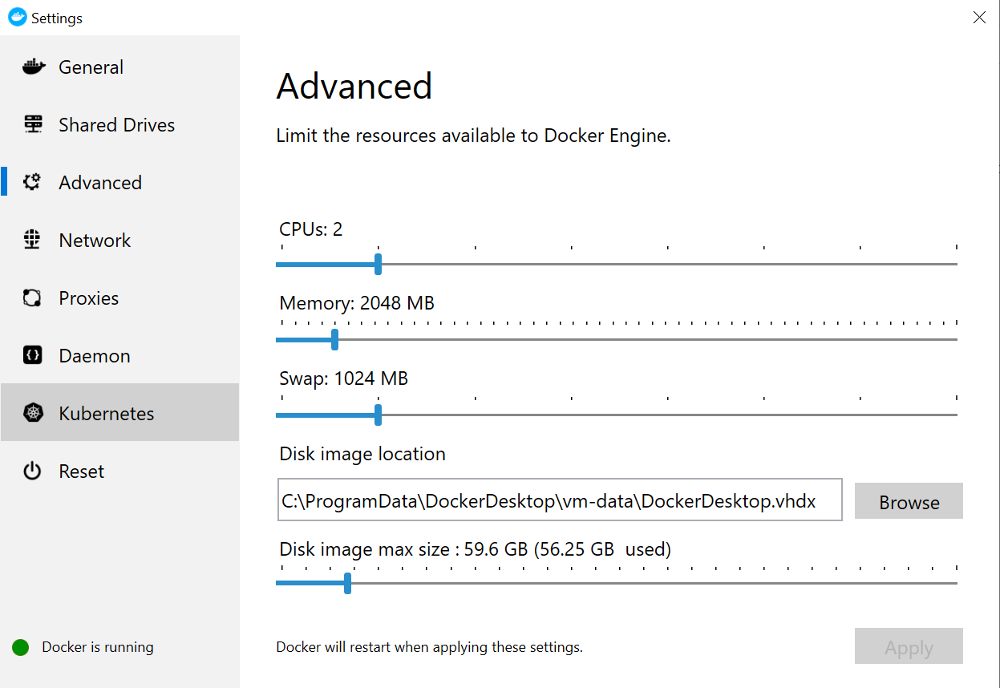
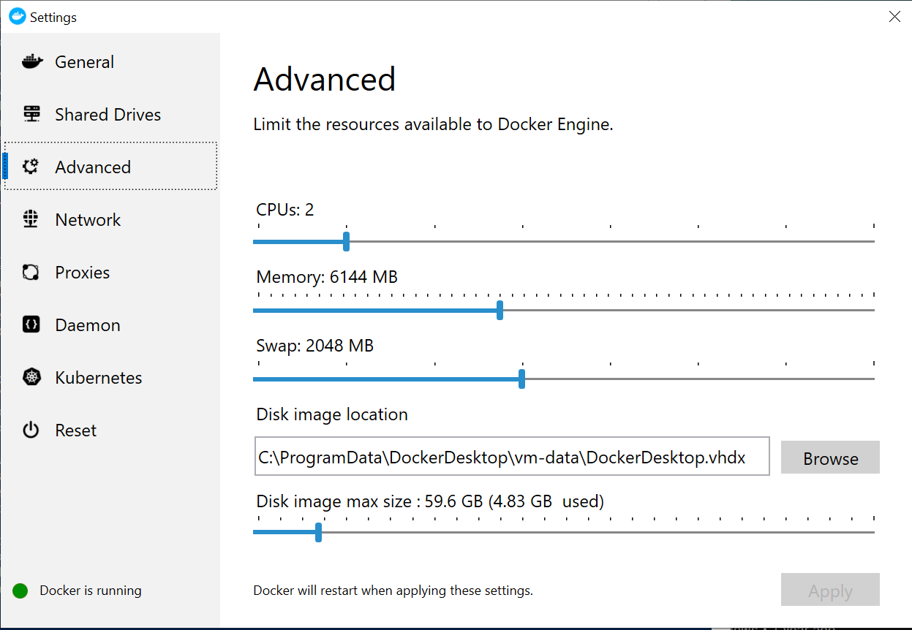

```{r, include=FALSE}
knitr::opts_chunk$set(error=TRUE) # in case CRAN vignette build does not have internet, fail gracefully
```
# Introduction: Geocoding

Location data like student addresses are a rich source of information that could be leveraged for institutions to know where students are concentrated in the surrounding areas, the distance to campus for each student, the commute time to campus for each student, and population-level attributes of geographical areas provided by the U.S. Census Bureau (e.g., the [American Community Survey](https://www.census.gov/programs-surveys/acs) or ACS).  **Geocoding** is the *act of converting an address to its geographical coordinates (longitude and latitude)*.  It is a critical first step to make addresses more useful for analysis by institutional researchers.

In this vignette, we cover how to geocode using the [tidygeocoder](https://CRAN.R-project.org/package=tidygeocoder) package in R.  Although many [options](https://gisgeography.com/geocoders/) exist for geocoding, we focus on this particular package in R for several reasons:

1. Many analysts use R to process or analyze data, so it is convenient to stay in the same environment.
2. `tidygeocoder` provides a unified interface for geocoding with many [services](https://jessecambon.github.io/tidygeocoder/articles/geocoder_services.html) on the backend.  The user specifies the appropriate service depending on their needs as services differ on match rates, costs, limits on the free tier (if available), usage limitations (queries per second or total queries in a time period), and data privacy / retention policies.
3. `tidygeocoder` supports the [Nominatim](https://nominatim.org/) service, a geocoding service based on [OpenStreetMap](https://www.openstreetmap.org/about) (OSM) data, a crowdsourced open data platform.  Moreover, the user could specify a custom API URL, which is useful for geocoding with a local Nominatim server instead of the public server.  This is especially critical for institutional researchers as address data **never leave the local network**, maintaining student privacy and limiting potential data security issues.

Besides geocoding, this vignette also illustrates a few spatial applications of the geocoded data.

# Installation and Setup

## `tidygeocoder` and other relevant packages in R

The `tidygeocoder` and other relevant packages could be installed by running the following line in an R console:

```R
# Installation
install.packages(c('tidygeocoder' # for geocoding
                   , 'maps' # map data for Visualizations
                   , 'geodist' # calculating distance
                   , 'sf' # interface for spatial data (e.g., shapefiles)
                   , 'tigris' # US Census shapefiles
                   , 'tidycensus' # query US Census data
                   ) 
                 , repos='https://cran.r-project.org')
```

## Nominatim Server via Docker (Optional; Recommended for Private Data)

### Data Privacy in Geocoding Services

As mentioned in the introduction section, addresses can be highly personal, and whether or not the data could be shared with a third-party organization is subject to the local institution's policies.  It is recommended that the user reviews the data privacy and retention policies of the geocoding [service](https://jessecambon.github.io/tidygeocoder/articles/geocoder_services.html) that they choose to use to determine if there are any concerns with sending addresses to the geocoding service.

For example, the [public](https://www.openstreetmap.org/#map=14/38.5311/-121.7721) Nominatim (geocoding based on OSM data) server's  [usage policy](https://operations.osmfoundation.org/policies/nominatim/) states, *"Please do not submit personal data or other confidential material to any of our services."*  It is unclear from the OpenStreetMap Foundation's [privacy policy](https://wiki.osmfoundation.org/wiki/Privacy_Policy) if submitted addresses are retained anywhere, and if so, for how long.

The [geocoding service by the US Census Bureau](https://geocoding.geo.census.gov/) does not publish any information regarding data privacy on their website, but an inquiry email asking for this resulted in the following response, dated September 1, 2021:

> "When you submit a geocode request, the web server automatically collects certain technical information from your computer and about your connection. The only information that is stored is IP Address (for batch and single address submissions) and submitted address (only for single address submissions).

> The information is stored on a server, which is internal to the Census network.  This server is only accessible by Census Bureau staff, who are bound by the confidentiality requirements set forth in Title 13 of the United States Code, and requires multiple levels of approval.
 
> This information is only used to monitor and track the performance of the Geocoder."

Based on this response, one could infer that the submitted addresses are retained, but the retention period is not known.

We point out the privacy policies of two commonly used and free services to remind institutional researchers about their duty to safeguard private information, and to be mindful about the services that are utilized in geocoding.

### One Solution: Nominatim Server

One privacy-respecting approach to geocoding is to install [Nominatim](https://nominatim.org/) on a local server, and use that server for geocoding.  That is, we can set up a web server with OSM data loaded into a PostgreSQL database, where the user could geocode with the local server (essentially a lookup in the database).  Data never leaves the local network during the geocoding process, or even the local computer if the service is set up as outlined in this vignette.

In subsequent sections, we illustrate how to implement this using [Docker](https://www.docker.com/) on a local computer running Windows 10.  The [documentation](https://nominatim.org/release-docs/latest/admin/Installation/#hardware) suggests a server with at least 64GB of ram and 900GB of disk space for a full planet data import (as of 8/31/2021).  However, the entire planet's data is not necessary in nearly all institutional research applications.  For example, those working in the California Community College system could probably get away with the [California](https://download.geofabrik.de/north-america/us/california.html) region, [US West](http://download.geofabrik.de/north-america/us-west.html) region or the [United States of America](http://download.geofabrik.de/north-america/us.html) region.  For this vignette, setup was done using the California region on a quad-core laptop with 16GB of memory and 200GB of free disk space (the US region did not work given the hardware constraints).  The user will set the resources allocated to Docker later as Nominatim does not require the computer's full resources.

### Step 1: Download OSM Map Data

First, download one of the following map (`pbf`) files, depending on your computer's specifications (RAM and disk sizes) and your geographical needs:

| Region | PBF File | Where to download |
| --- | --- | --- |
| Northern California | norcal.osm.pbf | [https://download.geofabrik.de/north-america/us/california/norcal.html](https://download.geofabrik.de/north-america/us/california/norcal.html) |
| Southern California | socal.osm.pbf | [https://download.geofabrik.de/north-america/us/california/socal.html](https://download.geofabrik.de/north-america/us/california/socal.html) |
| California | california-latest.osm.pbf | [https://download.geofabrik.de/north-america/us/california.html](https://download.geofabrik.de/north-america/us/california.html) |
| US West | us-west-latest.osm.pbf | [https://download.geofabrik.de/north-america/us-west.html](https://download.geofabrik.de/north-america/us-west.html) |
| US | us-latest.osm.pbf | [https://download.geofabrik.de/north-america/us.html](https://download.geofabrik.de/north-america/us.html) |

For this vignette, we'll use the California file for illustration.  The user should modify their code according to the file that they are working with.

After downloading the `california-latest.osm.pbf` file on [this](https://download.geofabrik.de/north-america/us/california.html) page, put the file in `C:/Users/USERNAME/Downloads/osm-data/` (also referred to as `~/Downloads/osm-data/` in subsequent steps in the tutorial as `~` is shorthand notation for the home directory, `C:/Users/USERNAME`), where `USERNAME` is the user logged into the Windows 10 computer.  If the user chooses to save the `pbf` file at another location, do change any reference to `~/Downloads/osm-data` in this vignette to that location for the code to run properly.

### Step 2: Set Up Docker

Download and install [Docker Desktop for Windows](https://docs.docker.com/get-docker/), which requires admin rights.  For those not familiar, Docker allows users to install different applications as containers in a virtual environment.  For our use case, this application will be the Nominatim server in a container, with OSM data imported into a PostgreSQL database.  The installation process should ask the user to restart their computer to finish the installation process.

On Windows 10, click the start menu and type *"Edit local users and groups"*.  Go to the *"Groups"* folder, and navigate to *"docker-users"*.  Right-click on this icon and click *"Add to group..."*.  Then add your Windows `USERNAME` to this group.  This step also requires admin rights.

The default Docker Engine settings allocate the following resources to Docker:

<!--  -->
<!--  -->
{width=100%}

These default settings work for the Southern California file, but are insufficient for larger map files.  The following settings work for the California and US West region files:

<!--  -->
<!--  -->
{width=100%}

For the US file, more resources should be allocated.

### Step 3: Create Folders for File Storage

Create the following folder:

- `~/Downloads/nominatim-flatnode`, which refers to `C:/Users/USERNAME/Downloads/nominatim-flatnode`.

We will store the flatnode file generated during the installation process here so it could be re-used for future launches of the server.

### Step 4: Start Nominatim Server

As of the time of this writing, [Nominatim Docker's](https://github.com/mediagis/nominatim-docker) latest version was at 3.7.  We will illustrate setup using this version, but the user could try to install a more recent version should that exist.

On Windows 10, launch *"Windows Powershell"* from the Start Menu.  Type the following in the terminal to create a disk volume for storing PostgreSQL data that could be re-used at future launches of Nominatim server:

```powershell
docker volume create nominatim_pg_data
```

Next, run the following line of code to download the Nominatim container image, launch the container, load the OSM map data into PostgreSQL, and launch the web service that accepts geocoding queries:

```powershell
docker run --rm `
  --shm-size=2g -e THREADS=4 -e POSTGRES_SHARED_BUFFERS=1GB -e POSTGRES_MAINTAINENCE_WORK_MEM=1GB -e POSTGRES_AUTOVACUUM_WORK_MEM=1GB -e POSTGRES_WORK_MEM=50MB -e POSTGRES_EFFECTIVE_CACHE_SIZE=1GB -e POSTGRES_SYNCHRONOUS_COMMIT=off -e POSTGRES_MAX_WAL_SIZE=1GB -e POSTGRES_CHECKPOINT_TIMEOUT=10min -e POSTGRES_CHECKPOINT_COMPLETITION_TARGET=0.9 `
  -v ~/Downloads/osm-data:/nominatim/data `
  -e PBF_PATH=/nominatim/data/california-latest.osm.pbf `
  -e REPLICATION_URL=https://download.geofabrik.de/north-america/us/california-updates/ `
  -e IMPORT_WIKIPEDIA=false `
  -v nominatim_pg_data:/var/lib/postgresql/12/main `
  -v ~/Downloads/nominatim-flatnode:/nominatim/flatnode -e NOMINATIM_FLATNODE_FILE=/nominatim/flatnode/flatnode.file `
  -p 8080:8080 `
  --name nominatim mediagis/nominatim:3.7
```

This command looks very complicated.  Let's dissect it to understand what's going on:

- `docker run`: start a container.
- `--name nominatim mediagis/nominatim:3.7`: name the container `nominatim`.
- `--shm-size=2g -e THREADS=4 -e POSTGRES_SHARED_BUFFERS=1GB -e POSTGRES_MAINTAINENCE_WORK_MEM=1GB -e POSTGRES_AUTOVACUUM_WORK_MEM=1GB -e POSTGRES_WORK_MEM=50MB -e POSTGRES_EFFECTIVE_CACHE_SIZE=1GB -e POSTGRES_SYNCHRONOUS_COMMIT=off -e POSTGRES_MAX_WAL_SIZE=1GB -e POSTGRES_CHECKPOINT_TIMEOUT=10min -e POSTGRES_CHECKPOINT_COMPLETITION_TARGET=0.9`: these settings overwrite the default setting that's designed for a server with 32GB of memory.  Since we are working on a laptop with 16GB of memory, the default setup would crash when PostgreSQL loads the OSM data.  [This](https://github.com/mediagis/nominatim-docker/issues/237#issuecomment-860353095) post suggests these settings for a "smaller" machine.
- `-v ~/Downloads/osm-data:/nominatim/data`: this maps the host computer's `C:/Users/USERNAME/Downloads/osm-data` folder to the container's `/nominatim/data` folder, giving the container access the previously downloaded `pbf` file.
- `-e PBF_PATH=/nominatim/data/california-latest.osm.pbf`: this specifies the `pbf` file to use.  If this were omitted, then `PBF_URL` should be specified, pointing to the online link of the `pbf` file, which will be downloaded on-the-fly during installation.
- `-v nominatim_pg_data:/var/lib/postgresql/12/main -v`: this maps the volume created earlier in the vignette to the container's `/var/lib/postgresql/12/main` folder.  This is done in order to make the loaded data persist to future runs of the server.  If this is not done, then the data gets imported every single time the server launches.  Importing the map data is very computationally intensive and takes a long time to complete, so saving this data and making it persist is a good idea.  At future runs, the server just launches the web server and can use the previously imported data.
- `-v ~/Downloads/nominatim-flatnode:/nominatim/flatnode -e NOMINATIM_FLATNODE_FILE=/nominatim/flatnode/flatnode.file`: this [saves](https://nominatim.org/release-docs/3.7/admin/Import/#flatnode-files) on import time and disk space, but creates a file that is about 70GB in size located at `~/Downloads/nominatim-flatnode/flatnode.file`.
- `-p 8080:8080`: this forwards the container's port 8080 to the host computer's port 8080.  In R, `tidygeocoder` could geocode using this Nominatim server by pointing to the `http://localhost:8080` URL when specifying a custom API URL.

The California file took about 12 hours to load and launch on a quad-core, 16GB laptop.  The Southern California file took a few hours.  The US West file took less than a day.

After the server is launched, leave it running in order for `tidygeocoder` to point to it.

To test if the server is running properly, paste the following url in a web browser: `[http://localhost:8080/search.php?q=springfield](http://localhost:8080/search.php?q=springfield)`.  Something like the following should be returned in the browser:

```
[{"place_id":1404212,"licence":"Data © OpenStreetMap contributors, ODbL 1.0. https://osm.org/copyright","osm_type":"way","osm_id":13347384,"boundingbox":["33.6307333","33.6313663","-117.633312","-117.6311185"],"lat":"33.6309708","lon":"-117.6324265","display_name":"Springfield, Canyon Crest, Mission Viejo, Orange County, 92692, United States","place_rank":26,"category":"highway","type":"residential","importance":0.19999999999999998},{"place_id":1404692,"licence":"Data © OpenStreetMap contributors, ODbL 1.0. https://osm.org/copyright","osm_type":"way","osm_id":13347386,"boundingbox":["33.6959562","33.6962003","-117.7740839","-117.7738424"],"lat":"33.6959562","lon":"-117.7740839","display_name":"Springfield, Heritage Park Apartments, El Camino Real, Irvine, Orange County, 92604, United States","place_rank":26,"category":"highway","type":"residential","importance":0.19999999999999998}]
```

The user can now use this service from the `tidygeocoder` package in R.

### Shutting Down Nominatim Server

When the user is done geocoding with the server, the server could be stopped with the following command in *Windows Powershell*:

```powershell
docker stop nominatim
```

Note that data imported during the first launch is still saved in the `nominatim_pg_data` volume in Docker.  Also, additional files are in `~/Downloads/osm-data` (`pbf` files) and `~/Downloads/nominatim-flatnode`.

### Deleting All Files (Geocoding No Longer Needed)

To do a full cleanup, delete the following folders:

- `~/Downloads/osm-data`
- `~/Downloads/nominatim-flatnode`.

In *Windows Powershell*, type the following:

```powershell
docker volume rm nominatim_pg_data
docker image rm nominatim
```

# Example: Geocoding Addresses

Let's load some necessary packages and load some address data provided by the `IRexamples` package.

```R
# Load packages
library(IRexamples)
library(tidygeocoder)
library(dplyr)

# Load data
data(ccc_list)
data(uc_list)

dim(ccc_list)
## [1] 115   5

dim(uc_list)
## [1] 10  2

head(ccc_list)
##                     College                                       District
## 1     ALLAN HANCOCK COLLEGE Allan Hancock Joint Community College District
## 2    AMERICAN RIVER COLLEGE            Los Rios Community College District
## 3   ANTELOPE VALLEY COLLEGE     Antelope Valley Community College District
## 4       BAKERSFIELD COLLEGE                Kern Community College District
## 5 BARSTOW COMMUNITY COLLEGE             Barstow Community College District
## 6     BERKELEY CITY COLLEGE             Peralta Community College District
##                                               Address        Phone
## 1 800 South College Drive, Santa Maria, CA 93454-6368 805.922.6966
## 2   4700 College Oak Drive, Sacramento, CA 95841-4286 916.484.8011
## 3        3041 West Avenue K, Lancaster, CA 93536-5426 661.722.6300
## 4     1801 Panorama Drive, Bakersfield, CA 93305-1299 661.395.4011
## 5           2700 Barstow Road, Barstow, CA 92311-6699 760.252.2411
## 6         2050 Center Street, Berkeley, CA 94704-1205 510.981.2800
##                       Website
## 1      www.hancockcollege.edu
## 2         www.arc.losrios.edu
## 3                 www.avc.edu
## 4  www.bakersfieldcollege.edu
## 5             www.barstow.edu
## 6 www.berkeleycitycollege.edu

head(uc_list)
## # A tibble: 6 x 2
##   University     Address                                         
##   <chr>          <chr>                                           
## 1 UC Berkeley    Berkeley, CA                                    
## 2 UC Davis       1 Shields Ave, Davis, CA 95616                  
## 3 UC Irvine      510 E Peltason Dr. Irvine, California 92697-5700
## 4 UC Los Angeles Los Angeles, CA 90095                           
## 5 UC Merced      5200 Lake Rd, Merced, CA 95343                  
## 6 UC Riverside   900 University Ave, Riverside, CA 92521        
```

The `ccc_list` and `uc_list` data sets contain lists of addresses for the California Community Colleges and the Universities of California, respectively.

Next, we geocode the data with the public Nominatim service.  To use the local server, uncomment the `api_url` and _`min_time` arguments.

```R
ccc_list_geo <- ccc_list %>%
  geocode(address=Address
          , method='osm' # nominatim
          # , api_url='http://localhost:8080/' # Uncomment this if using a local Nominatim server on the same computer that's running R; default uses the public online service; can also specify the address to a local server running on the network
          # , min_time=0.1 # If using local server, allow 1 query per 0.1 seconds.  Otherwise, default is 1 query per second on the public server (see ?min_time_reference)
          )
dim(ccc_list_geo)
## [1] 115   7

names(ccc_list_geo)
## [1] "College"  "District" "Address"  "Phone"    "Website"  "lat"      "long"

ccc_list_geo %>%
  select(College, lat, long) %>%
  print(n=120)
## # A tibble: 115 x 3
##     College                          lat  long
##     <chr>                          <dbl> <dbl>
##   1 ALLAN HANCOCK COLLEGE           34.9 -120.
##   2 AMERICAN RIVER COLLEGE          38.6 -121.
##   3 ANTELOPE VALLEY COLLEGE         34.7 -118.
##   4 BAKERSFIELD COLLEGE             35.4 -119.
##   5 BARSTOW COMMUNITY COLLEGE       34.9 -117.
##   6 BERKELEY CITY COLLEGE           37.9 -122.
##   7 BUTTE COLLEGE                   39.6 -122.
##   8 CABRILLO COLLEGE                37.0 -122.
##   9 CAÑADA COLLEGE                  37.4 -122.
##  10 CERRITOS COLLEGE                33.9 -118.
##  11 CERRO COSO COMMUNITY COLLEGE    35.6 -118.
##  12 CHABOT COLLEGE                  37.6 -122.
##  13 CHAFFEY COLLEGE                 34.1 -118.
##  14 CITRUS COLLEGE                  34.1 -118.
##  15 CITY COLLEGE OF SAN FRANCISCO   NA     NA 
##  16 CLOVIS COMMUNITY COLLEGE        36.9 -120.
##  17 COASTLINE COMMUNITY COLLEGE     33.7 -118.
##  18 COLLEGE OF ALAMEDA              37.8 -122.
##  19 COLLEGE OF MARIN                38.0 -123.
##  20 COLLEGE OF SAN MATEO            37.5 -122.
##  21 COLLEGE OF THE CANYONS          NA     NA 
##  22 COLLEGE OF THE DESERT           33.7 -116.
##  23 COLLEGE OF THE REDWOODS         NA     NA 
##  24 COLLEGE OF THE SEQUOIAS         36.3 -119.
##  25 COLLEGE OF THE SISKIYOUS        41.4 -122.
##  26 COLUMBIA COLLEGE                NA     NA 
##  27 COMPTON COLLEGE                 33.9 -118.
##  28 CONTRA COSTA COLLEGE            38.0 -122.
##  29 COPPER MOUNTAIN COLLEGE         NA     NA 
##  30 COSUMNES RIVER COLLEGE          38.4 -121.
##  31 CRAFTON HILLS COLLEGE           34.0 -117.
##  32 CUESTA COLLEGE                  NA     NA 
##  33 CUYAMACA COLLEGE                32.7 -117.
##  34 CYPRESS COLLEGE                 33.8 -118.
##  35 DEANZA COLLEGE                  37.3 -122.
##  36 DIABLO VALLEY COLLEGE           38.0 -122.
##  37 EAST LOS ANGELES COLLEGE        NA     NA 
##  38 EL CAMINO COLLEGE               33.9 -118.
##  39 EVERGREEN VALLEY COLLEGE        37.3 -122.
##  40 FEATHER RIVER COLLEGE           40.0 -121.
##  41 FOLSOM LAKE COLLEGE             38.7 -121.
##  42 FOOTHILL COLLEGE                37.4 -122.
##  43 FRESNO CITY COLLEGE             36.8 -120.
##  44 FULLERTON COLLEGE               33.9 -118.
##  45 GAVILAN COLLEGE                 37.0 -122.
##  46 GLENDALE COMMUNITY COLLEGE      34.2 -118.
##  47 GOLDEN WEST COLLEGE             33.7 -118.
##  48 GROSSMONT COLLEGE               32.8 -117.
##  49 HARTNELL COLLEGE                36.7 -122.
##  50 IMPERIAL VALLEY COLLEGE         32.8 -116.
##  51 IRVINE VALLEY COLLEGE           33.7 -118.
##  52 LAKE TAHOE COMMUNITY COLLEGE    NA     NA 
##  53 LANEY COLLEGE                   37.8 -122.
##  54 LAS POSITAS COLLEGE             37.7 -122.
##  55 LASSEN COLLEGE                  NA     NA 
##  56 LONG BEACH CITY COLLEGE         33.8 -118.
##  57 LOS ANGELES CITY COLLEGE        34.1 -118.
##  58 LOS ANGELES HARBOR COLLEGE      NA     NA 
##  59 LOS ANGELES MISSION COLLEGE     34.3 -118.
##  60 LOS ANGELES PIERCE COLLEGE      34.2 -119.
##  61 LOS ANGELES SOUTHWEST COLLEGE   33.9 -118.
##  62 LOS ANGELES TRADE-TECH COLLEGE  34.0 -118.
##  63 LOS ANGELES VALLEY COLLEGE      34.2 -118.
##  64 LOS MEDANOS COLLEGE             38.0 -122.
##  65 MADERA COLLEGE                  36.9 -120.
##  66 MENDOCINO COLLEGE               39.2 -123.
##  67 MERCED COLLEGE                  37.3 -120.
##  68 MERRITT COLLEGE                 37.8 -122.
##  69 MIRACOSTA COLLEGE               33.2 -117.
##  70 MISSION COLLEGE                 37.4 -122.
##  71 MODESTO JUNIOR COLLEGE          37.7 -121.
##  72 MONTEREY PENINSULA COLLEGE      36.6 -122.
##  73 MOORPARK COLLEGE                34.3 -119.
##  74 MORENO VALLEY COLLEGE           33.9 -117.
##  75 MT. SAN ANTONIO COLLEGE         34.0 -118.
##  76 MT. SAN JACINTO COLLEGE         33.8 -117.
##  77 NAPA VALLEY COLLEGE             38.2 -122.
##  78 NORCO COLLEGE                   NA     NA 
##  79 OHLONE COLLEGE                  37.5 -122.
##  80 ORANGE COAST COLLEGE            NA     NA 
##  81 OXNARD COLLEGE                  34.2 -119.
##  82 PALO VERDE COLLEGE              NA     NA 
##  83 PALOMAR COLLEGE                 33.2 -117.
##  84 PASADENA CITY COLLEGE           34.1 -118.
##  85 PORTERVILLE COLLEGE             36.0 -119.
##  86 REEDLEY COLLEGE                 36.6 -119.
##  87 RIO HONDO COLLEGE               34.0 -118.
##  88 RIVERSIDE CITY COLLEGE          34.0 -117.
##  89 SACRAMENTO CITY COLLEGE         38.5 -121.
##  90 SADDLEBACK COLLEGE              33.6 -118.
##  91 SAN BERNARDINO VALLEY COLLEGE   34.1 -117.
##  92 SAN DIEGO CITY COLLEGE          32.7 -117.
##  93 SAN DIEGO MESA COLLEGE          32.8 -117.
##  94 SAN DIEGO MIRAMAR COLLEGE       32.9 -117.
##  95 SAN JOAQUIN DELTA COLLEGE       38.0 -121.
##  96 SAN JOSE CITY COLLEGE           37.3 -122.
##  97 SANTA ANA COLLEGE               33.8 -118.
##  98 SANTA BARBARA CITY COLLEGE      34.4 -120.
##  99 SANTA MONICA COLLEGE            NA     NA 
## 100 SANTA ROSA JUNIOR COLLEGE       38.5 -123.
## 101 SANTIAGO CANYON COLLEGE         33.8 -118.
## 102 SHASTA COLLEGE                  NA     NA 
## 103 SIERRA COLLEGE                  38.8 -121.
## 104 SKYLINE COLLEGE                 37.6 -122.
## 105 SOLANO COMMUNITY COLLEGE        38.2 -122.
## 106 SOUTHWESTERN COLLEGE            32.6 -117.
## 107 TAFT COLLEGE                    NA     NA 
## 108 VENTURA COLLEGE                 34.3 -119.
## 109 VICTOR VALLEY COLLEGE           34.5 -117.
## 110 WEST HILLS COLLEGE COALINGA     NA     NA 
## 111 WEST HILLS COLLEGE LEMOORE      36.3 -120.
## 112 WEST LOS ANGELES COLLEGE        34.0 -118.
## 113 WEST VALLEY COLLEGE             37.3 -122.
## 114 WOODLAND COMMUNITY COLLEGE      38.7 -122.
## 115 YUBA COLLEGE                    NA     NA 

# Match rate
ccc_list_geo %>%
  summarize(N_Missing=sum(is.na(lat)), Match_Rate=mean(!is.na(lat)))
## # A tibble: 1 x 2
##   N_Missing Match_Rate
##       <int>      <dbl>
## 1        18      0.843

# Non-matches
ccc_list_geo %>%
  filter(is.na(long)) %>%
  select(College, Address) %>% 
  as.data.frame
##                          College
## 1  CITY COLLEGE OF SAN FRANCISCO
## 2         COLLEGE OF THE CANYONS
## 3        COLLEGE OF THE REDWOODS
## 4               COLUMBIA COLLEGE
## 5        COPPER MOUNTAIN COLLEGE
## 6                 CUESTA COLLEGE
## 7       EAST LOS ANGELES COLLEGE
## 8   LAKE TAHOE COMMUNITY COLLEGE
## 9                 LASSEN COLLEGE
## 10    LOS ANGELES HARBOR COLLEGE
## 11                 NORCO COLLEGE
## 12          ORANGE COAST COLLEGE
## 13            PALO VERDE COLLEGE
## 14          SANTA MONICA COLLEGE
## 15                SHASTA COLLEGE
## 16                  TAFT COLLEGE
## 17   WEST HILLS COLLEGE COALINGA
## 18                  YUBA COLLEGE
##                                                        Address
## 1          50 Phelan Avenue E200, San Francisco, CA 94112-1898
## 2  26455 N. Rockwell Canyon Road, Santa Clarita, CA 91355-1899
## 3               7351 Tompkins Hill Road, Eureka, CA 95501-9301
## 4          11600 Columbia College Drive, Sonora, CA 95370-8518
## 5                  6162 Rotary Way, Joshua Tree, CA 92252-6100
## 6                  PO Box 8106, San Luis Obispo, CA 93403-8106
## 7      1301 Avenida Cesar Chavez, Monterey Park, CA 91754-6099
## 8               1 College Drive, So. Lake Tahoe, CA 96150-4524
## 9                       PO Box 3000, Susanville, CA 96130-3000
## 10              1111 Figueroa Place, Wilmington, CA 90744-2397
## 11                     2001 Third Street, Norco, CA 92860-2600
## 12                      PO Box 5005, Costa Mesa, CA 92628-5005
## 13                    One College Drive, Blythe, CA 92225-1118
## 14            1900 Pico Boulevard, Santa Monica, CA 90405-1628
## 15                       PO Box 496006, Redding, CA 96049-6006
## 16                          29 Cougar Ct., Taft, CA 93268-4217
## 17                    300 Cherry Lane, Coalinga, CA 93210-1301
## 18            2088 North Beale Road, Marysville, CA 95901-7699
```

There is an 84% match rate for the `ccc_list` data using OSM.

The `geocode` function provides a `cascade` method that one could use to leverage multiple geocoding services: when the first service does not return coordinates for an address, a second service is used as a second attempt, with additional services used subsequently should more be specified.  The following code illustrates this feature with the `census` method as backup:

```R
ccc_list_geo2 <- ccc_list %>%
  geocode(address=Address
          , method='cascade'
          , cascade_order=c('osm', 'census')
          )

ccc_list_geo2 %>%
  summarize(N_Missing=sum(is.na(lat)), Match_Rate=mean(!is.na(lat)))
## # A tibble: 1 x 2
##   N_Missing Match_Rate
##       <int>      <dbl>
## 1         7      0.939

ccc_list_geo2 %>%
  filter(is.na(long)) %>%
  select(College, Address, lat, long) %>% 
  as.data.frame
##                        College                                        Address
## 1               CUESTA COLLEGE    PO Box 8106, San Luis Obispo, CA 93403-8106
## 2 LAKE TAHOE COMMUNITY COLLEGE 1 College Drive, So. Lake Tahoe, CA 96150-4524
## 3               LASSEN COLLEGE         PO Box 3000, Susanville, CA 96130-3000
## 4         ORANGE COAST COLLEGE         PO Box 5005, Costa Mesa, CA 92628-5005
## 5           PALO VERDE COLLEGE       One College Drive, Blythe, CA 92225-1118
## 6               SHASTA COLLEGE          PO Box 496006, Redding, CA 96049-6006
## 7                 TAFT COLLEGE             29 Cougar Ct., Taft, CA 93268-4217
##   lat long
## 1  NA   NA
## 2  NA   NA
## 3  NA   NA
## 4  NA   NA
## 5  NA   NA
## 6  NA   NA
## 7  NA   NA
```

With the Census as the second service, the match rate increased to 94%.  One thing to note is that `cascade` method would not work with a local Nominatim server.  To use a local Nominatim server, the user should geocode using the local server first, then identify the non-matched addresses for geocoding using a secondary service.  This is illustrated as follows:

```R
ccc_list_geo2_manual <- ccc_list_geo %>%
  filter(is.na(lat)) %>% # identify non-matches
  select(-lat, -long) %>% # remove these columns
  geocode(address=Address
          , method='census' # geocode non-matches with census method
          ) %>%
  rbind(ccc_list_geo %>% filter(!is.na(lat))) # Append matches from 1st run
dim(ccc_list_geo2_manual)
## [1] 115   7

ccc_list_geo2_manual %>%
  summarize(N_Missing=sum(is.na(lat)), Match_Rate=mean(!is.na(lat)))
## # A tibble: 1 x 2
##   N_Missing Match_Rate
##       <int>      <dbl>
## 1         7      0.939
```

The manual approach yields the same results as the `cascade` method, but is preferred when a local Nominatim server is used.

# Example: Visualizing Locations

With the geocoded results, we can visualize the locations of the California community colleges on a map:

```R
library(ggplot2)
library(maps)
library(ggrepel)

ggplot(ccc_list_geo2, aes(long, lat), color = "grey99") +
  borders(database='state', region='california') + # See ?map
  geom_point() +
  # geom_label_repel(aes(label = College)) +
  theme_void()
#dev.copy(png, filename='./images/ccc_map.png', width=3, height=5, units='in', res=150)
#dev.off()

# Concentration
# https://stackoverflow.com/questions/13316185/r-convert-zipcode-or-lat-long-to-county
```

<!-- {width=50%} -->
<!-- {width=50%} -->
{width=50%}

The following shows how to visualize the map of the US:
```R
ggplot(ccc_list_geo2, aes(long, lat), color = "grey99") +
  borders(database='county', region='california') + # See ?map
  geom_point() +
  # geom_label_repel(aes(label = College)) +
  theme_void()
#dev.copy(png, filename='./images/ccc_map_us.png', width=9, height=5, units='in', res=150)
#dev.off()
```

<!-- {width=50%} -->
<!-- {width=50%} -->
{width=100%}

With the geographical coordinates, the geocoded data set could also be exported and then imported in other platforms for visualization such as Tableau, ArcGIS, or QGIS.

# Example: Calculating Distance

With geocoded data, distance can be calculated using the [geodist](https://CRAN.R-project.org/package=geodist) in R.  In the following example, we first geocode the location of all the UC's, then calculate the distance to each UC for each community college.

```R
# Geocode UC's
uc_list_geo <- uc_list %>%
  geocode(address=Address
          , method='cascade'
          , cascade_order=c('osm', 'census')
          )
uc_list_geo %>%
  as.data.frame
##          University                                          Address      lat
## 1       UC Berkeley                                     Berkeley, CA 37.87535
## 2          UC Davis                   1 Shields Ave, Davis, CA 95616       NA
## 3         UC Irvine 510 E Peltason Dr. Irvine, California 92697-5700 33.64163
## 4    UC Los Angeles                            Los Angeles, CA 90095 34.07088
## 5         UC Merced                   5200 Lake Rd, Merced, CA 95343 37.34685
## 6      UC Riverside          900 University Ave, Riverside, CA 92521 33.96371
## 7      UC San Diego               9500 Gilman Dr, La Jolla, CA 92093 32.87615
## 8  UC San Francisco       505 Parnassus Ave, San Francisco, CA 94143 37.76307
## 9  UC Santa Barbara                          Santa Barbara, CA 93106 34.42213
## 10    UC Santa Cruz               1156 High St, Santa Cruz, CA 95064 36.97738
##         long geo_method
## 1  -122.2396        osm
## 2         NA     census
## 3  -117.8456        osm
## 4  -118.4468        osm
## 5  -120.4326        osm
## 6  -117.3398        osm
## 7  -117.2432        osm
## 8  -122.4574        osm
## 9  -119.7027        osm
## 10 -122.0549        osm

# Load packages
library(geodist)
library(stringr)

# Calculate distance between each CC to each UC
dist_mat <- geodist(x=ccc_list_geo, y=uc_list_geo, measure='haversine') / 1609.34 # results are in meters; convert to miles
dim(dist_mat)
## [1] 115  10

# Append results as new columns in original data frame
ccc_list_geo[paste0('Dist: ', uc_list$University)] <- dist_mat
dim(ccc_list_geo)
## [1] 115  17

# Print first few rows
head(ccc_list_geo) %>% as.data.frame
##                     College                                       District
## 1     ALLAN HANCOCK COLLEGE Allan Hancock Joint Community College District
## 2    AMERICAN RIVER COLLEGE            Los Rios Community College District
## 3   ANTELOPE VALLEY COLLEGE     Antelope Valley Community College District
## 4       BAKERSFIELD COLLEGE                Kern Community College District
## 5 BARSTOW COMMUNITY COLLEGE             Barstow Community College District
## 6     BERKELEY CITY COLLEGE             Peralta Community College District
##                                               Address        Phone
## 1 800 South College Drive, Santa Maria, CA 93454-6368 805.922.6966
## 2   4700 College Oak Drive, Sacramento, CA 95841-4286 916.484.8011
## 3        3041 West Avenue K, Lancaster, CA 93536-5426 661.722.6300
## 4     1801 Panorama Drive, Bakersfield, CA 93305-1299 661.395.4011
## 5           2700 Barstow Road, Barstow, CA 92311-6699 760.252.2411
## 6         2050 Center Street, Berkeley, CA 94704-1205 510.981.2800
##                       Website      lat      long Dist: UC Berkeley
## 1      www.hancockcollege.edu 34.94327 -120.4231        226.612872
## 2         www.arc.losrios.edu 38.64884 -121.3465         72.218347
## 3                 www.avc.edu 34.67492 -118.1874        316.272955
## 4  www.bakersfieldcollege.edu 35.40877 -118.9720        248.964004
## 5             www.barstow.edu 34.87101 -117.0258        356.981425
## 6 www.berkeleycitycollege.edu 37.86980 -122.2697          1.685213
##   Dist: UC Davis Dist: UC Irvine Dist: UC Los Angeles Dist: UC Merced
## 1             NA       172.62547            127.78918        166.2585
## 2             NA       397.65959            355.42338        102.9175
## 3             NA        74.10235             44.33047        223.4554
## 4             NA       138.06228             97.23803        156.8008
## 5             NA        97.09591             98.12937        256.0385
## 6             NA       383.57060            338.82270        106.9657
##   Dist: UC Riverside Dist: UC San Diego Dist: UC San Francisco
## 1          188.45515           231.8548              225.56507
## 2          393.48090           460.8291               86.02155
## 3           69.02799           135.7479              319.94485
## 4          136.41495           201.1988              252.93543
## 5           65.26556           138.5493              362.74946
## 6          386.23756           446.7000               12.63799
##   Dist: UC Santa Barbara Dist: UC Santa Cruz
## 1               54.57738           167.75483
## 2              306.29097           121.92436
## 3               88.08124           269.05504
## 4               79.84264           203.42795
## 5              155.45306           317.08630
## 6              278.23339            62.84623

# Distance to UCI from colleges with Orange in it's district's name
ccc_list_geo %>%
  filter(str_detect(District, 'Orange')) %>%
  select(College, `Dist: UC Irvine`)
## # A tibble: 4 x 2
##   College               `Dist: UC Irvine`
##   <chr>                             <dbl>
## 1 CYPRESS COLLEGE                   15.7 
## 2 FULLERTON COLLEGE                 16.7 
## 3 IRVINE VALLEY COLLEGE              4.71
## 4 SADDLEBACK COLLEGE                12.0 
```

# Example: Data Augmentation with Census Data

The US Census Bureau offers a lot of useful geographical-level information based on data collected from the [Decennial Census](https://www.census.gov/programs-surveys/decennial-census/data.html) (entire population, every 10 years) and the [American Community Survey](https://www.census.gov/programs-surveys/acs/about.html) (ACS; sample of population, every month).  For example, for a given geographical unit, one could obtain the population size, age group sizes, income levels, and education attainment of the area.  Such information could be used to describe the service areas of a college or impute the information about students if such information is unavailable to the institution (e.g., income or socioeconomic level).  The augmented data could be used to describe the student population or service areas in grant applications, or could be used as explanatory variables in a statistical model.

Before obtaining the needed information from the US Census, we must first determine the geographical area that an address corresponds, namely the census tract.  [Census tracts](https://www2.census.gov/geo/pdfs/education/CensusTracts.pdf) are granular geographical units determined by the US Census Bureau for which statistical information are summarized on (e.g., population size).  Previously, we illustrated how to geocode an address.  From these geographical coordinates, we can determine the corresponding census tracts these addresses belong to.  To do so, we first download the California census tract shapefiles via the [tigris](https://CRAN.R-project.org/package=tigris) R package.  From there, we could do a spatial join between the geographical coordinates (as spatial points) and the census tracts (areas) via the [sf](https://cran.r-project.org/package=sf) R package.  If a location or point is in a particular tract, a join is returned.  Once an address have been linked to a census tract, information from the US Census could be queried using the [tidycensus](https://cran.r-project.org/package=tidycensus) R package.

The following code illustrates how to link geographical coordinates to census tracts using the addresses found in the `uc_list` data as sample input:

```R
# Load packages
# https://stackoverflow.com/a/52260988/199140
library(tigris) # Download shapefiles from Census
library(sf) # Handle shapefiles; load after tigris
library(tidycensus)

# Get CA shapefiles
tract_CA <- tracts(state='CA', class='sf')
## Using FIPS code '06' for state 'CA'
##   |======================================================================| 100%

# Print
head(tract_CA)
## Simple feature collection with 6 features and 12 fields
## Geometry type: MULTIPOLYGON
## Dimension:     XY
## Bounding box:  xmin: -118.5715 ymin: 34.14174 xmax: -118.4836 ymax: 34.18716
## Geodetic CRS:  NAD83
##   STATEFP COUNTYFP TRACTCE       GEOID    NAME             NAMELSAD MTFCC
## 1      06      037  139301 06037139301 1393.01 Census Tract 1393.01 G5020
## 2      06      037  139302 06037139302 1393.02 Census Tract 1393.02 G5020
## 3      06      037  139502 06037139502 1395.02 Census Tract 1395.02 G5020
## 4      06      037  139600 06037139600    1396    Census Tract 1396 G5020
## 5      06      037  139701 06037139701 1397.01 Census Tract 1397.01 G5020
## 6      06      037  139801 06037139801 1398.01 Census Tract 1398.01 G5020
##   FUNCSTAT   ALAND AWATER    INTPTLAT     INTPTLON
## 1        S 2865657      0 +34.1781538 -118.5581265
## 2        S  338289      0 +34.1767230 -118.5383655
## 3        S 1047548      0 +34.1628402 -118.5263110
## 4        S 2477482      0 +34.1640599 -118.5101001
## 5        S 3396396   2411 +34.1574290 -118.4954117
## 6        S 3665744      0 +34.1527206 -118.5455805
##                         geometry
## 1 MULTIPOLYGON (((-118.5715 3...
## 2 MULTIPOLYGON (((-118.5407 3...
## 3 MULTIPOLYGON (((-118.5322 3...
## 4 MULTIPOLYGON (((-118.5186 3...
## 5 MULTIPOLYGON (((-118.5098 3...
## 6 MULTIPOLYGON (((-118.5567 3...

# Convert coordinates into geospatial data type (sf)
uc_points <- uc_list_geo %>%
  filter(!is.na(lat)) %>%  # remove missing
  st_as_sf(coords=c('long', 'lat'), crs=st_crs(tract_CA))

# Determine which census tract each point is located in
uc_points_tract <- st_join(uc_points, tract_CA)
dim(uc_points_tract)
## [1]  9 16

names(uc_points_tract)
##  [1] "University" "Address"    "geo_method" "geometry"   "STATEFP"   
##  [6] "COUNTYFP"   "TRACTCE"    "GEOID"      "NAME"       "NAMELSAD"  
## [11] "MTFCC"      "FUNCSTAT"   "ALAND"      "AWATER"     "INTPTLAT"  
## [16] "INTPTLON"
```

`GEOID` is the unique identifier of a census tract, and as you might infer from reviewing some the values, it is a concatenation of `STATEFP` (state identifier), `COUNTYFP` (county identifier), and `TRACTCE` (tract identifier).  Once `GEOID` is known, we could leverage the `get_decennial` and `get_acs` functions from the `tidycensus` package to query the data elements of interest, as described in the package's [basic usage vignette](https://walker-data.com/tidycensus/articles/basic-usage.html) and the [spatial data vignette](https://walker-data.com/tidycensus/articles/spatial-data.html).

To query data from the Census API, one must obtain a free API key [here](https://api.census.gov/data/key_signup.html).  This key could be set in R with the following code from the `tidycensus` package:

```R
# US Census API Key
#census_api_key(Sys.getenv('census_api_key'))
census_api_key('YOUR API KEY')
```

As noted in `tidycensus`'s [basic usage vignette](https://walker-data.com/tidycensus/articles/basic-usage.html), getting information from the Census or ACS requires knowing the variable ID's.  As tehre are many, one suggested workflow is to download the variable descriptions via the `load_variables` function, and search for the needed variables from these descriptions (type `?load_variables` in the R console for help).

We illustrate how to find the variable ID's for the following information, how to query the data, and how to append them to our sample addresses in the previously created `uc_points_tract` data set:

1. Median income
2. Educational attainment
3. Race and Ethnicity

## 1. Median Income

```R
# Download variables
v18 <- load_variables(2018, "acs5", cache = TRUE)
# ACS time estimates: https://www.census.gov/programs-surveys/acs/guidance/estimates.html

dim(v18)
## [1] 26997     3

names(v18)
## [1] "name"    "label"   "concept"

# View and filter variables in RStudio
# Concept: median income
#View(v18)

# Manually view and filter
v18 %>%
  filter(str_detect(tolower(concept), 'median')
       , str_detect(tolower(concept), 'income')
         ) %>%
  as.data.frame
## Long, so will not print here in vignette
```

What we want is `MEDIAN HOUSEHOLD INCOME IN THE PAST 12 MONTHS (IN 2018 INFLATION-ADJUSTED DOLLARS)`, which corresponds to variable `B19013_001`.  We can query this information at the tract level, then join it to our list of addresses in `uc_points_tract` with `GEOID` as the join key:

```R
lu_median_income <- get_acs(geography='tract'
                          , variables=c(median_income='B19013_001')
                          , state='CA'
                          , year=2018
                          , geometry=FALSE
  )
dim(lu_median_income)
## [1] 8057    5

names(lu_median_income)
## [1] "GEOID"    "NAME"     "variable" "estimate" "moe"

head(lu_median_income) %>% as.data.frame
##         GEOID                                          NAME      variable
## 1 06001400100 Census Tract 4001, Alameda County, California median_income
## 2 06001400200 Census Tract 4002, Alameda County, California median_income
## 3 06001400300 Census Tract 4003, Alameda County, California median_income
## 4 06001400400 Census Tract 4004, Alameda County, California median_income
## 5 06001400500 Census Tract 4005, Alameda County, California median_income
## 6 06001400600 Census Tract 4006, Alameda County, California median_income
##   estimate   moe
## 1   200893 49177
## 2   160536 29320
## 3    94732 23862
## 4   113036 16872
## 5   103846 18727
## 6   127232 25110

# Join
uc_income <- uc_points_tract %>%
  select(University, Address, GEOID) %>%
  left_join(lu_median_income %>%
            select(GEOID, estimate) %>%
            rename(median_income=estimate)
            )
uc_income %>%
  as.data.frame
##         University                                          Address       GEOID
## 1      UC Berkeley                                     Berkeley, CA 06001400100
## 2        UC Irvine 510 E Peltason Dr. Irvine, California 92697-5700 06059062614
## 3   UC Los Angeles                            Los Angeles, CA 90095 06037265301
## 4        UC Merced                   5200 Lake Rd, Merced, CA 95343 06047001801
## 5     UC Riverside          900 University Ave, Riverside, CA 92521 06065046500
## 6     UC San Diego               9500 Gilman Dr, La Jolla, CA 92093 06073008305
## 7 UC San Francisco       505 Parnassus Ave, San Francisco, CA 94143 06075030102
## 8 UC Santa Barbara                          Santa Barbara, CA 93106 06083000900
## 9    UC Santa Cruz               1156 High St, Santa Cruz, CA 95064 06087100400
##                     geometry median_income
## 1 POINT (-122.2396 37.87535)        200893
## 2 POINT (-117.8456 33.64163)         39135
## 3 POINT (-118.4468 34.07088)            NA
## 4 POINT (-120.4326 37.34685)         96875
## 5 POINT (-117.3398 33.96371)         22102
## 6 POINT (-117.2432 32.87615)         39306
## 7 POINT (-122.4574 37.76307)        147549
## 8 POINT (-119.7027 34.42213)         46275
## 9 POINT (-122.0549 36.97738)         46375
```

## 2. Educational Attainment

```R
# View and search in RStudio
# Concept: educational attainment
#v18 %>%
#  filter(str_detect(tolower(concept), 'educational attainment')) %>%
#  as.data.frame
```

After searching for "educational attainment" and reviewing the results, we will want to focus on `EDUCATIONAL ATTAINMENT FOR THE POPULATION 25 YEARS AND OVER` as described by variables with the prefix `B15003`.

```R
v18 %>% filter(str_detect(name, 'B15003')) %>% as.data.frame
##          name                                                     label
## 1  B15003_001                                           Estimate!!Total
## 2  B15003_002                   Estimate!!Total!!No schooling completed
## 3  B15003_003                           Estimate!!Total!!Nursery school
## 4  B15003_004                             Estimate!!Total!!Kindergarten
## 5  B15003_005                                Estimate!!Total!!1st grade
## 6  B15003_006                                Estimate!!Total!!2nd grade
## 7  B15003_007                                Estimate!!Total!!3rd grade
## 8  B15003_008                                Estimate!!Total!!4th grade
## 9  B15003_009                                Estimate!!Total!!5th grade
## 10 B15003_010                                Estimate!!Total!!6th grade
## 11 B15003_011                                Estimate!!Total!!7th grade
## 12 B15003_012                                Estimate!!Total!!8th grade
## 13 B15003_013                                Estimate!!Total!!9th grade
## 14 B15003_014                               Estimate!!Total!!10th grade
## 15 B15003_015                               Estimate!!Total!!11th grade
## 16 B15003_016                   Estimate!!Total!!12th grade, no diploma
## 17 B15003_017              Estimate!!Total!!Regular high school diploma
## 18 B15003_018            Estimate!!Total!!GED or alternative credential
## 19 B15003_019           Estimate!!Total!!Some college, less than 1 year
## 20 B15003_020 Estimate!!Total!!Some college, 1 or more years, no degree
## 21 B15003_021                       Estimate!!Total!!Associate's degree
## 22 B15003_022                        Estimate!!Total!!Bachelor's degree
## 23 B15003_023                          Estimate!!Total!!Master's degree
## 24 B15003_024               Estimate!!Total!!Professional school degree
## 25 B15003_025                         Estimate!!Total!!Doctorate degree
##                                                        concept
## 1  EDUCATIONAL ATTAINMENT FOR THE POPULATION 25 YEARS AND OVER
## 2  EDUCATIONAL ATTAINMENT FOR THE POPULATION 25 YEARS AND OVER
## 3  EDUCATIONAL ATTAINMENT FOR THE POPULATION 25 YEARS AND OVER
## 4  EDUCATIONAL ATTAINMENT FOR THE POPULATION 25 YEARS AND OVER
## 5  EDUCATIONAL ATTAINMENT FOR THE POPULATION 25 YEARS AND OVER
## 6  EDUCATIONAL ATTAINMENT FOR THE POPULATION 25 YEARS AND OVER
## 7  EDUCATIONAL ATTAINMENT FOR THE POPULATION 25 YEARS AND OVER
## 8  EDUCATIONAL ATTAINMENT FOR THE POPULATION 25 YEARS AND OVER
## 9  EDUCATIONAL ATTAINMENT FOR THE POPULATION 25 YEARS AND OVER
## 10 EDUCATIONAL ATTAINMENT FOR THE POPULATION 25 YEARS AND OVER
## 11 EDUCATIONAL ATTAINMENT FOR THE POPULATION 25 YEARS AND OVER
## 12 EDUCATIONAL ATTAINMENT FOR THE POPULATION 25 YEARS AND OVER
## 13 EDUCATIONAL ATTAINMENT FOR THE POPULATION 25 YEARS AND OVER
## 14 EDUCATIONAL ATTAINMENT FOR THE POPULATION 25 YEARS AND OVER
## 15 EDUCATIONAL ATTAINMENT FOR THE POPULATION 25 YEARS AND OVER
## 16 EDUCATIONAL ATTAINMENT FOR THE POPULATION 25 YEARS AND OVER
## 17 EDUCATIONAL ATTAINMENT FOR THE POPULATION 25 YEARS AND OVER
## 18 EDUCATIONAL ATTAINMENT FOR THE POPULATION 25 YEARS AND OVER
## 19 EDUCATIONAL ATTAINMENT FOR THE POPULATION 25 YEARS AND OVER
## 20 EDUCATIONAL ATTAINMENT FOR THE POPULATION 25 YEARS AND OVER
## 21 EDUCATIONAL ATTAINMENT FOR THE POPULATION 25 YEARS AND OVER
## 22 EDUCATIONAL ATTAINMENT FOR THE POPULATION 25 YEARS AND OVER
## 23 EDUCATIONAL ATTAINMENT FOR THE POPULATION 25 YEARS AND OVER
## 24 EDUCATIONAL ATTAINMENT FOR THE POPULATION 25 YEARS AND OVER
## 25 EDUCATIONAL ATTAINMENT FOR THE POPULATION 25 YEARS AND OVER

# Query all of these variables at the tract level
lu_edu_long <- get_acs(geography='tract'
                          , variables=v18 %>%
                              filter(str_detect(name, 'B15003')) %>%
                              pull(name)
                          , state='CA'
                          , year=2018
                          , geometry=FALSE
  )

dim(lu_edu_long)
## [1] 201425      5

names(lu_edu_long)
## [1] "GEOID"    "NAME"     "variable" "estimate" "moe"     

unique(lu_edu_long$variable)

# Calculate proportions at the tract level
lu_edu <- lu_edu_long %>%
  group_by(GEOID) %>%
  summarize(Edu_25_Total=sum(estimate[variable=='B15003_001'])
          , Pct_Edu_25_Less_HS=sum(estimate[variable %in% c('B15003_002', 'B15003_003', 'B15003_004', 'B15003_005', 'B15003_006', 'B15003_007', 'B15003_008', 'B15003_009', 'B15003_010', 'B15003_011', 'B15003_012', 'B15003_013', 'B15003_014', 'B15003_015', 'B15003_016')]) / Edu_25_Total
          , Pct_Edu_25_HS_GED=sum(estimate[variable %in% c('B15003_017', 'B15003_018')]) / Edu_25_Total       

          , Pct_Edu_25_Some_HE=sum(estimate[variable %in% c('B15003_019', 'B15003_020', 'B15003_021')]) / Edu_25_Total       
          , Pct_Edu_25_BA=sum(estimate[variable %in% c('B15003_022')]) / Edu_25_Total
          , Pct_Edu_25_MA_plus=sum(estimate[variable %in% c('B15003_023', 'B15003_024', 'B15003_025')]) / Edu_25_Total
            ) %>%
  ungroup

dim(lu_edu)
## [1] 8057    7

# Join
uc_edu <- uc_points_tract %>% 
  select(University, Address, GEOID) %>%
  left_join(lu_edu)

# Print
uc_edu %>%
  as.data.frame
##         University                                          Address       GEOID
## 1      UC Berkeley                                     Berkeley, CA 06001400100
## 2        UC Irvine 510 E Peltason Dr. Irvine, California 92697-5700 06059062614
## 3   UC Los Angeles                            Los Angeles, CA 90095 06037265301
## 4        UC Merced                   5200 Lake Rd, Merced, CA 95343 06047001801
## 5     UC Riverside          900 University Ave, Riverside, CA 92521 06065046500
## 6     UC San Diego               9500 Gilman Dr, La Jolla, CA 92093 06073008305
## 7 UC San Francisco       505 Parnassus Ave, San Francisco, CA 94143 06075030102
## 8 UC Santa Barbara                          Santa Barbara, CA 93106 06083000900
## 9    UC Santa Cruz               1156 High St, Santa Cruz, CA 95064 06087100400
##                     geometry Edu_25_Total Pct_Edu_25_Less_HS Pct_Edu_25_HS_GED
## 1 POINT (-122.2396 37.87535)         2455        0.024439919        0.03095723
## 2 POINT (-117.8456 33.64163)         5296        0.003587613        0.04040785
## 3 POINT (-118.4468 34.07088)           89        0.000000000        0.00000000
## 4 POINT (-120.4326 37.34685)         1839        0.038064165        0.19738989
## 5 POINT (-117.3398 33.96371)         1577        0.163601776        0.12999366
## 6 POINT (-117.2432 32.87615)         1256        0.027070064        0.06130573
## 7 POINT (-122.4574 37.76307)         4200        0.009047619        0.04833333
## 8 POINT (-119.7027 34.42213)         2633        0.200151918        0.12229396
## 9 POINT (-122.0549 36.97738)          906        0.006622517        0.04525386
##   Pct_Edu_25_Some_HE Pct_Edu_25_BA Pct_Edu_25_MA_plus
## 1         0.12545825     0.3213849          0.4977597
## 2         0.07817221     0.2471677          0.6306647
## 3         0.83146067     0.1685393          0.0000000
## 4         0.36052202     0.2300163          0.1740076
## 5         0.38173748     0.1521877          0.1724794
## 6         0.16401274     0.3542994          0.3933121
## 7         0.08238095     0.4159524          0.4442857
## 8         0.28142803     0.2054690          0.1906570
## 9         0.26158940     0.2207506          0.4657837
```

## 3. Race and Ethnicity

Working with race and ethnicity data from the Census is not as straightforward as one would expect.  It's important to understand how the information is gathered.  [This](https://web.archive.org/web/20230607175432/https://www.cosb.us/home/showpublisheddocument/5935/) sheet describes how race and ethnicity are asked in two questions by the Census.  Based on how these questions are asked and how the options are presented, it's important to recognize that respondents could:

1. Check more than 1 race categories in the race question.
2. Respond if they are of Hispanic origins or not in the ethnicity question.

Because of these points, respondents could fall under more than 1 racial and ethnic categorizations based on what is checked in the two questions.  It's also important to note that Census data are summarized with counts of individuals for each geographical area.  That is, data are not reported at the individual level.  Because of this, one could summarize each racial or ethnic group by counts and proportions, but these counts and proportions will most almost certainly not sum up to the whole.

We illustrate two ways of summarizing race and ethnicity data at the tract level.  In the first case, we include in each race group all respondents that checked a particular group, even if the respondent checks more than one group.  In the second case, we include in each race group all respondents that only check one particular group and not multiple.  In both cases, the Hispanic ethnicity is summarized separately.

Here is sample code for the first case that includes all respondents that identify with a racial group:

```R
# Major racial groups
v18 %>%
  filter(str_detect(tolower(concept), 'in combination')) %>%
  as.data.frame
##         name           label
## 1 B02008_001 Estimate!!Total
## 2 B02009_001 Estimate!!Total
## 3 B02010_001 Estimate!!Total
## 4 B02011_001 Estimate!!Total
## 5 B02012_001 Estimate!!Total
## 6 B02013_001 Estimate!!Total
##                                                                                           concept
## 1                                      WHITE ALONE OR IN COMBINATION WITH ONE OR MORE OTHER RACES
## 2                  BLACK OR AFRICAN AMERICAN ALONE OR IN COMBINATION WITH ONE OR MORE OTHER RACES
## 3          AMERICAN INDIAN AND ALASKA NATIVE ALONE OR IN COMBINATION WITH ONE OR MORE OTHER RACES
## 4                                      ASIAN ALONE OR IN COMBINATION WITH ONE OR MORE OTHER RACES
## 5 NATIVE HAWAIIAN AND OTHER PACIFIC ISLANDER ALONE OR IN COMBINATION WITH ONE OR MORE OTHER RACES
## 6                            SOME OTHER RACE ALONE OR IN COMBINATION WITH ONE OR MORE OTHER RACES

# Ethnicity
v18 %>%
  filter(concept=='HISPANIC OR LATINO ORIGIN') %>%
  as.data.frame
##         name                                   label                   concept
## 1 B03003_001                         Estimate!!Total HISPANIC OR LATINO ORIGIN
## 2 B03003_002 Estimate!!Total!!Not Hispanic or Latino HISPANIC OR LATINO ORIGIN
## 3 B03003_003     Estimate!!Total!!Hispanic or Latino HISPANIC OR LATINO ORIGIN

# Total
v18 %>%
  filter(concept=='TOTAL POPULATION') %>%
  as.data.frame
##         name           label          concept
## 1 B01003_001 Estimate!!Total TOTAL POPULATION

# Query data elements
lu_race_long <- get_acs(geography='tract'
                          , variables=c('B01003_001', 'B03003_003', 'B02008_001', 'B02009_001', 'B02010_001', 'B02011_001', 'B02012_001', 'B02013_001')
                          , state='CA'
                          , year=2018
                          , geometry=FALSE
  )

dim(lu_race_long)
## [1] 64456     5

names(lu_race_long)
## [1] "GEOID"    "NAME"     "variable" "estimate" "moe"     

unique(lu_race_long$variable)
## [1] "B01003_001" "B02008_001" "B02009_001" "B02010_001" "B02011_001"
## [6] "B02012_001" "B02013_001" "B03003_003"

lu_race <- lu_race_long %>%
  group_by(GEOID) %>%
  summarize(Pop_Total=sum(estimate[variable=='B01003_001'])
          , Pct_Pop_White=sum(estimate[variable=='B02008_001']) / Pop_Total
          , Pct_Pop_Black=sum(estimate[variable=='B02009_001']) / Pop_Total
          , Pct_Pop_American_Indian=sum(estimate[variable=='B02010_001']) / Pop_Total            
          , Pct_Pop_Asian=sum(estimate[variable=='B02011_001']) / Pop_Total
          , Pct_Pop_Pacific_Islander=sum(estimate[variable=='B02012_001']) / Pop_Total
          , Pct_Pop_Other=sum(estimate[variable=='B02013_001']) / Pop_Total
          , Pct_Pop_Hispanic=sum(estimate[variable=='B03003_003']) / Pop_Total
            )

dim(lu_race)
## [1] 8057    9

# Join
uc_race <- uc_points_tract %>% 
  select(University, Address, GEOID) %>%
  left_join(lu_race)

# Print
uc_race %>%
  as.data.frame
##         University                                          Address       GEOID
## 1      UC Berkeley                                     Berkeley, CA 06001400100
## 2        UC Irvine 510 E Peltason Dr. Irvine, California 92697-5700 06059062614
## 3   UC Los Angeles                            Los Angeles, CA 90095 06037265301
## 4        UC Merced                   5200 Lake Rd, Merced, CA 95343 06047001801
## 5     UC Riverside          900 University Ave, Riverside, CA 92521 06065046500
## 6     UC San Diego               9500 Gilman Dr, La Jolla, CA 92093 06073008305
## 7 UC San Francisco       505 Parnassus Ave, San Francisco, CA 94143 06075030102
## 8 UC Santa Barbara                          Santa Barbara, CA 93106 06083000900
## 9    UC Santa Cruz               1156 High St, Santa Cruz, CA 95064 06087100400
##                     geometry Pop_Total Pct_Pop_White Pct_Pop_Black
## 1 POINT (-122.2396 37.87535)      3115     0.7248796    0.05232745
## 2 POINT (-117.8456 33.64163)     17086     0.5653752    0.02680557
## 3 POINT (-118.4468 34.07088)     11235     0.5556742    0.04779706
## 4 POINT (-120.4326 37.34685)      5432     0.5427099    0.03589838
## 5 POINT (-117.3398 33.96371)      8754     0.4152387    0.14016450
## 6 POINT (-117.2432 32.87615)      1877     0.6105487    0.07032499
## 7 POINT (-122.4574 37.76307)      5255     0.7590866    0.03139867
## 8 POINT (-119.7027 34.42213)      3686     0.6706457    0.02414542
## 9 POINT (-122.0549 36.97738)     10299     0.6078260    0.05058744
##   Pct_Pop_American_Indian Pct_Pop_Asian Pct_Pop_Pacific_Islander Pct_Pop_Other
## 1             0.009951846    0.23210273              0.000000000   0.034349920
## 2             0.005677163    0.38622264              0.003921339   0.074154278
## 3             0.014508233    0.46995995              0.004361371   0.002225189
## 4             0.017304860    0.17746686              0.003129602   0.265095729
## 5             0.013022618    0.35435230              0.024560201   0.162668494
## 6             0.014917421    0.35109217              0.010122536   0.030367608
## 7             0.006089439    0.20761180              0.002664129   0.022264510
## 8             0.032013022    0.03635377              0.000000000   0.250135648
## 9             0.012525488    0.32119623              0.015438392   0.073502282
##   Pct_Pop_Hispanic
## 1       0.03338684
## 2       0.24007960
## 3       0.23230975
## 4       0.38494109
## 5       0.35857894
## 6       0.20618007
## 7       0.06698382
## 8       0.43271839
## 9       0.28546461
```

Here is sample code for the second case that includes respondents in a racial group only if they checked a single racial category:

```R
v18 %>%
  filter(concept=='RACE') %>%
  as.data.frame
##          name
## 1  B02001_001
## 2  B02001_002
## 3  B02001_003
## 4  B02001_004
## 5  B02001_005
## 6  B02001_006
## 7  B02001_007
## 8  B02001_008
## 9  B02001_009
## 10 B02001_010
##                                                                                               label
## 1                                                                                   Estimate!!Total
## 2                                                                      Estimate!!Total!!White alone
## 3                                                  Estimate!!Total!!Black or African American alone
## 4                                          Estimate!!Total!!American Indian and Alaska Native alone
## 5                                                                      Estimate!!Total!!Asian alone
## 6                                 Estimate!!Total!!Native Hawaiian and Other Pacific Islander alone
## 7                                                            Estimate!!Total!!Some other race alone
## 8                                                                Estimate!!Total!!Two or more races
## 9                           Estimate!!Total!!Two or more races!!Two races including Some other race
## 10 Estimate!!Total!!Two or more races!!Two races excluding Some other race, and three or more races
##    concept
## 1     RACE
## 2     RACE
## 3     RACE
## 4     RACE
## 5     RACE
## 6     RACE
## 7     RACE
## 8     RACE
## 9     RACE
## 10    RACE

# Query data elements
lu_race_single_long <- get_acs(geography='tract'
                          , variables=c('B01003_001', 'B03003_003', 'B02001_001', 'B02001_002', 'B02001_003', 'B02001_004', 'B02001_005', 'B02001_006', 'B02001_007', 'B02001_008', 'B02001_009', 'B02001_010')
                          , state='CA'
                          , year=2018
                          , geometry=FALSE
  )

dim(lu_race_single_long)
## [1] 96684     5

names(lu_race_single_long)
## [1] "GEOID"    "NAME"     "variable" "estimate" "moe"     

unique(lu_race_single_long$variable)
##  [1] "B01003_001" "B02001_001" "B02001_002" "B02001_003" "B02001_004"
##  [6] "B02001_005" "B02001_006" "B02001_007" "B02001_008" "B02001_009"
## [11] "B02001_010" "B03003_003"

lu_race_single <- lu_race_single_long %>%
  group_by(GEOID) %>%
  summarize(Pop_Total=sum(estimate[variable=='B01003_001'])
            # , Pop_Total2=sum(estimate[variable=='B02001_001'])
          , Pct_Pop_White_Only=sum(estimate[variable=='B02001_002']) / Pop_Total
          , Pct_Pop_Black_Only=sum(estimate[variable=='B02001_003']) / Pop_Total
          , Pct_Pop_American_Indian_Only=sum(estimate[variable=='B02001_004']) / Pop_Total            
          , Pct_Pop_Asian_Only=sum(estimate[variable=='B02001_005']) / Pop_Total
          , Pct_Pop_Pacific_Islander_Only=sum(estimate[variable=='B02001_006']) / Pop_Total
          , Pct_Pop_Other=sum(estimate[variable=='B02001_007']) / Pop_Total
          , Pct_Pop_Two_Or_More=sum(estimate[variable=='B02001_008']) / Pop_Total
          , Pct_Pop_Hispanic=sum(estimate[variable=='B03003_003']) / Pop_Total
            )

dim(lu_race_single)
## [1] 8057   10

# Join
uc_race_single <- uc_points_tract %>% 
  select(University, Address, GEOID) %>%
  left_join(lu_race_single)

# Print
uc_race_single %>%
  as.data.frame
##         University                                          Address       GEOID
## 1      UC Berkeley                                     Berkeley, CA 06001400100
## 2        UC Irvine 510 E Peltason Dr. Irvine, California 92697-5700 06059062614
## 3   UC Los Angeles                            Los Angeles, CA 90095 06037265301
## 4        UC Merced                   5200 Lake Rd, Merced, CA 95343 06047001801
## 5     UC Riverside          900 University Ave, Riverside, CA 92521 06065046500
## 6     UC San Diego               9500 Gilman Dr, La Jolla, CA 92093 06073008305
## 7 UC San Francisco       505 Parnassus Ave, San Francisco, CA 94143 06075030102
## 8 UC Santa Barbara                          Santa Barbara, CA 93106 06083000900
## 9    UC Santa Cruz               1156 High St, Santa Cruz, CA 95064 06087100400
##                     geometry Pop_Total Pct_Pop_White_Only Pct_Pop_Black_Only
## 1 POINT (-122.2396 37.87535)      3115          0.6812199         0.04109149
## 2 POINT (-117.8456 33.64163)     17086          0.5149245         0.01984081
## 3 POINT (-118.4468 34.07088)     11235          0.4753004         0.02999555
## 4 POINT (-120.4326 37.34685)      5432          0.5154639         0.02172312
## 5 POINT (-117.3398 33.96371)      8754          0.3516107         0.09355723
## 6 POINT (-117.2432 32.87615)      1877          0.5524774         0.03356420
## 7 POINT (-122.4574 37.76307)      5255          0.7326356         0.02188392
## 8 POINT (-119.7027 34.42213)      3686          0.6573521         0.02414542
## 9 POINT (-122.0549 36.97738)     10299          0.5383047         0.03349840
##   Pct_Pop_American_Indian_Only Pct_Pop_Asian_Only Pct_Pop_Pacific_Islander_Only
## 1                 0.0000000000         0.19229535                  0.0000000000
## 2                 0.0007608568         0.34226852                  0.0013461313
## 3                 0.0023141967         0.40338229                  0.0007120605
## 4                 0.0060751105         0.16678940                  0.0031296024
## 5                 0.0060543751         0.30877313                  0.0124514508
## 6                 0.0117208311         0.30687267                  0.0000000000
## 7                 0.0000000000         0.20057088                  0.0000000000
## 8                 0.0320130222         0.02306023                  0.0000000000
## 9                 0.0025245169         0.28255170                  0.0059229051
##   Pct_Pop_Other Pct_Pop_Two_Or_More Pct_Pop_Hispanic
## 1   0.031781701          0.05361156       0.03338684
## 2   0.063151118          0.05770807       0.24007960
## 3   0.002225189          0.08607032       0.23230975
## 4   0.251840943          0.03497791       0.38494109
## 5   0.130340416          0.09721270       0.35857894
## 6   0.014384656          0.08098029       0.20618007
## 7   0.018458611          0.02645100       0.06698382
## 8   0.250135648          0.01329354       0.43271839
## 9   0.059131955          0.07806583       0.28546461
```


# Example: CCC District Service Areas

The Foundation for California Community Colleges maintains a district service area [map](https://www.arcgis.com/apps/webappviewer/index.html?id=d6865c064a6f45a9b2537feb817464e5).  They also make the shapefiles available [here](https://www.arcgis.com/apps/webappviewer/index.html?id=d6865c064a6f45a9b2537feb817464e5).  One could download the shapefiles and be able to load them into R, Tableau, or other visualization or GIS platforms.

One use of this data is to quantify the number of students that a district serves outside of their service area.

# Appendix: R and R Package Versions

This vignette was generated using an R session with the following packages.  There may be some discrepancies when the reader replicates the code caused by version mismatch.

```R
sessionInfo()
## R version 4.0.2 (2020-06-22)
## Platform: x86_64-w64-mingw32/x64 (64-bit)
## Running under: Windows 10 x64 (build 17763)
## 
## Matrix products: default
## 
## locale:
## [1] LC_COLLATE=English_United States.1252 
## [2] LC_CTYPE=English_United States.1252   
## [3] LC_MONETARY=English_United States.1252
## [4] LC_NUMERIC=C                          
## [5] LC_TIME=English_United States.1252    
## 
## attached base packages:
## [1] stats     graphics  grDevices utils     datasets  methods   base     
## 
## other attached packages:
##  [1] tigris_1.4.1         sf_1.0-2             stringr_1.4.0       
##  [4] geodist_0.0.7        ggrepel_0.9.1        maps_3.3.0          
##  [7] ggplot2_3.3.3        dplyr_1.0.6          tidygeocoder_1.0.3  
## [10] IRexamples_0.0.2     RevoUtils_11.0.2     RevoUtilsMath_11.0.0
## 
## loaded via a namespace (and not attached):
##   [1] uuid_0.1-4           plyr_1.8.6           igraph_1.2.6        
##   [4] sp_1.4-5             splines_4.0.2        crosstalk_1.1.1     
##   [7] rstantools_2.1.1     inline_0.3.19        digest_0.6.27       
##  [10] htmltools_0.5.1.1    rsconnect_0.8.18     fansi_0.5.0         
##  [13] RSelenium_1.7.7      magrittr_2.0.1       readr_1.4.0         
##  [16] RcppParallel_5.1.4   matrixStats_0.59.0   xts_0.12.1          
##  [19] askpass_1.1          prettyunits_1.1.1    jpeg_0.1-8.1        
##  [22] colorspace_2.0-1     rvest_1.0.1          rappdirs_0.3.3      
##  [25] mitools_2.4          rgdal_1.5-23         callr_3.7.0         
##  [28] crayon_1.4.1         jsonlite_1.7.2       lme4_1.1-27         
##  [31] survival_3.2-11      zoo_1.8-9            glue_1.4.2          
##  [34] gtable_0.3.0         MatrixModels_0.5-0   V8_3.4.2            
##  [37] DisImpact_0.0.15     pkgbuild_1.2.0       rstan_2.21.2        
##  [40] semver_0.2.0         scales_1.1.1         DBI_1.1.1           
##  [43] ggthemes_4.2.4       miniUI_0.1.1.1       Rcpp_1.0.7          
##  [46] xtable_1.8-4         units_0.7-2          foreign_0.8-81      
##  [49] proxy_0.4-26         stats4_4.0.2         StanHeaders_2.21.0-7
##  [52] survey_4.0           DT_0.18              htmlwidgets_1.5.3   
##  [55] httr_1.4.2           threejs_0.3.3        RColorBrewer_1.1-2  
##  [58] ellipsis_0.3.2       farver_2.1.0         pkgconfig_2.0.3     
##  [61] loo_2.4.1            XML_3.99-0.6         utf8_1.2.1          
##  [64] labeling_0.4.2       tidyselect_1.1.1     rlang_0.4.11        
##  [67] reshape2_1.4.4       later_1.2.0          munsell_0.5.0       
##  [70] tools_4.0.2          xgboost_1.4.1.1      cli_2.5.0           
##  [73] generics_0.1.0       ggridges_0.5.3       fastmap_1.1.0       
##  [76] binman_0.1.2         processx_3.5.2       caTools_1.18.2      
##  [79] purrr_0.3.4          twang_2.3            nlme_3.1-152        
##  [82] mime_0.10            rstanarm_2.21.1      xml2_1.3.2          
##  [85] tidycensus_1.0       rstudioapi_0.13      compiler_4.0.2      
##  [88] bayesplot_1.8.1      shinythemes_1.2.0    curl_4.3.1          
##  [91] png_0.1-7            e1071_1.7-8          tibble_3.1.2        
##  [94] stringi_1.4.6        ps_1.6.0             forcats_0.5.1       
##  [97] lattice_0.20-44      Matrix_1.3-4         classInt_0.4-3      
## [100] nloptr_1.2.2.2       markdown_1.1         shinyjs_2.0.0       
## [103] gbm_2.1.8            vctrs_0.3.8          pillar_1.6.1        
## [106] lifecycle_1.0.0      data.table_1.14.0    bitops_1.0-7        
## [109] maptools_1.1-1       httpuv_1.6.1         wdman_0.2.5         
## [112] R6_2.5.0             latticeExtra_0.6-29  promises_1.2.0.1    
## [115] KernSmooth_2.23-20   gridExtra_2.3        codetools_0.2-18    
## [118] boot_1.3-28          colourpicker_1.1.0   MASS_7.3-54         
## [121] gtools_3.9.2         assertthat_0.2.1     openssl_1.4.4       
## [124] withr_2.4.2          shinystan_2.5.0      parallel_4.0.2      
## [127] hms_1.1.0            grid_4.0.2           tidyr_1.1.3         
## [130] class_7.3-19         minqa_1.2.4          shiny_1.6.0         
## [133] base64enc_0.1-3      dygraphs_1.1.1.6    
```
